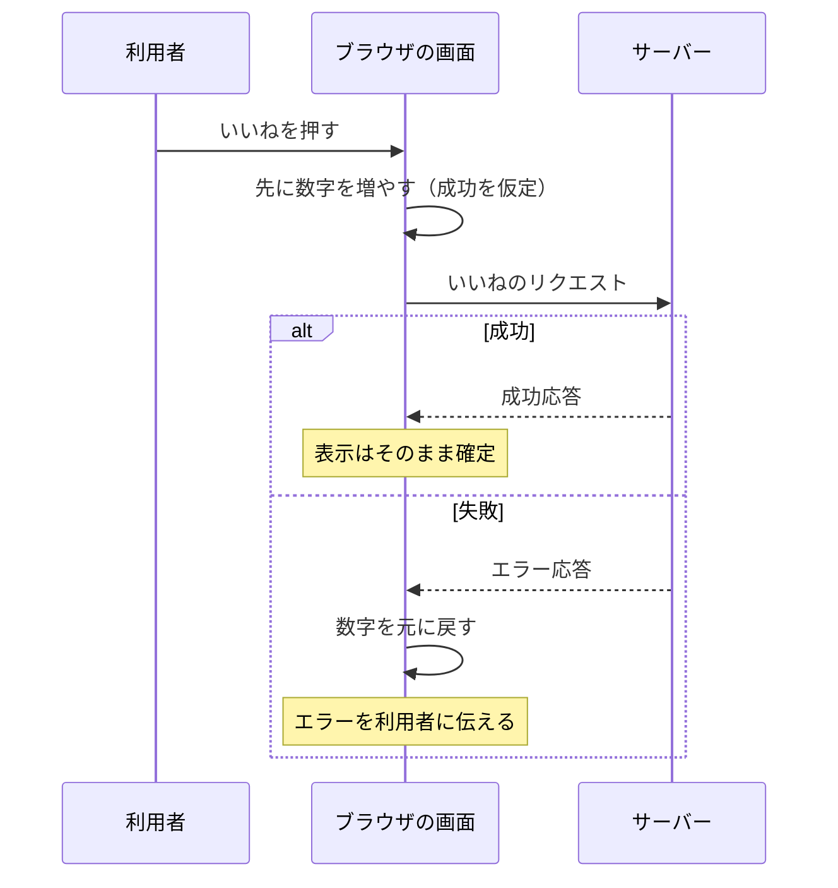

# 楽観的更新 — サーバーの返事を待たずに画面を先に変える

## 今日のゴール

- 楽観的更新が成功を仮定して画面を先に変える手法だと知る
- 楽観的更新は React の useOptimistic というフックで書けると知る
- 楽観的か悲観的かは失敗したときの被害の大きさで選ぶと知る

## いいねの数字が一瞬で増える理由

SNS では、操作した瞬間に画面が変わります。

- **いいね**: 押した瞬間に数字が増える
- **投稿**: ボタンを押すと、自分の投稿がすぐ一覧の先頭に現れる

当たり前の光景ですが、いいねが本当に記録されるのはサーバーの中です。通信が終わる前に画面が変わっているのは、よく考えると不思議です。

- 通信には往復の時間がかかる。リクエストがサーバーに届き、処理され、応答が返ってくるまで、速くても数十ミリ秒、モバイル回線なら 1 秒近くかかることもある
- 人は押してから 0.1 秒を超えたあたりで遅れを感じ始めると言われる

もし応答を待ってから画面を更新すると、体感はこうなります。

1. いいねを押す
2. 何も起きない時間が流れる
3. ようやく数字が増える

この「何も起きない時間」の間、利用者は「押せてないのかな」と不安になり、もう一度押したくなります。数字が一瞬で増えるアプリは、この待ち時間を見せないために**楽観的更新**という手法を使っています。

## 楽観的更新の仕組み

> **楽観的更新**（optimistic update）= 「どうせ成功するだろう」と楽観して、サーバーの応答を待たずに画面を先に更新する手法

本当のリクエストは裏で送っておき、結果に応じてつじつまを合わせます。

- 成功したら、先に変えた画面をそのまま確定させる
- 失敗したら、画面を元に戻して（ロールバック）、エラーを利用者に伝える



いいねのような操作はほとんど失敗しないので、大多数の利用者には「一瞬で反映される速いアプリ」に見えます。まれに失敗したときだけ、巻き戻しとエラー表示で埋め合わせる、という割り切りで速さを作っています。

注意したいのは、これが**見せ方の技術**だという点です。

- データの正しさを決めるのは、あくまでサーバー
- 画面が先に変わっても、サーバーのデータが変わったわけではない
- だから、失敗したときに元へ戻す処理まで含めて初めて成立する

## useOptimistic で書く楽観的更新

自前で書くと、「元の値を覚えておく」「失敗したら戻す」という管理を毎回書くことになります。React 19 にはこのパターンを標準で書ける **useOptimistic** というフックがあります。

```tsx
"use client";

import { useOptimistic, useState } from "react";
import { likePost } from "./actions"; // サーバーでいいねを記録する Server Action

export function LikeButton({ postId, initialCount }: { postId: string; initialCount: number }) {
  // サーバーで確定した「本当の値」
  const [likeCount, setLikeCount] = useState(initialCount);
  const [error, setError] = useState<string | null>(null);

  // 本当の値をもとに、一時的に見せる「楽観的な値」を作る
  const [optimisticCount, addOptimisticCount] = useOptimistic(
    likeCount,
    (currentCount, amount: number) => currentCount + amount
  );

  async function formAction() {
    setError(null);
    addOptimisticCount(1); // 画面は先に +1 される
    try {
      const updated = await likePost(postId); // 裏で本当のリクエスト
      setLikeCount(updated.likeCount); // サーバーの確定値で置き換える
    } catch {
      // 本当の値を更新しなければ、表示は自動的に元の数字へ戻る
      setError("いいねできませんでした。もう一度お試しください。");
    }
  }

  return (
    <form action={formAction}>
      <button type="submit">いいね {optimisticCount}</button>
      {error && <p role="alert">{error}</p>}
    </form>
  );
}
```

`useOptimistic(state, updateFn)` は、本当の状態 `state` と「楽観的な値の作り方」を受け取り、画面に出すための `optimisticCount` と、楽観的な変更を積む `addOptimisticCount` を返します。動きを追うとこうなります。

- `addOptimisticCount(1)` を呼ぶと、`optimisticCount` はすぐに 1 増えた値になり、画面が先に変わる
- この楽観的な値は一時的なもので、フォームの action の処理が終わると破棄され、表示は本当の値 `likeCount` に戻る
- 成功時は `setLikeCount` で本当の値も増えているので、見た目は変わらないまま確定する
- 失敗時は本当の値が増えていないので、表示は元の数字に巻き戻る

このフックに任せられる理由はこうです。

- 「失敗したら戻す」ためのコードを自分で書いていないのに、ロールバックが成立している
- 楽観的な値を別の変数として持ち、本当の値と混ぜないから、確定と巻き戻しの管理をフックに任せられる
- なお `addOptimisticCount` は、この例のようにフォームの action（またはトランジションと呼ばれる更新）の中で呼ぶ決まりになっている

## 悲観的更新との使い分け

楽観的更新には対になる方式があります。

> **悲観的更新**（pessimistic update）= 「失敗するかもしれない」と悲観して、サーバーの成功応答を確認してから画面を更新する手法

押してから変わるまでの待ちは発生しますが、画面に出た結果は必ずサーバーで確定しています。

| 方式 | 画面が変わるタイミング | 向いている操作 |
|------|----------------------|---------------|
| 楽観的更新 | 押した瞬間 | いいね、ブックマーク、既読、Todo のチェックなど、失敗しても被害が小さくやり直せる操作 |
| 悲観的更新 | サーバーの成功応答の後 | 決済、送金、注文の確定、在庫の引き当てなど、失敗を成功に見せてはいけない操作 |

選ぶ基準は速さではなく、**失敗したときの被害の大きさ**です。

- いいねが 1 回消えても誰も困らない
- 「注文が完了しました」と見せた注文が実は失敗していたら大事故
- 被害が大きい操作では、待ち時間を隠すのではなく、ボタンを無効化してスピナーを出し、「処理中」だと正直に見せるほうが正しい設計になる

AI に実装を任せるときも、この語彙で欲しい挙動を一言で指定できます。

> いいねは楽観的更新にして、失敗時はロールバックとエラー表示を入れて

> 決済の確定は悲観的更新で、処理中はボタンを無効化して

## 失敗時の設計

楽観的更新でいちばん危ないのは、失敗の扱いを省略することです。画面では成功に見えているぶん、失敗を伝え損ねると「押したのに実は反映されていなかった」という、利用者が気づきようのない事故になります。

楽観的更新を入れるときは、次の 3 点をセットで設計します。

- **ロールバック**: 失敗したら表示を必ず元に戻す。成功に見える画面を残さない
- **エラーの提示**: 黙って戻すだけでは、利用者は変化に気づけない。「いいねできませんでした」のように、何が起きたかを言葉で伝える
- **支援技術への通知**: 数字が戻るという視覚的な変化は、スクリーンリーダーの利用者には伝わらない。さきほどのコード例のようにエラーを `role="alert"` の要素に出すと、表示された瞬間に読み上げられる（`aria-live="assertive"` を指定したのと同じ扱いになる）

逆に言うと、この 3 点を確認すれば、楽観的更新を含むコードの良し悪しを評価できます。画面を先に変えるコードを見つけたら「失敗したらどうなるか」を確かめる、というのがこのパターンをレビューするときの定番の視点です。

## まとめ

- 楽観的更新は成功を仮定して画面を先に変え、失敗したらロールバックしてエラーを見せる
- useOptimistic は操作中だけ楽観的な値を見せ、終わると本当の値に戻ることでロールバックを担う
- 楽観的か悲観的かは、失敗したときの被害の大きさで選ぶ
