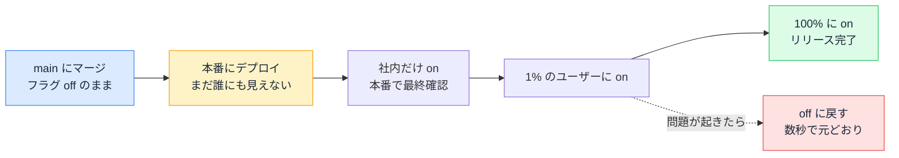

# フィーチャーフラグ — デプロイとリリースを切り離す

## 今日のゴール

- デプロイ（コードを本番に置く）とリリース（機能をユーザーに見せる）は切り離せると知る
- フィーチャーフラグで本番のコードの機能を on/off する仕組みを知る
- 段階的リリースや即時の切り戻しなど、フラグの使い方と寿命を知る

## 作りかけの機能の置き場所

新しい決済画面を作るのに 2 週間かかるとします。チーム開発では多くの場合、main ブランチにマージされたコードが本番、つまり実際のユーザーが使う環境にデプロイされます。作りかけの決済画面が main に入ってそのままデプロイされたら、未完成の画面がユーザーに見えてしまいそうです。

そう考えると「完成するまで main に入れない」が自然な答えに思えます。完成まで自分のブランチで作業を続けるやり方です。ただ、ブランチが長生きすると別の問題が出てきます。

- 作業している 2 週間の間も、main は他のメンバーの変更で進み続ける
- 完成してマージするころには差分が巨大になり、コンフリクトの解消に丸一日かかることもある
- レビューする側も、2 週間分の変更をまとめて読むことになる

ブランチが長生きするほどマージはつらくなります。かといって小さくこまめに main に入れると、作りかけの機能が本番に出てしまう。この板挟みを解くのが**フィーチャーフラグ**です。

## フィーチャーフラグの仕組み

フィーチャーフラグ（feature flag。フィーチャートグルとも呼びます）は、機能単位の on/off スイッチです。仕組みは単純で、機能のコードを if の分岐で包みます。

```tsx
import { getFeatureFlags } from "@/lib/feature-flags";
import { NewCheckout } from "./new-checkout";
import { OldCheckout } from "./old-checkout";

export default async function CheckoutPage() {
  // フラグの値は、コードの外にある設定や管理画面から読み込む
  const flags = await getFeatureFlags();

  if (flags.newCheckout) {
    return <NewCheckout />; // 新しい決済画面
  }
  return <OldCheckout />; // 従来の決済画面
}
```

ポイントは、フラグの値をコードの中に直接書かないことです。設定ファイルや環境変数、専用の管理画面などコードの外に置き、実行のたびにそこから読み込みます。こうしておくと、コードを変更せずにフラグの値だけを切り替えられます。

この形にすると、作りかけの機能でも main に入れられます。

- 新しい決済画面のコードは main にマージされ、本番にもデプロイされている
- でもフラグが off なので分岐の中は実行されず、ユーザーには従来の画面しか見えない
- 完成して確認が済んだら、フラグを on にした瞬間から新しい画面が表示される

未完成の機能をフラグで隠しながら、小さくこまめに main に入れ続ける。この進め方は **trunk-based development**（トランクベース開発）と呼ばれ、ブランチを長生きさせない開発スタイルとして広く使われています。

## デプロイとリリースの分離

フィーチャーフラグがあると、これまで 1 つの出来事に見えていたものが 2 つに分かれます。

| 言葉 | 意味 | タイミング |
|------|------|-----------|
| デプロイ | コードを本番のサーバーに置く | コードの準備ができたとき |
| リリース | 機能をユーザーに見せる | 見せたいとき（フラグを on にする） |

フラグがなければ、デプロイした瞬間がそのままリリースの瞬間です。フラグがあれば、デプロイは木曜の夕方に済ませておき、リリースはキャンペーンが始まる月曜の朝 9 時にフラグを on にするだけ、という分け方ができます。エンジニアの作業の都合と、ユーザーに見せるタイミングの都合を、別々に決められます。

「本番に出す」と言うとき、そこには「ユーザーに見える」という意味を含めがちです。フィーチャーフラグのあるチームでは、この 2 つは別の操作です。main にマージされて本番にデプロイ済みなのに、まだ誰にも見えていない機能がある、というのが実務では普通の状態です。

## 段階的リリースと切り戻し

リリースがフラグの切り替えになると、on と off の 2 択以外の出し方もできます。フラグの仕組みによっては、「誰に対して on にするか」を条件で決められるからです。

- **社内のメンバーだけ on**: 本番の環境と実データで最終確認してから、一般のユーザーに公開できる
- **1% のユーザーだけ on**: 問題がなければ 10%、50%、100% と広げる。少人数への影響で問題を検知してから全員に届ける出し方で、**段階的ロールアウト**やカナリアリリースと呼ばれる
- **半分ずつ別の画面を出す**: 2 つの案をランダムに出し分けて成果を比べる、いわゆる A/B テスト



途中で問題が見つかったときにも、フラグは効きます。フラグを off に戻せば、その場で従来の画面に戻ります。コードを前のバージョンに戻して再デプロイする方法だと数分から数十分かかるところが、フラグなら数秒です。障害対応で「まずフラグを戻す」が最初の一手になります。

フラグを管理画面から切り替えられる専用のサービス（LaunchDarkly など）を使うチームもあれば、設定ファイルや環境変数で自前運用するチームもあります。仕組みは違っても、「フラグの値で出し分ける」という考え方は共通です。

## フラグの寿命管理

便利な一方で、フラグは増えるほどコードを複雑にします。

- フラグが 1 つ増えるたびに if の分岐が増え、コードの通り道が 2 倍になる。フラグが 10 個あれば組み合わせは 1000 通りを超える
- 100% のリリースが終わると、off 側のコード（従来の画面）は誰も通らない分岐として残る
- 消し忘れたフラグが溜まると、どのフラグが今も使われているのか誰にも分からなくなる

だからフラグには寿命があります。100% のリリースが済んで安定したら、if の分岐ごと削除して新しいコードだけを残します。フラグは作って終わりではなく、消すところまでが一仕事です。

この語彙は AI への指示にもそのまま使えます。「この機能はフィーチャーフラグで包んで、デフォルトは off にして」「このフラグは 100% リリースが済んだので、分岐を取り除いて古い側のコードを削除して」のように、機能の出し方と後片付けを具体的な言葉で頼めます。

## まとめ

- デプロイはコードを本番に置くこと、リリースはユーザーに見せることで、フラグがあれば別々にできる
- フラグ off の機能は本番にあっても見えないので、作りかけでも main に入れられる
- 一部のユーザーだけ on や数秒での切り戻しができる一方、役目を終えたフラグは分岐ごと消す
