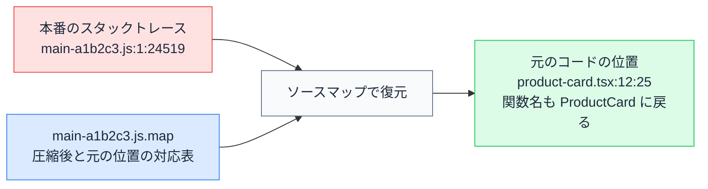

# ソースマップ — 本番のエラーを元のコードの行に戻す仕組み

## 今日のゴール

- 本番の JavaScript がビルドで圧縮され、書いたコードとは別物になっていることを知る
- ソースマップが圧縮後の位置と元のコードの位置をつなぐ対応表だと知る
- エラー監視サービスがソースマップを使って本番のエラーを復元していることを知る

## 本番のエラーは圧縮後の位置を指す

AI に作ってもらったアプリをデプロイして、実際に使われ始めたあとにエラーが起きたとします。開発中なら、エラーにはこんなスタックトレースが付いています。

```
TypeError: Cannot read properties of undefined (reading 'name')
    at ProductCard (product-card.tsx:12:25)
```

`product-card.tsx` の 12 行目。ファイル名と行番号から、どこを見ればいいかすぐ分かります。ところが本番で同じエラーが起きると、こう見えます（位置の数値は説明用の例です）。

```
TypeError: Cannot read properties of undefined (reading 'name')
    at d (main-a1b2c3.js:1:24519)
```

| | 開発中 | 本番 |
|---|--------|------|
| 関数名 | `ProductCard` | `d` という 1 文字 |
| ファイル名 | `product-card.tsx` | 見覚えのない `main-a1b2c3.js` |
| 場所 | 12 行目の 25 文字目 | 「1 行目の 24519 文字目」 |

どれも自分が書いたコードと対応が取れません。これは文字化けでも監視ツールの不具合でもなく、本番のコードは本当にこの姿で動いています。

## ビルドがコードを別物に変える

開発中に書いた TypeScript や JSX は、そのままの形でブラウザで動いているわけではありません。デプロイ前のビルドで、コードは大きく作り替えられます。

- たくさんのファイルが少数のファイルにまとめられる（バンドル）
- TypeScript や JSX が、ブラウザが実行できる素の JavaScript に変換される
- 変数名や関数名が短い名前に置き換えられ、空白・改行・コメントが削られる（ミニファイ）

書いたコードとビルド後のコードを並べると、変わりようが分かります。

```jsx
// 開発中に書いたコード（product-card.tsx）
export function ProductCard({ product }) {
  const formatted = formatPrice(product.price);
  return (
    <article className="card">
      <h2>{product.name}</h2>
      <p>{formatted}</p>
    </article>
  );
}
```

```js
// ビルド後のイメージ。実際はこの調子で改行なしに数万文字続く
function d({product:e}){const t=f(e.price);return s.jsxs("article",{className:"card",children:[s.jsx("h2",{children:e.name}),s.jsx("p",{children:t})]})}
```

ここまで削る理由は転送量です。

- 分かりやすい名前や改行は人間が読むためのもので、ブラウザの実行には要らない
- 削れば配信するファイルが小さくなり、ページの読み込みが速くなる

その代償として、エラーの位置は圧縮後のコード上の住所になります。

- 改行がないので行番号はほぼ常に 1、代わりに「何文字目か」が巨大な数になる
- 機械にとっては正確な住所だが、人間には元のどのファイルのどの行なのか読み取れない

## ソースマップは位置の対応表

この「読めない」を解決するために、ビルドツールは圧縮と同時に**ソースマップ**という対応表を生成できます。

> **ソースマップ** = 「圧縮後のコードのこの位置は、元のこのファイルのこの行・この列にあって、元の名前はこれ」という対応の記録

- `main-a1b2c3.js` に対して `main-a1b2c3.js.map` のような `.map` ファイルとして出力される
- 圧縮後のファイルの末尾に `//# sourceMappingURL=main-a1b2c3.js.map` というコメントが付き、対応表のありかを示す
- `.map` の中身は JSON で、位置の対応は専用の形式で圧縮して詰め込まれている（人間が直接読むファイルではない）



ブラウザの DevTools は、この対応表を自動で使います。

- `sourceMappingURL` のコメントを見つけると、`.map` ファイルを取りに行く
- スタックトレースやデバッガの表示を、元のファイル名・行番号・変数名に置き換えて見せてくれる

実は開発中も、これに助けられています。

- `npm run dev` の間も、TypeScript や JSX は変換されてからブラウザに届いている
- 開発サーバーがソースマップを一緒に配っているので、DevTools には自分が書いたままのコードが表示される
- 開発中にエラーの場所がすんなり読めるのは、変換されていないからではなく、**対応表が最初から効いているから**

## エラー監視サービスとの組み合わせ

本番のエラーは、開発者の手元ではなくユーザーの画面で起きます。開発者はそれを後から読むしかありません。

> **エラー監視サービス**（Sentry や Datadog など）= ユーザーのブラウザで起きたエラーのスタックトレースを収集して、一覧にしてくれるサービス

ただし、集まってくるトレースは圧縮後の位置のままです。そこで、ここでもソースマップが使われます。

1. ビルド時に生成したソースマップを、監視サービスにアップロードしておく
2. サービス側が対応表を引いて、圧縮後の位置を復元する
3. ダッシュボードには `product-card.tsx:12` のような元の位置で表示される

「どのユーザーの環境で、どのファイルの何行目が落ちたか」が読めるのは、この復元があってこそです。

運用ではもうひとつ、`.map` ファイルをどこに置くかという判断があります。

- 本番のサーバーにそのまま置くと、DevTools を開いた人は誰でも元のコードに近いものを読めてしまう
- 公開されて困らないサービスもあるが、見せたくないロジックを含むなら、`.map` は本番には配置せず監視サービスにだけアップロードする構成がよく取られる

この語彙があると、困ったときの伝え方が変わります。「本番のエラーが読めない」で止まらずに、「監視サービスにソースマップがアップロードされているか確認したい」とチームや AI に言えれば、確認する場所がすぐに定まります。

## まとめ

- 本番の JavaScript はバンドルとミニファイで別物になり、エラーは圧縮後の位置を指す
- ソースマップは圧縮後と元のコードの位置の対応表で、`.map` ファイルとして生成される
- 監視サービスにソースマップを渡しておくと、本番のエラーを元のコードの行で読める
