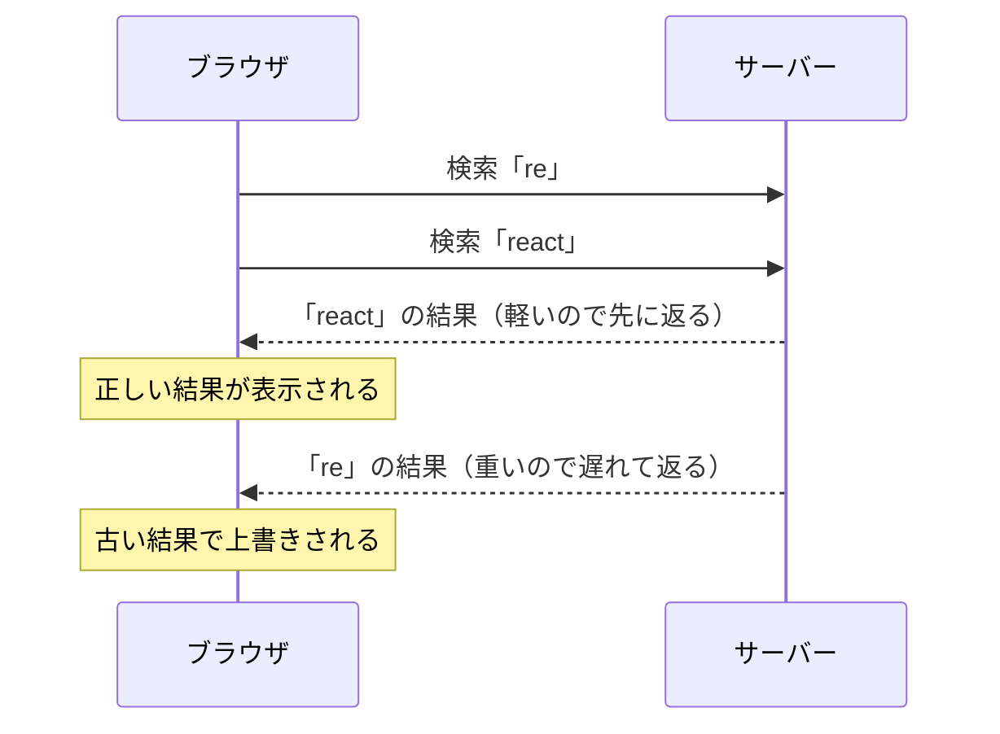

# 競合状態 — 新しい検索結果が古い結果で上書きされる仕組み

## 今日のゴール

- リクエストは投げた順に返ってくるとは限らないと知る
- 返ってきた順に上書きする実装は競合状態で壊れると知る
- 対策として古いレスポンスの無視と AbortController での中断があると知る

## 「react」と打ったのに「re」の結果が表示される

検索ボックスに 1 文字打つたびに下の候補が絞り込まれていく動きは、EC サイトの商品検索や管理画面のユーザー検索でよく見かけます。

この検索ボックスに、素早く「re」→「rea」→「react」と打ち込んだとします。画面にはいったん「react」の検索結果が並んだのに、直後になぜか「re」の検索結果へ置き換わってしまい、打ち直すと直ることもあれば、また起きることもあります。

操作は何も間違っていません。それでも処理のタイミング次第で結果が壊れる現象を、**競合状態**（race condition）と呼びます。複数の処理が競走していて、どれが先に終わるかで結果が変わってしまう状態のことです。もともとは並行処理の用語で、フロントエンドでは「入力のたびに通信する」画面がこの状態になりやすい代表格です。

## リクエストは投げた順に返ってこない

原因は通信の性質にあります。リクエストの所要時間は、毎回同じではありません。

- サーバーの混み具合はそのときどきで変わる
- 検索の重さも違う。「re」は該当が多くて処理に時間がかかり、「react」は絞り込まれていて速い、ということが起きる
- ネットワークの経路や電波状況も一定ではない

だから、**後に投げたリクエストが先に返ってくる**ことは、異常でも何でもなく普通に起きます。



追い越しそのものは防げません。問題は、追い越されて遅れてきたレスポンスをどう扱うかです。

## 壊れる素朴な実装

「入力のたびに検索する」を素直に書くと、こうなります。

```tsx
"use client";

import { useEffect, useState } from "react";

type Book = { id: string; title: string };

export function BookSearch() {
  const [query, setQuery] = useState("");
  const [results, setResults] = useState<Book[]>([]);

  useEffect(() => {
    if (query === "") {
      setResults([]);
      return;
    }
    fetch(`/api/books?q=${encodeURIComponent(query)}`)
      .then((res) => res.json())
      .then((data: Book[]) => setResults(data)); // 返ってきた順に上書きする
  }, [query]);

  return (
    <div>
      <label htmlFor="book-search">書籍名で検索</label>
      <input
        id="book-search"
        type="search"
        value={query}
        onChange={(e) => setQuery(e.target.value)}
      />
      <p aria-live="polite">{results.length} 件見つかりました</p>
      <ul>
        {results.map((book) => (
          <li key={book.id}>{book.title}</li>
        ))}
      </ul>
    </div>
  );
}
```

件数を出している `aria-live="polite"` は、結果が入れ替わったことをスクリーンリーダーにも伝えるための指定です。文字を打つだけで画面の下のほうが変わる UI では、入れておきたい配慮です。

さて、このコンポーネントで素早く「re」→「react」と打つと、こう動きます。

1. query が「re」になり、1 本目の fetch が飛ぶ
2. query が「react」になり、2 本目の fetch が飛ぶ
3. 「react」のレスポンスが先に返り、setResults で画面に反映される
4. 遅れて「re」のレスポンスが返り、setResults がもう一度呼ばれて上書きする

`.then()` の中の処理は、レスポンスが返ってきた時点で実行されます。そのとき「この結果はまだ必要か」を誰も確認していないので、画面に残るのは**最後に返ってきた**結果です。それが最後に投げたリクエストの結果とは限りません。

## 手元で再現しにくいバグ

このバグには、**手元では再現しにくい**という性質があります。

- 開発中はサーバーが手元にあり、応答が一瞬で返るので、追い越しがほぼ起きない
- 本番では、遅い回線や重い検索語、サーバーの混雑が重なったときに起きる
- しかも毎回ではなく、タイミングが噛み合ったときだけ

結果として「たまに検索結果が変になる気がする」という曖昧なバグ報告になります。報告を受けて手元で試しても再現せず、原因の見当がつかないまま様子見になりがちです。動かして再現できない以上、コードを読んで「追い越されたら壊れる構造かどうか」を判断するしかありません。仕組みを知っているかどうかが、そのまま調査の速さになります。

## 古いレスポンスを無視する

レスポンスが返ってきたとき、「これは最新のリクエストの結果か」を確認し、古ければ捨てる。この方針を useEffect のクリーンアップ関数で書くのが、react.dev の公式ドキュメントでも紹介されている定番のパターンです。

```tsx
useEffect(() => {
  if (query === "") {
    setResults([]);
    return;
  }
  let ignore = false;
  fetch(`/api/books?q=${encodeURIComponent(query)}`)
    .then((res) => res.json())
    .then((data: Book[]) => {
      if (!ignore) {
        setResults(data); // 最新のリクエストの結果だけを反映する
      }
    });
  return () => {
    ignore = true;
  };
}, [query]);
```

クリーンアップ関数、つまり useEffect から return した関数が呼ばれるのは、**次の副作用が実行される直前**と、コンポーネントが画面から消えるときです。この性質を使って、リクエストごとに「もう古い」の印を付けます。

- 「re」で副作用が実行され、1 本目の fetch が飛ぶ。この回の `ignore` は false
- 入力が「react」に変わると、次の副作用の前に「re」の回のクリーンアップが呼ばれ、その回の `ignore` が true になる
- 遅れて「re」のレスポンスが返ってきても、`if (!ignore)` で弾かれて画面には反映されない

`let ignore = false` が**実行のたびに作り直される**のがポイントです。各リクエストが自分専用のフラグを持っていて、自分より新しいリクエストが始まった時点で「この結果は使わない」と印が付く仕組みです。

## リクエストそのものを中断する

無視する方式では、古いリクエストの通信自体は最後まで続きます。使わないと決めたレスポンスのために、サーバーは処理を続け、回線も使われ続けます。この無駄を通信ごと打ち切るのが **AbortController** です。

```tsx
useEffect(() => {
  if (query === "") {
    setResults([]);
    return;
  }
  const controller = new AbortController();
  fetch(`/api/books?q=${encodeURIComponent(query)}`, {
    signal: controller.signal, // このリクエストを中断できるようにする
  })
    .then((res) => res.json())
    .then((data: Book[]) => setResults(data))
    .catch((error) => {
      if (error.name === "AbortError") {
        return; // 自分で中断した合図なので、何もしなくてよい
      }
      console.error(error); // それ以外は本物の失敗
    });
  return () => {
    controller.abort(); // 次の検索が始まる前に、前のリクエストを中断する
  };
}, [query]);
```

`fetch` に `signal` を渡しておくと、`controller.abort()` でそのリクエストを中断できます。中断された fetch は `AbortError` という名前のエラーで失敗するので、catch で名前を確認して、中断なら何もしない。エラーの形はしていますが、自分でキャンセルしたという想定内の合図です。ここを本物の失敗と同じに扱うと、文字を打つたびにエラー表示が出る、という別のバグになります。

## 無視と中断の違い

| 方式 | 画面 | 古いリクエストの通信 |
|------|------|--------------------|
| 無視する | 古い結果は反映されない | 最後まで続く |
| 中断する | 古い結果は反映されない | 途中で打ち切られる |

画面の正しさはどちらでも守れます。違いは通信の無駄です。中断すれば、使わないレスポンスのためにサーバーと回線が働き続けなくて済みます。検索のように入力のたびにリクエストが積み重なる機能では、中断まで入れる価値があります。

なお、SWR や TanStack Query といったデータ取得ライブラリは、この競合状態の管理を内蔵しています。ライブラリに任せられる場面ではそれが近道ですが、中で何が起きているかを知っておくと、素の fetch のコードを評価するときにも、ライブラリの挙動を調べるときにも土台になります。

## AI への指示の語彙

検索やオートコンプリートの実装を AI に任せるとき、この知識はそのまま確認の観点と指示の言葉になります。

出てきたコードを確かめるなら、観点は「素早く入力したとき、古い結果で上書きされないか」です。具体的には、fetch の結果をそのまま setState していて、古さの確認も中断もしていない箇所を探します。

作らせる段階なら、最初からこう指示できます。

> 検索は入力のたびにリクエストが飛ぶので、AbortController で前のリクエストをキャンセルして。中断で発生する AbortError は想定内として無視して

競合状態という言葉と 2 つの対策を知っているだけで、このやりとりが一言で済むようになります。

## まとめ

- 通信の所要時間は毎回違い、後に投げたリクエストが先に返ることがある
- 返ってきた順に上書きする実装は、最後に返った結果が勝つ競合状態になる
- 対策はクリーンアップで古いレスポンスを無視するか、AbortController で中断するか
