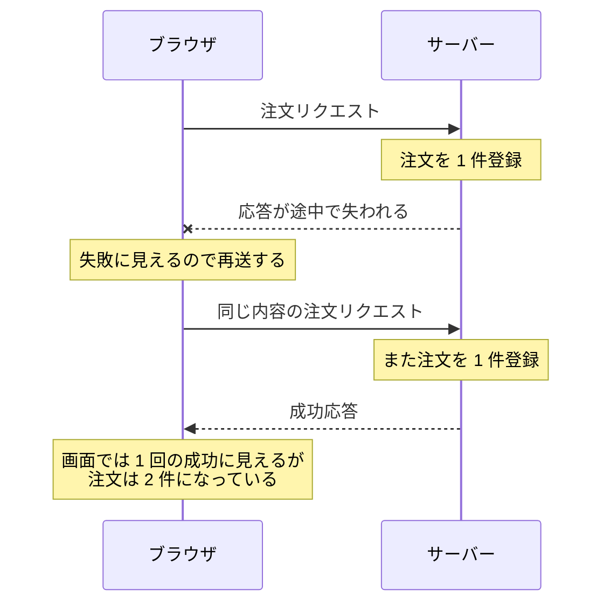
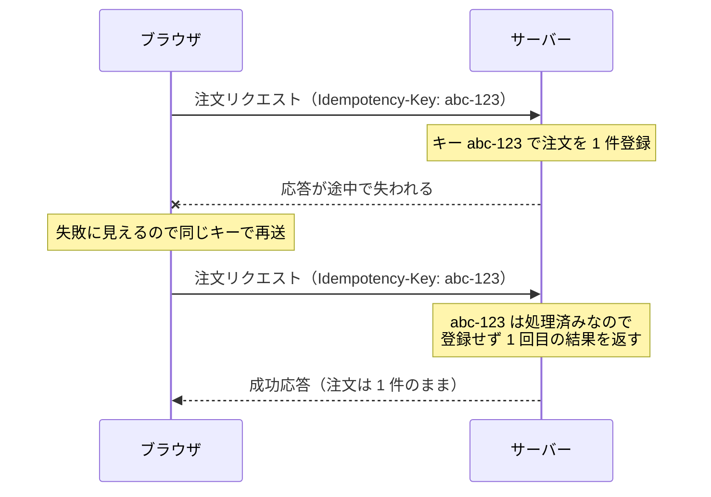

# 二重送信と冪等性 — 同じ注文が 2 回入る仕組みと防ぎ方

## 今日のゴール

- 二重送信はボタン連打以外の経路でも起きると知る
- 同じ操作を何回やっても結果が 1 回分になる性質を冪等と呼ぶと知る
- ボタンの無効化が防ぐのは画面内の誤操作で、本当の防御はサーバー側の冪等キーだと知る

## 同じ注文が 2 件入る事故

通販サイトで注文ボタンを押したのに、画面がなかなか変わらない。不安になってもう一度押した。こうした経験は誰にでもあります。運が悪いと、あとで履歴に同じ注文が 2 件並び、決済も 2 回走っています。

> **二重送信**: 同じ内容のリクエストがサーバーに 2 回届き、サーバーが 2 回とも処理してしまう事故

「注文する」「支払う」「投稿する」のような、実行した回数だけ結果が増える操作で起きます。

対策として最初に思いつくのは「送信中はボタンを押せなくする」でしょう。それは必要な対策ですが、それだけでは防ぎきれません。二重送信には、ボタンの連打以外にも入り口があるからです。

## 二重送信が起きる経路

- **応答待ちの再クリック**: 押したのに反応がないので、もう一度押す
- **再読み込みや戻る**: POST の結果ページを再読み込みすると、直前の送信がもう一度実行されることがある。ブラウザにはこのときフォームの再送信を確認するダイアログを出す仕組みがあり、見たことがある人も多いはず
- **応答だけが失われた後の再送**: リクエストはサーバーに届いて処理されたのに、応答が戻る途中で通信が切れる。クライアントからは失敗に見えるので、再送すると 2 回目の処理になる

3 つ目がいちばん厄介です。図にするとこうなります。



この図で、ブラウザ側に落ち度はありません。

- **クライアントには区別がつかない**: 処理されたのか失敗したのか、応答が返ってこない以上わからない
- **再送は自然な回復動作**: 失敗に見えるものを送り直すこと自体は正しい
- **問題は操作の側にある**: 「もう一度送っても大丈夫な操作かどうか」を考えるための言葉が冪等性

## 冪等性という考え方

> **冪等**（べきとう、idempotent）: 同じ操作を何回実行しても、1 回実行したのと同じ結果になる性質

- **エレベーターの呼びボタン**: 何回押しても「呼んだ」状態になるだけ。冪等
- **自動販売機の購入ボタン**: 押すたびに 1 本出てくる。冪等ではない

HTTP では、メソッドごとに冪等かどうかの約束が仕様（RFC 9110）で決まっています。

| メソッド | 冪等か | 理由 |
|---------|--------|------|
| GET | 冪等 | 取得するだけで、サーバーの状態を変えない |
| PUT | 冪等 | 「この内容に置き換える」ので、2 回やっても同じ内容になる |
| DELETE | 冪等 | 2 回目は消す対象がすでにないだけで、「消えた状態」は変わらない |
| POST | 冪等ではない | 「新しく作る」ので、回数のぶんだけ増える |

冪等かどうかはサーバーの状態がどうなるかの話で、毎回同じ応答が返るという意味ではありません。DELETE の 2 回目には「見つからない」というエラーが返ることもありますが、サーバー上の結果が 1 回目と同じなら冪等です。

この約束は、サーバーを実装する側が守る前提の取り決めです。そしてブラウザや通信ライブラリは、この約束を前提に動いています。

- **再読み込みの扱いの差**: GET なら黙って再取得するのに、POST では確認ダイアログを出す
- **自動再送の判断**: 通信ライブラリやインフラの中には、「冪等なメソッドなら失敗時に自動で再送してよい」と判断するものがある

逆に言うと、POST には「もう一度送っても大丈夫」という保証がどこにもありません。先ほどの応答が失われた場面でも、GET なら安心して再送できますが、POST の再送は 2 件目の注文を作るかもしれない。

> 二重送信の問題は、突き詰めると「冪等でない POST を、どう安全に再送できるようにするか」に行き着く

## 送信中のボタン無効化とその限界

まず入れるべき対策は、送信中にボタンを無効化して、送信中だと表示することです。React 19 では、`<form>` の `action` と `useActionState` を使うと、送信中かどうかを `isPending` として受け取れます。

```tsx
"use client";

import { useActionState } from "react";
import { submitOrder } from "./actions"; // 注文を登録する Server Action

export function OrderForm() {
  const [result, formAction, isPending] = useActionState(submitOrder, null);

  return (
    <form action={formAction} aria-busy={isPending}>
      {/* 商品や数量の入力欄は省略 */}
      <button type="submit" disabled={isPending}>
        {isPending ? "注文を送信中…" : "注文を確定する"}
      </button>
      {result?.error && <p role="alert">{result.error}</p>}
    </form>
  );
}
```

- **`disabled={isPending}`**: 連打と再クリックを防ぐ
- **文言を「送信中…」に変える**: 押せたことを利用者に伝えて、「反応がないからもう一度押す」という不安をなくす
- **`aria-busy`**: フォームが処理中だと支援技術に伝える
- **`role="alert"` の要素にエラーを出す**: 表示された瞬間に読み上げられる

ただし、これで防げるのは**同じ画面の中で起きる誤操作**だけです。

- **再読み込みや戻る**: 画面が作り直されると、disabled の状態は消える
- **別のタブ**: 同じページを開いていれば、そちらのボタンは押せる
- **応答だけが失われた場面**: そもそもボタンは 1 回しか押されていない

フロントエンドのコードは、利用者の画面の中でしか働けません。画面の外、つまりネットワークやもう 1 つのタブで起きることには手が届かない。だから本当の防御はサーバー側に置きます。

## 冪等キーによるサーバー側の防御

サーバー側の定番の対策が**冪等キー**（Idempotency-Key）です。

- **クライアント**: 操作 1 回につき 1 つの一意なキーを作り、リクエストに付けて送る。再送するときも同じキーを使う
- **サーバー**: 処理済みのキーを覚えておき、同じキーのリクエストがまた来たら、処理せずに 1 回目の結果をそのまま返す

```ts
// この注文 1 回につき 1 つのキーを作る
// 再送のときも同じキーを使い回すことで「同じ操作のやり直し」だと伝わる
const idempotencyKey = crypto.randomUUID();

async function sendOrder(order: { productId: string; quantity: number }) {
  const res = await fetch("/api/orders", {
    method: "POST",
    headers: {
      "Content-Type": "application/json",
      "Idempotency-Key": idempotencyKey,
    },
    body: JSON.stringify(order),
  });
  return res.json();
}
```

キーを作る単位には注意が要ります。

- **送信処理を呼ぶたびに新しく作る**: 再送のたびに別のキーになり、意味がなくなる
- **「この注文という操作 1 回」に 1 つ**: やり直しでは同じキーを送る。これが正しい単位

先ほどの応答が失われた場面は、冪等キーがあるとこう変わります。



こうすると、POST でも安心して再送できるようになります。何回送っても注文は 1 件のまま、つまり POST に後付けで冪等性を持たせたことになります。

- **決済サービスの Stripe が API に採用して広まった**パターン
- Idempotency-Key を標準の HTTP ヘッダーにする議論も IETF で行われてきた。まだ正式な標準ではないが、名前と考え方は API 設計の共通語彙になっている

二重送信への対策は、フロントエンドとサーバーの 2 段構えになります。

| どこで | 対策 | 防げるもの |
|----|------|-----------|
| フロントエンド | 送信中のボタン無効化と送信中表示 | 同じ画面での連打・再クリック |
| サーバー | 冪等キーで 2 回目以降を処理しない | 再読み込み・別タブ・応答が失われた後の再送を含む全経路 |

- **フロント側の対策**: 利用者の不安と誤操作を減らすためのもの
- **サーバー側の責任**: データの正しさを守る。リクエストは正規の画面以外からも来るし、同じものが 2 回届くこともある、という前提で受け止める

AI にフォームの実装を頼むときも、この 2 段構えで指示できます。

> 「送信中はボタンを無効化して送信中表示を出して。あわせて二重送信対策として、リクエストに冪等キーを付けてサーバー側で重複を処理しないようにして」

逆にレビューする側に回ったら、ボタンの無効化だけで二重送信対策が終わっていないか、が定番の確認ポイントです。

## まとめ

- 二重送信は連打だけでなく、再読み込みや応答が失われた後の再送でも起きる
- 冪等は同じ操作を何回やっても 1 回と同じ結果になる性質で、POST は冪等ではない
- ボタンの無効化が防ぐのは画面内の誤操作で、本当の防御はサーバー側の冪等キー
