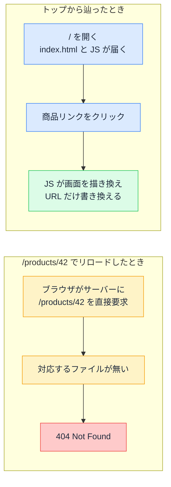

# SPA と 404 — リロードで消えるページ、何を打っても 200 のページ

## 今日のゴール

- リロードで 404 になるのは「URL に応える相手」が変わるからだと知る
- どんなパスにも index.html を返すリライト設定という定番の対処を知る
- 存在しない URL に 200 が返ってしまう soft 404 を知る

## リロードすると 404 になる下層ページ

AI に作ってもらった SPA（Single Page Application、1 枚の HTML でできたアプリ）を無料のホスティングサービスにデプロイしたとします。トップページは問題なく開き、商品一覧から商品詳細 `/products/42` への移動もできます。ところが、その商品詳細ページでブラウザをリロードすると、突然「404 Not Found」が表示されます。

さっきまで同じ URL で見えていたページが、リロードしただけで消えたことになります。SPA をデプロイした人が最初にぶつかる定番のトラブルで、原因はバグではなく、**その URL に応えている相手がリロードの前後で入れ替わっている**ことにあります。

## URL ごとにファイルが対応する伝統的なサイト

昔ながらの Web サイトでは、サーバーに URL と対応するファイルが置いてあり、ブラウザが URL を要求するとサーバーがそれを探して返します。

| リクエストされた URL | サーバーが返すもの |
|---|---|
| `/` | index.html |
| `/about` | about.html |
| `/products/42` | 対応するファイルか、サーバー処理が組み立てた HTML |
| `/aaaa`（存在しない） | **404 Not Found** |

URL は「サーバー上のどれが欲しいか」の指定そのものです。対応するものが無ければサーバーは 404 を返します。**URL を解釈しているのはサーバー**で、ブラウザは受け取って表示するだけです。

## ブラウザの中にしか存在しない URL

SPA はこの前提を崩します。サーバーからページを受け取るのは最初の 1 回だけで、届くのは index.html と JavaScript です。以降のページ切り替えは、この JavaScript がブラウザの中で行います。リンクがクリックされたら必要なデータだけを取得して画面を描き換え、ブラウザの History API という機能でアドレスバーの URL を書き換えます。サーバーに「次のページをください」とは言いません。

つまり `/products/42` という URL は、JavaScript がアドレスバーに書き込んだ結果です。サーバー上に `/products/42` に対応するファイルがあるわけではありません。**この URL はブラウザの中にしか存在しません**。

一方、リロードは「アドレスバーの URL をサーバーにあらためて要求する」操作です。ブラウザは `/products/42` をサーバーに要求しますが、サーバーが持っているのは index.html と JavaScript だけなので、正直に 404 を返します。

トップから辿ったときに見えていたのは、JavaScript が URL とページの対応を引き受けていたからです。同じ URL でも、画面内の遷移で着いたときは JavaScript が、リロードではサーバーが応えています。

リロードに限った話ではありません。下層ページの URL を同僚に共有して相手がそれを開いたときも、ブックマークから開き直したときも、サーバーへの素のリクエストになるので同じ 404 が起きます。

## どんなパスにも index.html を返すリライト設定

定番の解決はホスティングサービスの**リライト**（フォールバックと呼ぶサービスもあります）の設定です。中身は「どんなパスへのリクエストにも index.html を返す」という指示で、流れはこうなります。

1. ブラウザが `/products/42` をサーバーに要求する
2. サーバーは対応するファイルを探す代わりに、index.html を返す
3. index.html が JavaScript を読み込む
4. JavaScript の中の**ルーター**（URL を見てどの画面を出すか決める部分）がアドレスバーの `/products/42` を読み、商品詳細の画面を描く

サーバーは URL の解釈をやめて、ブラウザに届いた JavaScript に丸ごと任せるやり方です。多くのホスティングサービスがこの設定を用意しています。たとえば Netlify では `_redirects` というファイル、Vercel では `vercel.json` で指定します。

書き方はサービスごとに違うので覚える必要はありません。「SPA なので、すべてのパスを index.html にフォールバックさせる設定を追加して」と AI に指示できれば十分です。設定の名前を知らないと「リロードすると壊れる」としか伝えられず、この一言が言えるかどうかで直るまでの速さが変わります。

## 何を打っても 200 が返る soft 404

このリライト設定には副作用があります。「どんなパスにも index.html を返す」ので、`/products/99999` でも `/aaaa` でも、**存在しない URL に対しても index.html が 200 で返ります**。JavaScript のルーターが「ページが見つかりません」という画面を描いたとしても、HTTP のステータスは成功の 200 のままです。

こうした「見た目は 404 なのにステータスは 200」という状態を **soft 404** と呼びます。人間の目には正しく見えても、ステータスコードを見て動く機械には別物として映ります。

- **検索エンジン**: 200 が返るので「正常なページ」として扱おうとする。存在しないページが検索結果に載ったり、逆に品質の低いサイトと判定されたりする
- **死活監視やリンクチェック**: 「404 が返ったら異常」という前提の仕組みをすり抜ける。リンク切れが検出されず、壊れたまま残る

リロード 404 を直すと、今度は soft 404 が生まれます。どちらも「URL を解釈しているのが誰か」が変わったことの表と裏です。

## サーバー側でルーティングする構成との違い

Next.js のように**サーバー側にもルーターがある**構成では、事情が変わります。サーバー自身が「どの URL にどのページがあるか」を知っているので、画面内の遷移は SPA と同じ速さのまま、リロードや直接アクセスにはサーバーがそのページの HTML を返せます。リライト設定は要りません。

存在しない URL の扱いも変わります。App Router では、存在しない商品 ID にアクセスされたときに `notFound()` という関数を呼ぶと、「見つかりません」の画面とあわせて **404 ステータスそのもの**を返せます。検索エンジンにも監視にも「このページは無い」と正しく伝わります。

ここまでの現象はすべて、**その URL を解釈しているのはサーバーか、ブラウザに届いた JavaScript か**という 1 点に行き着きます。

| 構成 | URL を解釈する場所 | 無い URL への応答 |
|---|---|---|
| 伝統的なサイト | サーバー | 404 |
| SPA とリライト設定 | ブラウザの中の JavaScript | 200 で index.html（soft 404） |
| サーバー側ルーティング | サーバー（画面内遷移は JavaScript） | 404 |

「リロードすると 404 になる」ならフォールバック設定が無い。「何を打っても 200 が返る」ならサーバーは URL を解釈していない。この 2 つの言い方ができれば、現象の報告としても AI への指示としても、そのまま通じます。

## まとめ

- SPA の下層 URL は JavaScript が書き込んだもので、サーバーに対応するファイルは無い
- リロード 404 の対処は「どんなパスにも index.html を返す」リライト設定
- その副作用が soft 404 で、存在しない URL にも 200 が返り検索エンジンや監視が誤認する
