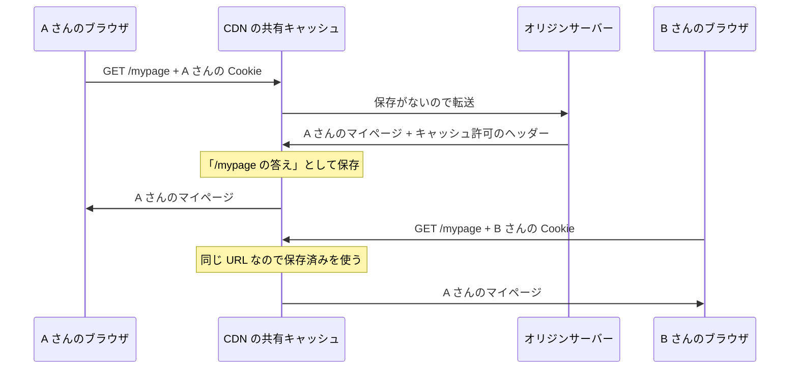

# 共有キャッシュ事故 — 他人のマイページが表示される仕組み

## 今日のゴール

- キャッシュの置き場には私有と共有の 2 種類があると知る
- 個人向けのレスポンスが共有キャッシュに載ると別人に配られる仕組みを知る
- Cache-Control の private と no-store で事故を防げると知る

## 別人の情報が表示される障害

「ログインしたら他人の氏名や住所が表示された」という障害が、実在のサービスで繰り返し起きています。ニュースで見かけたことがあるかもしれません。

不正アクセスの話に聞こえますが、代表的な原因のひとつは攻撃ではありません。**個人向けのページを、大勢に配るためのキャッシュに保存してしまう**という設定ミスです。

ログイン処理のプログラムは正しく動いているのに、設定ひとつで他人の個人情報が配られてしまう。この事故は、キャッシュの置き場の区別を知っていれば防げます。

## 私有キャッシュと共有キャッシュ

キャッシュ（前回の結果を保存しておき、次のアクセスで使い回す仕組み）の置き場は、誰が使うかで 2 種類に分かれます。

| 種類 | 置き場所 | 保存した結果を使う人 |
|------|---------|-------------------|
| **私有キャッシュ** | ブラウザの中 | その端末を使う本人だけ |
| **共有キャッシュ** | CDN やプロキシ | 不特定多数のユーザー |

私有キャッシュ（プライベートキャッシュとも呼ばれます）は、ブラウザが自分のために持つ保存場所です。ここに自分のマイページが残っていても、見るのは本人だけなので問題になりません。

共有キャッシュは、サーバーとブラウザの間に立つ中継サーバーが持つ保存場所です。代表が CDN（世界各地に配置されたキャッシュ専用のサーバーから、ユーザーに近い場所でコンテンツを配る仕組み）で、1 人へのレスポンスを保存しておき、同じ URL へ来た**別の人にも**配ります。

共有キャッシュが成り立つ前提はひとつです。

> 同じ URL には、誰に対しても同じ内容を返してよい

ロゴ画像や CSS、ニュース記事はこの前提を満たします。誰が見ても同じだからこそ、1 回の結果を大勢に使い回せて速くなります。

## 同じ URL で中身が人ごとに違うページ

ところが、ログイン後のマイページはこの前提を満たしません。A さんが開いても B さんが開いても URL は同じ `/mypage` なのに、表示される中身は別人のものです。

サーバーが人を見分けられるのは、ブラウザがリクエストに **Cookie**（サーバーが発行する会員証のような小さなデータ。以降のリクエストに毎回添えられる）を付けて送っているからです。サーバーは Cookie を見て「これは A さんだ」と判断し、A さんの情報でページを組み立てて返します。

つまり、出し分けの手がかりは Cookie にあって、**URL には誰のページかという情報が入っていません**。一方、共有キャッシュが「同じものだ」と判断する基準（キャッシュキー）は基本的に URL です。このずれが事故の入り口になります。

## 事故が起きる流れ

ずれが実際の事故になるのは、個人向けのレスポンスに「キャッシュしてよい」という指示が付いたときです。サーバーがレスポンスヘッダーで許可してしまう場合と、CDN 側の設定で特定のパスを強制的にキャッシュしている場合があります。



1. A さんが `/mypage` を開く。CDN はまだ保存を持っていないので、オリジンサーバー（アプリ本体が動くサーバー）に転送する
2. サーバーは Cookie から A さんだと判断し、A さんのマイページを返す。このレスポンスにキャッシュを許可するヘッダーが付いている
3. CDN はこれを「`/mypage` の答え」として保存し、A さんに返す
4. B さんが `/mypage` を開く。CDN は URL が同じなので保存済みの答え、つまり **A さんのマイページ**を B さんに返す

やっかいなのは、B さんのリクエストがオリジンサーバーに届いていないことです。認証のコードにバグはなく、サーバーのログにも異常が残りにくいので、アプリのコードだけを調べていても原因にたどり着けません。

## 防ぐための Cache-Control

どこに保存してよいかは、サーバーがレスポンスの Cache-Control ヘッダーで指示できます。

| 指定 | 意味 |
|------|------|
| `Cache-Control: private` | 共有キャッシュに保存してはいけない。ブラウザの私有キャッシュは可 |
| `Cache-Control: no-store` | 私有・共有を問わず、どこにも保存してはいけない |
| `Cache-Control: public` | 共有キャッシュに保存してよいと明示する |

マイページのように個人情報を含むレスポンスには、`private` か `no-store` を付けます。ネットカフェのような共有端末ではブラウザに残ることも避けたいので、より厳しい `no-store` を選ぶ判断もあります。

逆に、個人情報を含むレスポンスに `public` や長めの `max-age`（使い回してよい秒数の指定）が付いていたら危険信号です。

### Vary ヘッダー

HTTP には、URL 以外の情報もキャッシュのキーに加える `Vary` というヘッダーもあります。「URL が同じでも、指定したリクエストヘッダーの値が違えば別物として扱え」という指示です。

```
Vary: Accept-Language
```

これを付けると、同じ URL でも日本語版と英語版のレスポンスを別々にキャッシュできます。

では `Vary: Cookie` を付ければ人ごとに分けられるかというと、理屈の上ではそのとおりです。ただし Cookie の値はほぼ全員違うので、保存した結果が次の人に当たることがほぼなくなり、共有キャッシュに置く意味が消えます。個人向けのレスポンスは、分けて置くのではなく、そもそも共有キャッシュに載せないのが実務の基本です。

## 共有キャッシュに載せるものの仕分け

事故の背景には「CDN でキャッシュすれば速くなる」という高速化の圧力があります。それ自体は正しく、全員に同じものを配るページで CDN は絶大な効果を出します。

問題は、速さを求めるあまり、個人向けのページまでまとめてキャッシュの対象にしてしまうことです。だから本当に考えるべきは、キャッシュ機能の使い方より先に、この仕分けです。

- **全員に同じでよいもの**: ロゴ、CSS、商品説明、ニュース記事。共有キャッシュに載せて速くする
- **人ごとに違うもの**: 氏名、購入履歴、カートの中身。共有キャッシュに載せず、毎回サーバーが返す

1 枚のページに両方が混ざっているなら、ページの共通部分は共有キャッシュから配り、個人の部分だけ後からログイン済みの通信で取ってくる、という分け方もよく使われます。

## Next.js と CDN 設定の関係

Next.js のようなフレームワークは、この仕分けをある程度助けてくれます。たとえば Cookie を読んで出し分けるページは自動的に動的な扱いになり、共有キャッシュに保存させないレスポンスヘッダーが付きます。

ただし、それで終わりではありません。CDN 側には「このパスは強制的にキャッシュする」といった設定があり、そこでフレームワークの付けたヘッダーを上書きすれば、同じ事故が起きます。フレームワークが守ってくれる範囲と、インフラの設定で壊せる範囲は別物です。

だからこそ、仕組みを知っていれば言葉で伝えられます。「このページはログインユーザーの個人情報を表示するので、共有キャッシュに保存されないように Cache-Control は private か no-store にしてください」。AI に実装を頼むときも、CDN の設定をチームで相談するときも、この一言で要件が正しく伝わります。

## まとめ

- 共有キャッシュの前提は「同じ URL には同じ内容」で、ログイン後のページはこれを満たさない
- 個人情報を含むレスポンスには `private` か `no-store` を付け、共有キャッシュに載せない
- 全員に同じでよいものと人ごとに違うものの仕分けが設計の本体
