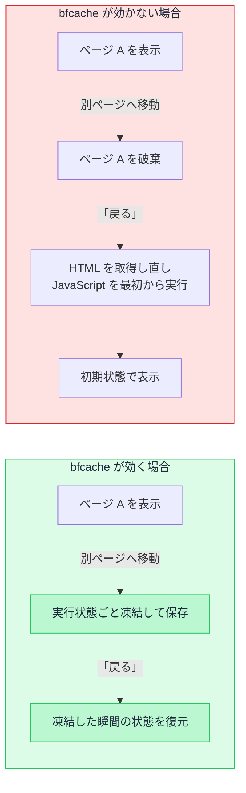

# bfcache — 「戻る」が一瞬で表示される仕組み

## 今日のゴール

- 「戻る」が速いのは、ブラウザがページを実行状態ごと凍結保存しているからだと知る
- bfcache からの復元は pageshow イベントの `event.persisted` で判定できると知る
- unload ハンドラなど、書き方しだいで bfcache が無効になると知る

## 破棄ではなく凍結

ブラウザの「戻る」を押したとき、前のページが読み込みの表示もなく一瞬で出てきたことはないでしょうか。スクロール位置はそのままで、フォームに入力しかけた文字も残っている。一方で、同じ「戻る」でも読み込みが走って、初期状態に戻ってしまうサイトもあります。

この差を作っているのが **bfcache** です。back/forward cache の略で、名前のとおり「戻る」「進む」のためのキャッシュです。

ページを移動すると前のページは捨てられる、と思われがちですが、主要なブラウザは、条件を満たすページを破棄せずに**丸ごと凍結してメモリに保存**します。凍結されるのは画面の見た目だけではありません。JavaScript の変数の中身や実行の途中経過まで、そのままの形で保存されます。

「戻る」「進む」でそのページに帰ってくると、ブラウザは凍結したものをそのまま復元します。HTML を取得し直すわけでも、JavaScript を最初から実行し直すわけでもなく、**離れた瞬間の状態がそのまま帰ってきます**。だから一瞬で表示され、スクロール位置も入力途中の文字も残っています。



「キャッシュ」と聞くと、画像や JS ファイルを保存して次の取得を省く HTTP キャッシュや、フレームワークがデータや HTML を保存しておく仕組みを思い浮かべるかもしれません。bfcache はそれらとは別物です。ファイルやデータという「材料」ではなく、**表示していたページそのもの**を実行状態ごと保存します。

メモリ上の一時的な保存なので、タブを閉じれば消えますし、時間が経つとブラウザの判断で捨てられることもあります。捨てられていた場合は、普通の読み込みに戻るだけです。

## 凍結中の JavaScript

凍結中、そのページの JavaScript は完全に停止します。`setTimeout` や `setInterval` のタイマーも進みません。

セール終了までの残り時間を 1 秒ごとに減らすカウントダウンを例にします。

```js
let remaining = 300; // 残り 300 秒

setInterval(() => {
  remaining -= 1;
  document.querySelector("#countdown").textContent = `残り ${remaining} 秒`;
}, 1000);
```

残り 300 秒の時点で別のページへ移り、60 秒後に「戻る」で帰ってきたとします。実際の残りは 240 秒のはずですが、画面はほぼ「残り 300 秒」のままで、そこから 299、298 と続きのカウントが動き出します。凍結中はタイマーが止まっていて、復元されると凍結した続きから再開するからです。

「一度離れたのにタイマーが動いていない」「戻ったら表示が実際より古い」という現象は、これで説明がつきます。ページは終了したのではなく一時停止していて、復元されると続きから動き出します。

## 復元では load イベントが発火しない

ページを開いたときに 1 回だけ実行したい初期化処理は、load イベントに書くのが定番です。ところが bfcache からの復元は、見た目には「ページを開いた」ようでも読み込みではないので、**load イベントも DOMContentLoaded も発火しません**。JavaScript が続きから再開するだけです。

これが画面では「戻ったら状態が古い」として現れます。たとえば load のタイミングでお知らせの未読件数を取得しているページは、bfcache から復元されても取得が走らないので、離れる前の古い件数のまま表示され続けます。

逆向きも同じです。「ページを離れたら 1 回」のつもりの処理も、凍結ではページが終了しないため、終了を前提にしたイベントは期待どおりに発火しません。

## 復元と離脱を知らせる pageshow と pagehide

この両方向のために、bfcache を前提にしたイベントが用意されています。

表示側は **pageshow** です。通常の読み込みでも bfcache からの復元でも発火し、`event.persisted` が `true` なら bfcache からの復元だと分かります。復元のときだけデータを取り直す、という書き方ができます。

```js
window.addEventListener("pageshow", async (event) => {
  if (!event.persisted) return; // 通常の読み込みでは何もしない

  // bfcache からの復元。凍結中に古くなった未読件数を取り直す
  const res = await fetch("/api/notifications/unread-count");
  const { count } = await res.json();
  document.querySelector("#unread-badge").textContent = count;
});
```

離脱側は **pagehide** です。ページを離れるときに、bfcache に入る場合も入らない場合も発火します。こちらの `event.persisted` は、`true` なら「凍結されて、あとで戻ってくるかもしれない」ことを表します。離脱時の後片付けや記録の送信はここに書きます。

「bfcache 復元時にデータを再取得したいので、pageshow で persisted を見て分岐して」のように、AI への指示にそのまま使える語彙です。

## bfcache が無効になる条件

どんなページでも凍結できるわけではありません。ブラウザが「安全に凍結して、あとで矛盾なく復元できる」と判断したページだけが対象です。開発者側の書き方が原因で対象外になる代表例を挙げます。

まず **unload イベントハンドラ**です。unload はページが完全に終了するときのイベントですが、凍結するとページは終了しないので、ブラウザはこのハンドラを呼ぶ機会を失います。呼ぶ約束を守れないくらいなら凍結しない、という扱いで、unload ハンドラが付いたページは bfcache に入れなくなります。古い記事からコピペしたコードや、昔ながらの解析タグが unload を使っていて、気づかないうちにサイト全体の bfcache を止めていることがあります。離脱時の処理は pagehide に書きます。

**`Cache-Control: no-store`** というレスポンスヘッダー（「この応答を保存するな」というサーバーからの指定）が付いたページも、長らく bfcache の対象外でした。機密情報を扱うページで付けられることが多く、そのページだけ「戻る」が遅い原因になりがちな例です。ただしこの扱いは変わりつつあり、Chrome は段階的な展開を経て 2025 年に、安全と判断できる場合に限って no-store のページも凍結するようになりました。

無効になる条件はこれだけではなく、ブラウザごとの差も時期による変化もあります。覚え込むより確かめ方を知っておくのが実用的です。Chrome DevTools の Application パネルには **Back/forward cache** の項目があり、表示中のページが bfcache に入れるか、入れないなら何が原因かをテストできます。

## 表示速度への効果

bfcache が効いた「戻る」「進む」は、ネットワークにもサーバーにも行かないので、体感はほぼ 0 秒です。

Core Web Vitals（Google が定める、表示速度など利用者の体験の指標）は実際のユーザーの操作をもとに集計されます。「戻る」での閲覧が多いサイトでは、bfcache が効いているかどうかが実測値に直接影響します。unload ハンドラを 1 つ消すだけで数値が改善する、ということも起こります。

## SPA の画面切り替えとの違い

Next.js のようなつくりのサイトでは、サイト内のページ移動は 1 枚のページの中で JavaScript が表示を切り替えています。このときブラウザはページを離れていないので、bfcache の出番はありません。サイト内の「戻る」を速くしているのは、フレームワーク側が持つ別のキャッシュです（Next.js では Router Cache と呼ばれます）。

bfcache が働くのは、ページ丸ごとの移動です。別のサイトへ移動して戻ってきたときのように、ページ全体を離れて帰ってくる場面では、Next.js のサイトでも bfcache が効きます。同じ「戻るが速い」でも、担当している仕組みが違います。

## まとめ

- bfcache はページを JavaScript の実行状態ごと凍結し「戻る」「進む」でそのまま復元する仕組み
- 復元では load は発火しないので pageshow の `event.persisted` で判定する
- unload ハンドラなどで bfcache は無効になり、条件は DevTools でテストできる
