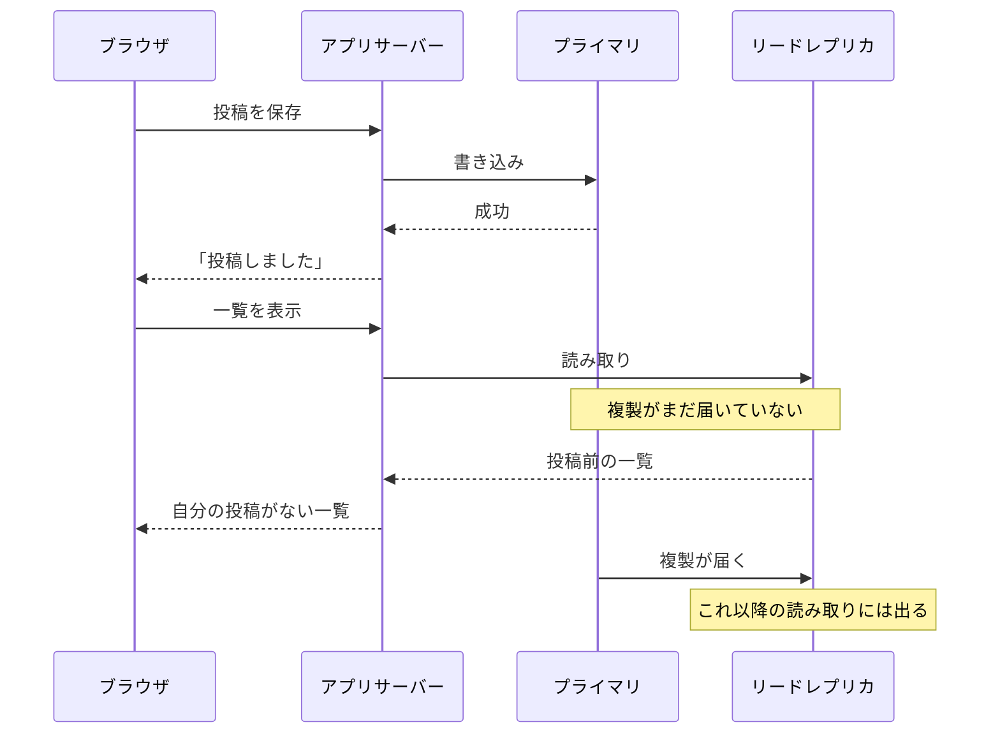

# 結果整合性 — 保存が成功したのに一覧に出てこない仕組み

## 今日のゴール

- 書き込み直後の読み取りが古いデータを返すことがある構造を知る
- それが故障ではなく結果整合性というトレードオフだと知る
- 自分の書き込みをすぐ見せる read-your-own-writes のやり方を知る

## 保存したのに一覧にない

- SNS にコメントを書き込んで、「投稿しました」と表示された
- ところが一覧に戻ると、自分のコメントがどこにもない
- 不安になってもう一度投稿しかけたけれど、数秒待ってリロードしたら、ちゃんと出てきた

こういう体験は、大きなサービスでもたまに起きます。開発中のアプリで起きてバグとして報告すると、「それは仕様です」と返ってくることさえあります。

保存は本当に成功しているのに、直後の読み取りには反映されていない。この一見矛盾した動きは、**データの置き場所が 1 か所ではない**ことから生まれます。

## プライマリとリードレプリカ

Web サービスへのアクセスは、書き込みより読み取りのほうが圧倒的に多いのが普通です。投稿は 1 回でも、その投稿は何千回も読まれます。

1 台のデータベースに読み書きの両方を任せると、読み取りの負荷で手一杯になります。そこで規模の大きいサービスでは、役割を分けるのが定石です。

- **プライマリ**: 書き込みを受け持つ 1 台。データの大元
- **リードレプリカ**: 読み取り専用のコピー。複数台に増やして、読み取りの負荷を分散する

プライマリに書かれた内容は、順次レプリカへ複製されます。読み取りをレプリカに逃がすことで、読者が何倍に増えてもレプリカを足せば耐えられるようになります。

## 複製の遅れと古い読み取り

この複製は一瞬では終わりません。

> **レプリケーションラグ** = 複製がレプリカに届くまでの遅れ。普段は数ミリ秒でも、負荷が高いときには数秒になることがある

問題は、書き込みの直後です。プライマリへの保存は成功したのに、直後の読み取りがまだ複製の届いていないレプリカに向かうと、書き込み前の古い状態が返ってきます。



- **「投稿しました」は嘘ではない**: プライマリには確かに書けている
- **読みに行った先がずれていただけ**: 複製の追いついていないレプリカに読みに行った
- **リロードで直る理由**: そのわずかな間に複製が追いつくから

## 結果整合性というトレードオフ

すべてのコピーを常に一致させることもできます。書き込みのたびに、全レプリカへの反映が終わるまで待って「成功」を返せば済みます。

| 方針 | 得るもの | 失うもの |
|------|---------|---------|
| コピーを常に一致させる | どこを読んでも最新 | 書き込みが遅くなり、レプリカが 1 台でも不調だと書き込み自体が止まる |
| 一瞬のずれを許す | 速さと止まりにくさ | 書き込み直後の読み取りが古いことがある |

多くのサービスは後者に割り切っています。

> **結果整合性**（eventual consistency） = 書いた内容はいずれ全コピーに行き渡るけれど、一瞬はずれていてもよい、とする考え方

つまり「保存したのに一覧にない」は故障ではなく、この割り切りが利用者から見えた瞬間です。だから「仕様です」という返事が返ってきます。

同じ構造は、データベースのレプリカに限りません。「書いた場所と読む場所が違う」ところすべてで起きます。

- CDN やサーバーのキャッシュが、更新前の古い内容を返し続ける
- 記事を保存した直後、サイト内検索にはまだ出てこない（検索インデックスへの反映待ち）
- 外部 API で作成した直後、一覧取得の API にはまだ反映されていない

## 自分の書き込みをすぐ見せる方法

結果整合性で困るのは、実はほぼ 1 場面だけです。

- 他人の投稿が数秒遅れて見えても、誰も気づかない
- でも**自分の投稿が見えないのは、本人にはバグにしか見えない**

この「自分が書いたものは、自分にはすぐ見えてほしい」という要求には、名前が付いています。

> **read-your-own-writes**（自分の書き込みは自分で読める） = 全体は結果整合性のままでよく、自分の分だけすぐ見えることを保証すればいい、という絞り込み

いちばん手軽な方法は、**一覧を読み直さないこと**です。ずれるのは読み直すからで、作成 API の応答に作成結果が含まれているなら、それをそのまま画面の一覧に足せば済みます。

```tsx
"use client";

import { useState } from "react";

type Post = { id: string; title: string };

export function Posts({ initialPosts }: { initialPosts: Post[] }) {
  const [posts, setPosts] = useState(initialPosts);
  const [message, setMessage] = useState("");

  async function formAction(formData: FormData) {
    const res = await fetch("/api/posts", { method: "POST", body: formData });
    if (!res.ok) {
      setMessage("保存できませんでした。もう一度お試しください。");
      return;
    }
    const created: Post = await res.json(); // 応答に作成結果が入っている
    setPosts((prev) => [created, ...prev]); // 一覧を読み直さず、応答を直接足す
    setMessage("投稿を保存しました。");
  }

  return (
    <>
      <form action={formAction}>
        <label htmlFor="title">タイトル</label>
        <input id="title" name="title" required />
        <button type="submit">投稿する</button>
      </form>
      <p role="status">{message}</p>
      <ul>
        {posts.map((post) => (
          <li key={post.id}>{post.title}</li>
        ))}
      </ul>
    </>
  );
}
```

結果メッセージを `role="status"` の要素に出しているのは、スクリーンリーダーの利用者に成功と失敗を読み上げで伝えるためです。空のままあらかじめ置いておくと、中身が変わった時点で読み上げられます。

似た手法との違いも整理しておきます。

| 手法 | 画面に出すもの |
|------|---------------|
| 楽観的更新 | サーバーの応答を待たずに、成功を仮定した結果を先に見せる |
| 応答の直接反映 | サーバーが確定した結果を使う。成功は確認済み |

ずれているのは読み直し先のデータだけなので、応答を使えば正しい表示になります。

サーバー側で保証する方法もあります。

- 書き込んだ直後の読み取りだけ、レプリカではなくプライマリに向ける
- 書き込んだ直後だけ、キャッシュを使わず取得し直す

Next.js にも、この用途の API があります。

- **何をするか**: 一覧をタグ付きでキャッシュしている場合、Server Action の中で `updateTag(tag)` を呼ぶと、そのタグのキャッシュが即時に無効化される
- **効果**: 自分の書き込みが直後の表示に反映される
- **位置づけ**: read-your-own-writes のための即時無効化として用意されていて、Server Action 専用

```ts
// app/posts/actions.ts
"use server";

import { updateTag } from "next/cache";

export async function createPost(formData: FormData) {
  await fetch("https://api.example.com/posts", {
    method: "POST",
    body: formData,
  });

  updateTag("posts"); // 一覧のキャッシュを即時無効化して、自分の投稿を直後の表示に反映する
}
```

## バグ報告の切り分け

この構造を知っていると、あやふやなバグ報告に当たりが付けられます。次の 3 つがそろったら、結果整合性を疑う価値があります。

- 「リロードしたら直った」
- 「たまに出ないことがある」
- 「手元では再現しない」

切り分けの問いはこうなります。

- 書いた場所と読んだ場所は同じか。間にレプリカ・キャッシュ・検索インデックスを挟んでいないか
- 時間をおくと直るか。直るなら、壊れているのではなく追いついていない
- 困っているのは全員か、書いた本人だけか。本人だけなら read-your-own-writes の保証が抜けている

言葉を知っていること自体も、そのまま役立ちます。

- **チームの会話で**: 「これは結果整合性では」「read-your-own-writes はどう保証していますか」と聞けると、話が一気に具体的になる
- **AI への指示で**: 「作成 API の応答を一覧に直接反映して」「保存後は updateTag でキャッシュを無効化して」と、欲しい挙動を一言で伝えられる

## まとめ

- 規模の大きいサービスは書き込みをプライマリ、読み取りをレプリカに分けるため、複製の遅れで古い読み取りが起きる
- コピーの一致を諦めて速さと止まりにくさを取るのが結果整合性で、故障ではない
- 自分の書き込みは応答の直接反映やキャッシュの即時無効化で read-your-own-writes を保証する
