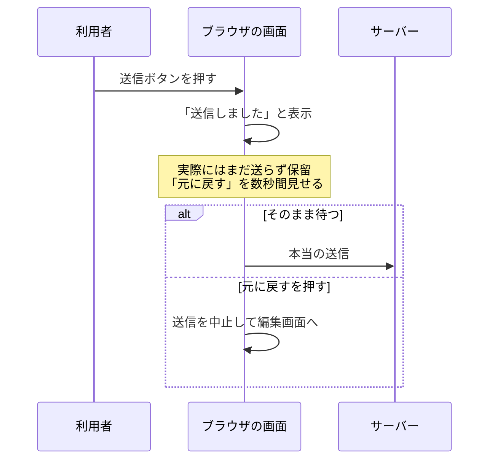

# 取り消せる設計 — 確認ダイアログより Undo が効く場面

## 今日のゴール

- 確認ダイアログは慣れると読まれなくなり、誤操作を防ぎきれないと知る
- Undo は画面上の出来事と取り返しのつかない実行を切り離して成り立つと知る
- 遅延実行とソフトデリートという 2 つの実装の型を知る

## Gmail の送信取り消しの仕組み

Gmail でメールを送信すると、画面の隅に「メッセージを送信しました」と表示され、その隣にしばらく「元に戻す」が出ています。押すと送信が取り消され、編集画面に戻ります。

一度送ったメールを相手の受信箱から回収しているように見えますが、そうではありません。

- この時点で Gmail は**まだメールを送信していない**
- 設定に応じて数秒から 30 秒ほど送信を保留し、その間だけ「元に戻す」を見せている
- 押されたら、保留していた送信そのものを中止する

つまりこの機能は「実行してから戻す」のではなく、**実行を遅らせて、戻れる時間を作る**仕組みです。この考え方は Gmail に限らず、削除や送信のような取り返しのつかない操作を守る設計全般に通じます。

## 確認ダイアログの限界

破壊的な操作の守り方として定番なのは、実行前に「本当に削除しますか？」と確認を挟むことです。ただ、この守り方にはよく知られた弱点があります。

- **毎回出る確認は、読まれなくなる**: 削除のたびにダイアログが出ると、人は「OK を押せば進む」ことだけを学習し、文面を読まずに反射で OK を押すようになる。守るつもりで挟んだ確認が、慣れると単なる追加のワンクリックになる
- **より根本的には、誤操作の瞬間、本人は間違えているつもりがない**: 消すファイルを取り違えた人は、「正しいファイルを消している」と思いながらダイアログを見るので、迷わず OK を押す。間違いに気づくのは実行された結果を見た後で、事前の確認はそのタイミングでは間に合わない

## 事後に救済する Undo 方式

Undo 方式は、確認を挟む代わりに操作を即座に画面へ反映します。そのうえで、「元に戻す」の手段をしばらく提示しておきます。

確認ダイアログとの違いは、救済のタイミングです。

| | 確認ダイアログ | Undo |
|---|---|---|
| 守るタイミング | 実行の前 | 実行の後 |
| 頼るもの | 本人が間違いに気づいていること | 結果を見て間違いに気づけること |
| 操作の流れ | 毎回止まる | 止まらない |

- 誤操作した本人は、実行前には自分を疑っていない
- 結果が画面に出て初めて「違う、これじゃない」と気づく
- Undo は、その**気づいた後**に救済が間に合う守り方

## Undo を成立させる 2 つの実装

Undo は「元に戻せます」と画面で約束する機能なので、本当に戻せる裏付けが実装に必要です。作り方は主に、遅延実行とソフトデリートの 2 つに分かれます。

### 遅延実行

Gmail の送信取り消しがこの型です。

- 画面では「送信しました」と表示しつつ、本当の処理は保留しておく
- 「元に戻す」が押されたら、保留していた実行そのものをやめる



メール送信のように、**一度実行したら相手側に届いてしまい、後からは取り消せない操作**に向いています。実行した後に取り消すのは難しくても、実行する前にやめるのは簡単だからです。

### ソフトデリート

削除の Undo でよく使われるのがソフトデリートです。

> **ソフトデリート** = 「削除」と言いながら実データは消さず、削除フラグを立てて画面に出さなくするだけの削除

```sql
-- 「削除」は削除日時を記録するだけ。行そのものは残る
UPDATE messages SET deleted_at = NOW() WHERE id = 42;

-- 一覧にはフラグの立っていない行だけを出す
SELECT * FROM messages WHERE deleted_at IS NULL;

-- 「元に戻す」はフラグを外すだけ
UPDATE messages SET deleted_at = NULL WHERE id = 42;
```

- 利用者から見れば消えているが、データは残っているので、いつでも戻せる
- メールソフトやファイル共有サービスの「ゴミ箱」はこの型
- 本当の削除は、ゴミ箱を空にしたときや、30 日のような保管期限が来たときにまとめて行う

### 共通の構造

2 つの型は、やっていることは違っても構造は同じです。

> **画面上の出来事と、取り返しのつかない実行を切り離す。** 画面では「送信した」「削除した」と見せながら、裏では取り消せない一線をまだ越えていない

Undo が押されるかもしれない時間だけ、その一線の手前で待っています。

## Undo トースト実装の注意点

操作直後に画面の隅へ出る「削除しました 元に戻す」の小さな通知を、トーストと呼びます。Undo の入り口として定番ですが、実装ではいくつか配慮が要ります。

```tsx
function UndoToast({ onUndo }: { onUndo: () => void }) {
  return (
    <div role="status">
      <p>メッセージを削除しました</p>
      <button type="button" onClick={onUndo}>
        元に戻す
      </button>
    </div>
  );
}
```

- **`role="status"` を付ける**: トーストは画面の隅に突然現れるため、スクリーンリーダーの利用者は出たことに気づけません。`role="status"` を付けると、表示された内容がフォーカスを奪わずに読み上げられます
- **数秒で消える通知だけに頼らない**: 表示時間内に「元に戻す」を押せない人がいます。読み上げを聞いている途中で消える、手の動きに時間がかかるなど、間に合わない事情はさまざまです。表示時間を長めに取る、マウスが乗っている間は消さない、トーストを逃してもゴミ箱から戻せる、というように**戻る経路を複数用意**します
- **削除ボタン自体のガードも省略しない**: Undo があるからといって、誤操作しやすい UI でよいわけではありません。よく使うボタンから距離を取る、色だけでなくラベルで危険を伝える、といった予防は引き続き効きます

## 確認ダイアログが正しい場面

Undo が万能というわけでもありません。**取り消しが用意できず、被害が大きい操作**には、確認ダイアログが今も正解です。

たとえば GitHub でリポジトリを削除するときは、確認画面でリポジトリ名をそのまま入力させられます。

- 名前の入力は、わざと手間を増やして、反射で OK を押せなくする工夫
- 読まずに押せるボタンと違い、対象の名前を打ち込むには、いま何を消そうとしているかを見るしかない

ここまでを並べると、守り方は手間の強さの階段になっています。

| 操作 | 守り方 |
|------|--------|
| 失敗してもすぐ戻せる | Undo で流れを止めない |
| 戻せるが影響が広い | 確認ダイアログで一度止める |
| 戻せず被害が大きい | 名前の入力のように手間を意図的に増やす |

手間の強さを被害の大きさに比例させると、日常の操作は速いまま、危ない操作だけを慎重にできます。

## AI への指示に活かす

何も指定せずに AI へ削除機能を任せると、`confirm("本当に削除しますか?")` で確認を挟む定番の形になりがちです。動きはしますが、守り方を選んだ結果ではありません。

守り方の選択肢を知っていれば、設計ごと指示できます。

- 「削除はソフトデリートにして、Undo トーストを出して。トーストには `role="status"` を付けて」
- 「送信は数秒の遅延実行にして、その間は取り消せるようにして」
- 「アカウント削除は取り消せないから、確認でアカウント名を入力させて」

出てきたコードを評価するときも、「この操作、間違えて押した人はどう戻るのか」が定番の視点になります。

## まとめ

- 確認ダイアログは慣れで読まれなくなり、誤操作は事前の確認をすり抜ける
- Undo は遅延実行かソフトデリートで、画面上の出来事と取り返しのつかない実行を切り離す
- 戻せない操作にだけ強い確認を使い、手間の強さを被害の大きさに比例させる
