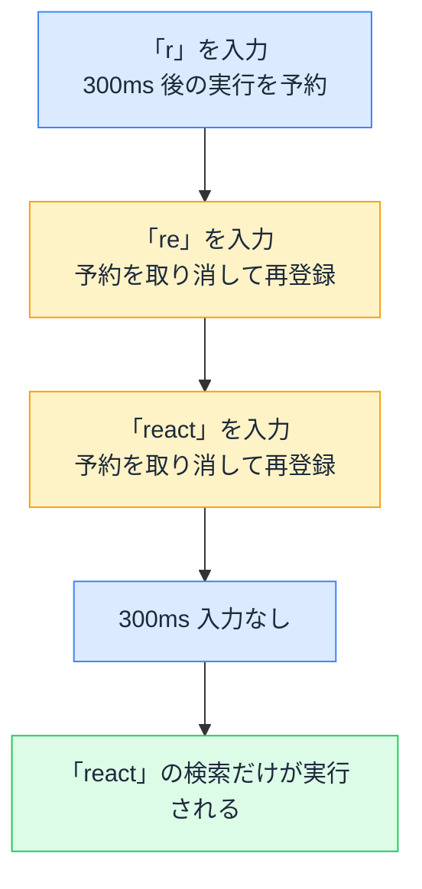

# debounce と throttle — リクエストの頻度を減らす 2 つの型

## 今日のゴール

- 入力のたびに fetch する実装は通信の頻度に問題を抱えると知る
- debounce は操作が止んでから 1 回だけ実行する調整だと知る
- throttle は一定間隔に間引いて実行し続ける調整だと知る

## 1 文字ごとに飛ぶリクエスト

検索ボックスに文字を打つと、入力のたびに下の候補が絞り込まれていく。EC サイトの商品検索でおなじみの動きです。これを素直に実装すると、「入力が変わるたびに fetch する」コードになります。

```tsx
"use client";

import { useEffect, useState } from "react";

type Book = { id: string; title: string };

export function BookSearch() {
  const [query, setQuery] = useState("");
  const [results, setResults] = useState<Book[]>([]);

  useEffect(() => {
    if (query === "") {
      setResults([]);
      return;
    }
    fetch(`/api/books?q=${encodeURIComponent(query)}`)
      .then((res) => res.json())
      .then((data: Book[]) => setResults(data));
  }, [query]); // query が変わるたびに fetch が飛ぶ

  return (
    <div>
      <label htmlFor="book-search">書籍名で検索</label>
      <input
        id="book-search"
        type="search"
        value={query}
        onChange={(e) => setQuery(e.target.value)}
      />
      <p aria-live="polite">{results.length} 件見つかりました</p>
      <ul>
        {results.map((book) => (
          <li key={book.id}>{book.title}</li>
        ))}
      </ul>
    </div>
  );
}
```

件数を出している `aria-live="polite"` は、結果が入れ替わったことをスクリーンリーダーにも伝えるための指定です。文字を打つだけで画面の下のほうが変わる UI では、入れておきたい配慮です。

さて、このコードは動きます。ただし「react」と打つと、「r」「re」「rea」「reac」「react」で 5 回 fetch が飛びます。

- 画面に表示したいのは最後の「react」の結果だけなのに、残り 4 回分の通信は無駄になる
- 利用者が増えるほど、サーバーには打鍵の数だけリクエストが届く
- 外部の検索 API を使っていれば、回数制限や課金にそのまま響く

タイピングは 1 文字あたり 100ms 程度の間隔で連続します。通信よりずっと速いペースで発生するイベントに、毎回そのまま反応しているのが問題です。この「速すぎる操作」への調整には「まとめる」と「間引く」の 2 通りがあり、それぞれ **debounce**、**throttle** と呼ばれています。

## まとめる型の debounce

debounce は、**操作が止んでから一定時間たって、はじめて実行する**調整です。仕組みの核はタイマーのリセットにあります。

- 呼び出されるたびに「300ms 後に実行する」という予約を入れる
- 予約が残っているうちに次の呼び出しが来たら、前の予約を取り消して入れ直す
- 300ms 何も来なければ、最後の予約だけが実行される



素の JavaScript で書くと、骨子は `setTimeout` と `clearTimeout` の組み合わせだけです。

```js
function debounce(fn, delay) {
  let timerId;
  return (...args) => {
    clearTimeout(timerId); // 前の予約を取り消す
    timerId = setTimeout(() => fn(...args), delay); // 予約を入れ直す
  };
}

const search = debounce((query) => {
  console.log(`「${query}」で検索`);
}, 300);

search("r");
search("re");
search("react"); // 300ms 後、この 1 回だけが実行される
```

打ち終わるのを待ってから動くので、検索ボックスの入力のほか、ウィンドウリサイズが終わったのを見計らってレイアウトを計算し直す、といった場面に向きます。待ち時間は長すぎると反応が鈍く感じられるため、検索では 200〜500ms あたりがよく選ばれます。

## React での debounce

React では、useEffect の中でタイマーを仕掛け、クリーンアップで取り消す形で書けます。クリーンアップ関数は次の副作用が実行される直前に呼ばれるので、「新しい入力が来たら前の予約を取り消す」という debounce の動きがそのまま作れます。冒頭のコンポーネントの useEffect を、こう書き換えます。

```tsx
useEffect(() => {
  if (query === "") {
    setResults([]);
    return;
  }
  const timerId = setTimeout(() => {
    fetch(`/api/books?q=${encodeURIComponent(query)}`)
      .then((res) => res.json())
      .then((data: Book[]) => setResults(data));
  }, 300); // 300ms 後の検索を予約する
  return () => clearTimeout(timerId); // 次の入力が来たら予約を取り消す
}, [query]);
```

query が変わるたびに前のタイマーが取り消され、入力が 300ms 止んだときだけ fetch が実行されます。タイマーを仕掛ける副作用に、対になる後片付けとして clearTimeout を返す。useEffect の作法をそのまま守ることが、debounce の実装になっています。

なお、lodash などのユーティリティライブラリにも debounce は用意されています。中で起きているのは、ここで見たタイマーのリセットと同じです。

## 間引く型の throttle

throttle は、**一定時間に 1 回までしか実行しない**よう間引く調整です。debounce と違って、操作が止むのを待ちません。操作が続いている間も、一定間隔で実行され続けます。

```js
function throttle(fn, interval) {
  let ready = true;
  return (...args) => {
    if (!ready) return; // 間隔が空くまでは何もしない
    ready = false;
    fn(...args);
    setTimeout(() => {
      ready = true; // 一定時間たったら、また実行できるようにする
    }, interval);
  };
}

window.addEventListener(
  "scroll",
  throttle(() => {
    console.log(`スクロール位置: ${window.scrollY}`);
  }, 200)
);
```

スクロールイベントは、画面を 1 回スクロールする間に何十回も発生します。発生し続けるけれど、そのすべてに反応する必要はない。こういうイベントの代表格です。debounce にしてしまうとスクロールが止まるまで何も起きないので、動いている間も追従したい処理には throttle を使います。ボタンの連打対策も同じ発想です。

この実装は骨子です。実際のユーティリティは「期間の最後の呼び出しも実行するか」などのオプションを持っていて、もう少し作り込まれています。

## 2 つの使い分け

|  | debounce | throttle |
|---|---------|----------|
| 動き | 止まってから 1 回実行 | 一定間隔で実行し続ける |
| 操作が続いている間 | 何も起きない | 間引かれながら実行される |
| 向く場面 | 検索入力、リサイズの完了検知 | スクロール追従、連打対策 |

迷ったら「最後の状態だけ分かればよいか、途中経過にも反応したいか」で選べます。検索は最後の入力だけ分かればよいので debounce、スクロール追従は途中経過に反応したいので throttle です。

## 競合状態とは別の問題

debounce を入れると fetch の回数は減りますが、リクエストが常に 1 本になるわけではありません。300ms より長い間を置いて打ち足せば、リクエストは複数飛びます。そして通信の所要時間は毎回違うので、**後に投げたリクエストが先に返ってくる**ことがあります。

古いレスポンスが遅れて届き、新しい検索結果を上書きしてしまう。これは競合状態（race condition）と呼ばれる、頻度とは独立した問題です。

- debounce と throttle が解決するのは「そもそもリクエストを送る頻度」
- 競合状態の対策が解決するのは「返ってきたレスポンスの順序の乱れ」で、古いレスポンスを無視する、AbortController で中断するといった方法を使う

片方を入れてももう片方は解決しないので、検索ボックスのような機能では、実務で両方を組み合わせることもあります。

## AI への指示の語彙

検索機能の実装を AI に任せるとき、出てきたコードを確かめる観点は「入力のたびに fetch がそのまま飛んでいないか」です。頻度の調整が入っていなくても検索としては動いてしまうので、動作確認だけでは気づけません。useEffect の中に setTimeout と clearTimeout の対があるかを見ます。

作らせる段階なら、最初からこう指示できます。

> 検索の fetch には 300ms の debounce を入れて。useEffect で setTimeout を仕掛けて、クリーンアップで clearTimeout する形で

debounce と throttle という言葉を知っているだけで、「入力が落ち着いてから検索してほしい」「スクロール中も間引きながら反応してほしい」という要望が一言で伝わるようになります。

## まとめ

- 速すぎる操作への調整は、止まってからまとめて実行する debounce と、一定間隔に間引く throttle
- React の debounce は useEffect で setTimeout を仕掛け、クリーンアップで clearTimeout する
- 頻度を減らしても、レスポンスの順序が乱れる競合状態は別の問題として残る
