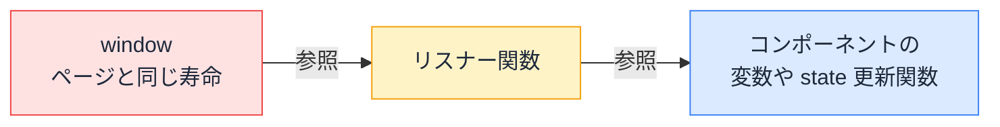

# メモリリーク — 消し忘れたリスナーとタイマーがタブを重くする

## 今日のゴール

- ブラウザが不要なメモリを自動で回収する条件を知る
- 解除し忘れたリスナーやタイマーがメモリリークになる仕組みを知る
- 「登録と解除が対になっているか」というコードの確認観点を持つ

## 長時間開いたタブが重くなる現象

Web アプリを何時間も開きっぱなしにしていると、だんだん動きが重くなることがあります。スクロールがカクつく、クリックの反応が鈍い、ひどいときはタブごと固まる。そしてリロードすると直ります。

リロードで直るのは、ページの JavaScript がまるごと作り直され、それまでにメモリへ溜まっていたものが一度に解放されるからです。裏を返せば、リロードするまで**何かがメモリに溜まり続けていた**ことになります。

このように、使い終わったはずのメモリが解放されずに増え続ける状態を**メモリリーク**（memory leak）と呼びます。今日は、フロントエンドで特に多い「イベントリスナーとタイマーの消し忘れ」によるメモリリークを見ます。

## ガベージコレクションの仕組み

JavaScript では、メモリの解放を自分で書きません。ブラウザの JavaScript エンジンが「もう使われていないオブジェクト」を自動で見つけて回収します。この仕組みを**ガベージコレクション**（GC）と呼びます。

回収の条件は「**どこからも参照されていないこと**」です。

```js
function greet() {
  const user = { name: "Ozaki" }; // ここで作られたオブジェクトは
  console.log(`Hello, ${user.name}`);
} // 関数が終わると誰からも参照されなくなり、GC の回収対象になる

greet();
```

普段はこの仕組みのおかげで、メモリを意識せずに書けます。ただし GC には裏返しの性質があります。**参照が 1 本でも残っているオブジェクトは、絶対に回収しない**のです。GC から見れば「まだ誰かが使うかもしれない」ものだからです。

つまりメモリリークの多くは、GC の故障ではありません。書いた人は不要だと思っているのに、**参照が残っているせいで GC が回収できない**オブジェクトの積み重ねです。

## コンポーネントより長生きするものへの登録

React のコンポーネントは、画面遷移などで表示されなくなれば役目を終えます。ところが `window` や `document` は、**ページを開いている間ずっと生きています**。

この寿命の違いが問題を起こします。コンポーネントの中で `window.addEventListener` を呼ぶと、`window` がそのリスナー関数への参照を持ちます。さらにリスナー関数は、自分の中で使っているコンポーネントの変数や state 更新の関数を抱え込んでいます。



コンポーネントが画面から消えても、この参照の鎖は切れません。`window` からリスナー関数まで参照を辿れる限り、リスナー関数も、それが抱えた変数も、GC は回収できないのです。**表示が消えることと、メモリから消えることは別**です。

`setInterval` や `setTimeout` も同じです。タイマーは `clearInterval` などで止めるまでブラウザの中で生き続け、コールバック関数とその中で使っている変数を参照し続けます。コンポーネントが消えたあとも、タイマーは裏で動き続けます。

## クリーンアップを書き忘れたコード

React では、リスナーやタイマーの登録は `useEffect` の中で行い、return した関数（クリーンアップ関数）で解除するのが決まった形です。この解除を書き忘れると、上の参照の鎖がそのまま残ります。

```tsx
import { useEffect, useState } from "react";

function ScrollTopButton() {
  const [visible, setVisible] = useState(false);

  useEffect(() => {
    const onScroll = () => setVisible(window.scrollY > 100);
    window.addEventListener("scroll", onScroll);
    // ❌ クリーンアップが無い
  }, []);

  if (!visible) return null;
  return <a href="#top">トップへ戻る</a>;
}
```

このボタンがある画面を開いて、別の画面へ移動して、また戻ってくる。この往復のたびに、`onScroll` が `window` に 1 個ずつ積み上がります。10 回行き来すれば 10 個です。

- スクロールするたびに 10 個のリスナーが全部実行され、処理が何重にも走る
- もう表示されていないコンポーネントの state を更新しようとするリスナーも動き続ける
- リスナーが抱えた関数やデータは回収されず、メモリ使用量が増え続ける

クリック 1 回で処理が 2 回 3 回動く、という不可解なバグも、この「リスナーの積み重なり」でよく起きます。

正しい形はこうです。

```tsx
useEffect(() => {
  const onScroll = () => setVisible(window.scrollY > 100);
  window.addEventListener("scroll", onScroll);
  return () => window.removeEventListener("scroll", onScroll); // ✅ 対になる解除
}, []);
```

タイマーも同じく、登録した `useEffect` のクリーンアップで止めます。

```tsx
useEffect(() => {
  const id = setInterval(() => {
    setCount((c) => c + 1);
  }, 1000);
  return () => clearInterval(id); // ✅ ID を控えておいて止める
}, []);
```

### 書いてあっても解除できていないパターン

`removeEventListener` には、**登録したときと同じ関数**を渡す必要があります。見た目が同じでも、その場で書いた無名関数は別の関数オブジェクトなので解除できません。

```tsx
useEffect(() => {
  window.addEventListener("scroll", () => setVisible(window.scrollY > 100));
  // ❌ 解除しているつもりで、登録したものとは別の関数を渡している
  return () =>
    window.removeEventListener("scroll", () => setVisible(window.scrollY > 100));
}, []);
```

エラーは出ません。解除に失敗したまま、静かにリスナーが積み上がります。関数を `onScroll` のような変数に入れて、**登録と解除に同じ変数を渡す**のが確実です。

## メモリリークの確かめ方

疑わしいときは、Chrome DevTools の **Memory パネル**で確かめられます。ヒープスナップショットというメモリの中身の記録を、画面の開閉を繰り返す前と後で撮って比較し、同じ操作の繰り返しでメモリが増え続けていないかを見ます。今日は「そういう調べ方がある」と知っておけば十分です。

メモリリークは発症が遅い問題です。開発中の数分の動作確認では何も起きず、何時間も開きっぱなしにする利用者のところで初めて表面化します。

だからこそ、動いた後に測るより、**コードを見た時点で「登録と解除が対になっているか」を確認する**ほうが安上がりです。AI の出力をレビューするときも、`addEventListener` や `setInterval` を見つけたら「対になる解除はクリーンアップにある?」と確認する、という観点がそのまま使えます。

## まとめ

- GC は「どこからも参照されていない」オブジェクトだけを回収する
- `window` やタイマーへの登録は、解除しない限りコンポーネントより長生きする
- `addEventListener` と `removeEventListener`、`setInterval` と `clearInterval` を対でチェックする
