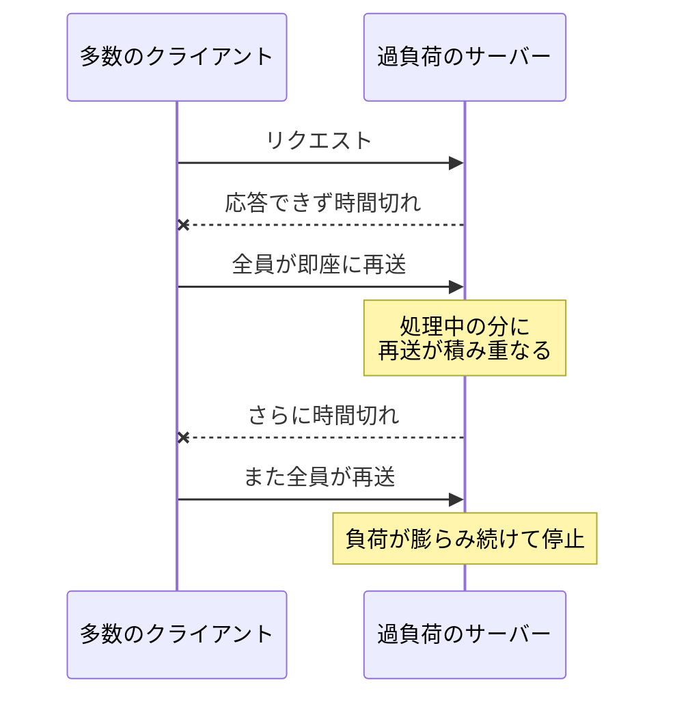

# タイムアウトとリトライ — 待ちすぎず、諦めすぎない

## 今日のゴール

- fetch は待ち時間の上限を持たず、タイムアウトは自分で付けるものだと知る
- 失敗して即座に再送する実装が、雪だるま式の障害につながると知る
- 指数バックオフとジッターというリトライの定番の待ち方を知る

## 「送信中」のまま動かない画面

フォームの送信ボタンを押したら、ボタンが「送信中…」に変わったまま、1 分たっても画面が変わらない。あるいは、読み込み中のくるくるが回り続けて、いつまでも一覧が表示されない。誰でも見たことのある固まり方です。

こうなったとき、利用者にできることは、いつ終わるかわからないまま待ち続けるか、再読み込みして最初からやり直すかしかありません。どちらを選んでも体験は台無しです。

この固まり方の一因が、通信に**タイムアウト**がないことです。タイムアウトは、一定時間内に応答がなければ失敗とみなして諦める仕組みを指します。

## fetch はいつまでも待ち続ける

データ取得の素朴な形はこうです。

```ts
const res = await fetch("/api/products");
const products = await res.json();
```

相手のサーバーが完全に落ちていて接続すらできないなら、fetch は比較的すぐエラーになります。厄介なのは、接続はできたのに応答が返ってこないときです。サーバーが過負荷で処理が詰まっている、途中のネットワークが不調で応答が届かない、といった「固まった相手」を前にすると、fetch は待つのをやめません。

fetch には待ち時間の上限を指定するオプションがありません。何も指定しなければ、ブラウザが持つ独自の上限に達するまで待ち続けます。上限はブラウザごとに違いますが、どれも分の単位なので、画面の前の利用者にとっては永遠と同じです。「送信中」のまま動かないボタンは、こうして生まれます。

## AbortSignal.timeout で上限を決める

待ち時間の上限は、**AbortSignal.timeout()** で付けられます。指定した時間がたつと中断の合図を出す signal を作る標準の Web API で、fetch に渡しておくと、その時間で通信が自動的に打ち切られます。

```ts
try {
  const res = await fetch("/api/products", {
    signal: AbortSignal.timeout(5000), // 5 秒たったら自動的に中断する
  });
  const products = await res.json();
} catch (error) {
  if (error instanceof DOMException && error.name === "TimeoutError") {
    // 時間切れ。「読み込めませんでした」を画面に伝える
  } else {
    throw error;
  }
}
```

signal は、検索画面などで古いリクエストを中断するときに使う AbortController と同じ仕組みです。AbortController が自分の好きなタイミングで中断の合図を出すのに対して、AbortSignal.timeout() は「時間がたったら自動で合図を出す」を 1 行で書けるようにしたものです。時間切れで中断された fetch は TimeoutError という名前のエラーで失敗するので、ほかの失敗と区別したいときはこの名前で判定します。

何秒にするかに唯一の正解はありません。検索候補のようにすぐ返るはずの通信なら数秒、ファイルのアップロードのように時間がかかって当然の通信なら長めに取ります。大事なのは上限を決めてあることそのもので、上限さえあれば、固まる代わりに失敗を画面に伝えて、利用者にやり直しの選択肢を返せます。

そして、失敗したと分かれば次の手が打てます。もう一度試すこと、つまりリトライです。

## 即座のリトライが相手を追い詰める

通信の失敗の多くは、サーバーが一瞬混んでいた、電波が一瞬途切れた、といった一時的なものです。少し待ってもう一度送れば成功することは珍しくありません。だから、失敗したら自動でもう一度試すリトライは、それ自体は正しい発想です。

危ないのはやり方です。サーバーの応答が遅くなるのは、たいてい過負荷のときです。そこにタイムアウトで諦めたクライアントたちが間を置かず再送すると、処理が終わっていないリクエストの上に新しいリクエストが積み重なり、サーバーはさらに遅くなります。遅くなればもっと多くのクライアントがタイムアウトし、もっと多くの再送が飛びます。リクエストが雪だるま式に膨らんで、落ちかけていたサーバーが完全に落ちます。



リトライは、相手が弱っているときほど発動する機能です。だからこそ、弱った相手に追い打ちをかけない待ち方が要ります。

## 指数バックオフで間隔を広げる

定番の待ち方が**指数バックオフ**（exponential backoff）です。リトライのたびに、待つ時間を倍々に増やします。

- 1 回目の失敗のあとは 1 秒待って再送する
- 2 回目の失敗のあとは 2 秒待つ
- 3 回目の失敗のあとは 4 秒待つ

失敗が続くのは相手の不調が続いているということなので、続くほど長く間を空けて、回復の時間を与えます。あわせて回数の上限も決めます。3 回試して駄目なら、それ以上は自動で粘らず、失敗を画面に伝えて利用者に判断を返します。

## ジッターでタイミングを散らす

指数バックオフだけでは足りない場面があります。サーバーが一瞬落ちた瞬間、リクエスト中だった 1000 のクライアントが同時に失敗したとします。全員が同じルールで「1 秒待って再送」すると、1 秒後に 1000 件の再送が一斉に届きます。それも失敗すれば、次は 2 秒後にまた一斉に届きます。間隔は空いているのに、波になって押し寄せる状況は変わりません。大勢が同じタイミングで殺到するこの現象を**サンダリングハード問題**（thundering herd）と呼びます。

対策は、待ち時間にランダムなブレを混ぜることです。このブレを**ジッター**（jitter）と呼びます。

| リトライ | バックオフのみ | ジッターを混ぜた場合 |
|---------|--------------|--------------------|
| 1 回目 | 全員が 1 秒後 | 1〜2 秒後にばらける |
| 2 回目 | 全員が 2 秒後 | 2〜3 秒後にばらける |
| 3 回目 | 全員が 4 秒後 | 4〜5 秒後にばらける |

一人ひとりの待ち時間はほとんど変わらないのに、全体で見るとリクエストが時間軸の上に散らばります。サーバーにとって、1000 件が同じ瞬間に届くのと、1 秒の幅にぱらぱらと届くのとでは大違いです。

## タイムアウトとリトライを組み合わせる

ここまでの部品を 1 つの関数にまとめると、こうなります。

```ts
async function fetchWithRetry(
  url: string,
  options: RequestInit = {},
  maxRetries = 3,
): Promise<Response> {
  for (let attempt = 0; attempt <= maxRetries; attempt++) {
    try {
      const res = await fetch(url, {
        ...options,
        signal: AbortSignal.timeout(5000), // 1 回の試行は 5 秒で諦める
      });
      if (res.status >= 500) {
        // サーバー側の一時的な不調の可能性が高いので、リトライの対象にする
        throw new Error(`サーバーエラー: ${res.status}`);
      }
      return res;
    } catch (error) {
      if (attempt === maxRetries) {
        throw error; // 上限に達したら、失敗を呼び出し元に伝える
      }
      const backoff = 1000 * 2 ** attempt; // 1 秒 → 2 秒 → 4 秒
      const jitter = Math.random() * 1000; // 0〜1 秒のランダムなブレ
      await new Promise((resolve) => setTimeout(resolve, backoff + jitter));
    }
  }
  throw new Error("到達しない");
}

// 商品一覧の取得。一時的な失敗なら自動で立ち直る
const res = await fetchWithRetry("/api/products");
const products = await res.json();
```

- リトライするのは、時間切れ・ネットワークの失敗・500 番台の応答。どれも時間を置けば直るかもしれない失敗です
- 400 番台の応答はリトライせずそのまま返します。存在しない URL や権限不足、入力の不備といったリクエスト自体の間違いは、何回送り直しても同じ結果だからです
- 待ち時間は 1 秒、2 秒、4 秒と倍々に増やし、`Math.random()` のブレで散らします

## リトライに向く操作と向かない操作

リトライを入れる前に、もう 1 つ確かめることがあります。その操作は、もう一度実行しても安全か、です。

商品一覧の取得のような読むだけの操作は、何回やり直しても結果が変わらないので、安心してリトライできます。この「何回実行しても 1 回と同じ結果になる」性質を**冪等**（べきとう）と呼び、HTTP では GET がこれにあたります。一方、注文の登録のような POST の操作は、再送すると 2 件目の登録になりかねません。サーバー側に同じリクエストの 2 回目を受け流す仕組みがあると分かっている場合を除き、自動リトライは取得系に限定するのが安全です。

## AI への指示の語彙

データ取得の実装は、特に何も伝えなければ fetch を呼ぶだけの素朴な形になりがちです。その形は、相手のサーバーが健康なあいだは問題なく動きます。確かめる観点は「相手が固まったとき、この画面はどうなるか」と「失敗したとき、再送はどんな間隔で走るか」です。

作らせる段階なら、最初からこう指示できます。

> fetch には AbortSignal.timeout で 5 秒のタイムアウトを付けて。失敗したら指数バックオフにジッターを混ぜて、最大 3 回までリトライして。リトライするのは GET だけにして

タイムアウト・指数バックオフ・ジッターの 3 語を知っているだけで、「固まらず、諦めすぎもしない」通信の要件が一言で伝わります。

## まとめ

- fetch は上限を決めない限り待ち続けるので、AbortSignal.timeout でタイムアウトを付ける
- 失敗して即座に再送する実装は、過負荷の相手にリクエストを集中させて共倒れになる
- リトライは指数バックオフで間隔を広げ、ジッターで散らし、回数と対象を限定する
