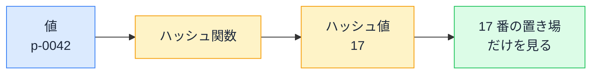

# ハッシュテーブル — Set.has が速くて Array.includes が遅い理由

## 今日のゴール

- `Array.includes` は先頭から 1 個ずつ比べるため、件数に比例して遅くなることを知る
- `Set` は保存場所を計算で直接特定するため、件数が増えても速さがほぼ変わらないことを知る
- ループの中の `includes` を `Set` の `has` に置き換えるリファクタの型を覚える

## 件数が増えると重くなるコード

「この ID、リストに含まれてる？」を確かめるコードは、いろいろな画面に出てきます。たとえば注文履歴の一覧に、お気に入り商品の印を付ける処理です。

```js
// お気に入りの商品 ID 一覧（1000 件）
const favoriteIds = await fetchFavoriteIds();
// 例: ["p-0001", "p-0042", "p-0987", ...]

// 注文履歴 5000 件それぞれに「お気に入りかどうか」の印を付ける
const orders = allOrders.map((order) => ({
  ...order,
  isFavorite: favoriteIds.includes(order.productId),
}));
```

このコードは正しく動きますし、開発中の 10 件程度のデータなら一瞬で終わります。ところが本番でお気に入りが 1000 件、注文が 5000 件になると、急にもたつき始めます。

コードは 1 行も間違っていないのに遅い、というこの現象の原因は、`includes` の「探し方」にあります。

## Array.includes は先頭から順に比べる

配列は、値の入った箱が順番に並んだ構造です。`includes` で「含まれるか」を確かめるとき、できることは 1 つだけです。

> **線形探索**: 先頭から 1 個ずつ「これか、違う。これか、違う」と順に比べていく探し方。`includes` はこれで探す

- 運よく先頭付近にあれば数回で終わる
- 末尾にあれば、要素数と同じ回数の比較が要る
- 含まれていない場合も、全部と比べ終わるまで「ない」と言い切れない

つまり件数が 10 倍になれば、最悪の比較回数も 10 倍です。さらに先ほどのコードは、この探索を**ループの中で毎回**呼んでいます。回数は掛け算で膨らみます。

| お気に入りの件数 | includes 1 回の最悪比較回数 | 注文 5000 件ぶんの最悪比較回数 |
|------------------|----------------------------|-------------------------------|
| 10 件            | 10 回                      | 5 万回                        |
| 1000 件          | 1000 回                    | 500 万回                      |
| 10 万件          | 10 万回                    | 5 億回                        |

開発中は表の左上にいて、本番では右下に移ります。「データが増えたら急に重くなった」と原因がつかめないときは、たいていこの掛け算が見えていません。

## Set は置き場を計算で当てる

`Set` は「値の集まり」を扱う JavaScript の組み込みオブジェクトです。言語仕様は Set に「件数に比例して遅くならない探し方」を求めていて、主要なエンジンはこれを**ハッシュテーブル**という構造で実現しています。

ハッシュテーブルのしまい方はこうです。

1. 内部に、番号付きの置き場をたくさん用意しておく
2. 値を**ハッシュ関数**に通す。これは値を受け取って決まった範囲の数値（ハッシュ値）を返す関数で、**同じ値を入れれば必ず同じ数値**が返る
3. 出てきた数値を置き場の番号として使い、そこに値をしまう

探すときも同じ計算をするだけです。`has("p-0042")` は `"p-0042"` をハッシュ関数に通し、出てきた番号の置き場だけを見に行きます。



1 個ずつ順に比べる作業が丸ごと消えるので、**件数が 1000 件でも 100 万件でも、探すためにやることはほぼ変わりません**。

この増え方の違いは、会話やドキュメントでは O(n)（オー・エヌ）、O(1)（オー・イチ）と書かれます。

| 記法 | 意味 | 今日の例 |
|------|------|----------|
| O(n) | 件数 n に比例して遅くなる | 線形探索（`Array.includes`） |
| O(1) | 平均して件数によらず一定 | ハッシュテーブルの探索（`Set.has`） |

記法の細かい定義まで覚える必要はなく、「O(1) は件数が増えても一定」とだけ覚えておくと、性能の会話についていけます。

## 直し方は 2 行

最初のコードを `Set` に直すと、こうなります。

```js
// お気に入りの商品 ID 一覧（1000 件）
const favoriteIds = await fetchFavoriteIds();

// 配列から Set への変換は、ループの外で一度だけ
const favoriteSet = new Set(favoriteIds);

const orders = allOrders.map((order) => ({
  ...order,
  isFavorite: favoriteSet.has(order.productId), // 件数が増えてもほぼ一定
}));
```

変わったのは 2 行だけです。

- **`new Set(favoriteIds)` で Set を作る行**: 変換では全件を 1 回ずつしまうので配列の長さぶんの時間がかかるが、それは一度きり
- **`includes` を `has` に替えた行**: ループの中の 5000 回の探索がすべて速くなる

同じ形のリファクタは、実務のあちこちに出てきます。

**一覧から重複を除く**

```js
const ids = ["p-01", "p-02", "p-01", "p-03", "p-02"];
const uniqueIds = [...new Set(ids)];
// ["p-01", "p-02", "p-03"]
```

Set は同じ値を 1 つしか持てないので、配列を Set に通してから配列に戻すと重複が消えます。

**2 つの配列の共通要素を探す**

```js
const setB = new Set(listB);
const common = listA.filter((item) => setB.has(item));
```

`listA.filter((item) => listB.includes(item))` と書くと掛け算の比較になります。片方を先に Set にしておくのが定番の形です。

なお `Map` も同じハッシュテーブルの仕組みで動いていて、「キーから値を取り出す」が件数によらずほぼ一定の速さです。ID をキーにして値もセットで引きたい場面では、オブジェクトを辞書代わりに使うよりも、追加や削除を繰り返す用途に向いた Map という選択肢があります。

## 配列と Set の使い分け

速いなら全部 Set でいいかというと、そうではありません。配列と Set は得意なことが違います。

| やりたいこと | 向いているもの |
|--------------|----------------|
| 並べ替える、n 番目を取り出す | 配列 |
| 同じ値を複数回持つ | 配列 |
| 「含まれるか」を何度も確かめる | Set |
| 重複を除く | Set |
| キーから値を取り出す | Map |

位置や並べ替えで扱うなら配列、「含まれるか」「重複を除く」が目的なら Set、と覚えておけば十分です。

## この知識が効く場面

- **一覧が増えたら急に画面が重くなった**: ループの中の `includes` や `find` を疑う。件数の掛け算で比較回数が膨らんでいないかを見る
- **指示の語彙になる**: 「この重複チェック、ループ内の includes を Set に置き換えて高速化して」と AI に具体的に指示できる
- **コードを評価する目になる**: `filter` の中に `includes` がある形を見つけたら、データが増える見込みを確認する

## まとめ

- `Array.includes` は先頭から順に比べる線形探索で、件数に比例して遅くなる
- `Set` はハッシュ値で置き場を直接計算するので、件数が増えても探す速さはほぼ一定
- ループの中の `includes` を見たら、外で一度 `new Set` を作って `has` に置き換える
