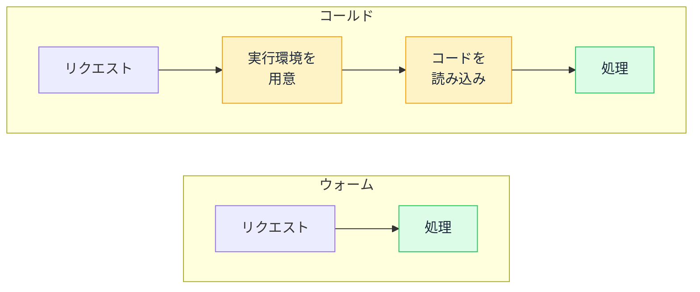

# コールドスタート — 最初の 1 回だけ遅くなる仕組み

## 今日のゴール

- デプロイしたアプリが最初の 1 回だけ遅くなる現象をコールドスタートと呼ぶと知る
- サーバーレスはリクエストが来て初めて実行環境を用意する仕組みだと知る
- 「本番だけ最初が遅い」の切り分けにコールドスタートを候補として挙げられるようになる

## 久しぶりに開くと最初だけ遅い

Vercel などのホスティングサービスにデプロイしたアプリを、数時間ぶりに開いたとします。最初のページ表示だけやけに待たされたのに、リロードしたらサッと表示された。そんな経験はないでしょうか。

不思議なのは、この遅さがローカルでは再現しないことです。`npm run dev` で動かしている手元のアプリは、いつ開いても同じ速さで返ってきます。コードは同じなのに、デプロイした先でだけ、それも最初の 1 回だけ遅くなります。

これはコードのバグではなく、デプロイ先のサーバーの動かし方から来ている現象です。**コールドスタート**という名前が付いています。

## 常時起動のサーバーとサーバーレス

従来型のサーバーは、24 時間起動しっぱなしです。リクエストが来ればすぐ処理を始められる代わりに、誰もアクセスしない深夜も起動したままで、その間もリソースを使い続けます。

これに対して Vercel などのホスティングサービスでは、サーバー側の処理の多くが**サーバーレス**という仕組みで動きます。サーバーレスといってもサーバーがないわけではありません。自分たちでサーバーを起動しっぱなしにする代わりに、コードだけを預けておき、リクエストが来たときにホスティングサービスが実行環境を用意して動かす、という意味です。

つまりサーバーレスでは、使われていない間、コードを動かすものが**起動していません**。リクエストが来て初めて、こんな手順が走ります。

1. 実行環境を新しく用意する
2. 預けてあったコードを読み込む
3. ようやくリクエストの処理を始める

常時起動のサーバーなら 3 だけで済むところに、1 と 2 の準備時間が上乗せされます。この余計にかかる時間がコールドスタートです。

## ウォームなら準備なしで速い

一度動いた実行環境は、処理が終わってもすぐには片付けられず、少しの間だけ起動したまま待機します。この状態を**ウォーム**と呼びます。待機中に次のリクエストが来れば、準備の手順を丸ごと飛ばしてすぐ処理に入れます。待機時間を過ぎると実行環境は片付けられて、次のリクエストはまたコールドスタートからやり直しです。

これで冒頭の体感に説明がつきます。

| 体感 | 実行環境の状態 |
|------|--------------|
| 久しぶりに開いたら遅い | コールド。準備からやり直している |
| 直後のリロードは速い | さっきの実行環境がまだウォームで残っている |
| しばらく放置したらまた遅い | 待機時間が過ぎて片付けられた。次はまたコールド |

「さっき使ったばかりのページは速いのに、時間を置くとまた遅い」という一見気まぐれな挙動は、実行環境がウォームかコールドかの違いをそのまま映しています。

## 使った分だけ払う仕組みの裏返し

わざわざ実行環境を止めるのは、コストのためです。常時起動のサーバーは、アクセスがゼロの時間帯もマシンを確保し続けるので、使っていなくても費用がかかります。サーバーレスは実際にコードが動いた分だけ課金されるので、アクセスに波があるサービスや、まだ利用者の少ないサービスでは大幅に安く済みます。

使われていない間はリソースを確保しないから安く済み、確保していないからこそ、久しぶりのリクエストは準備から始まります。コールドスタートは、サーバーレスの利点とちょうど裏表の関係にあります。欠陥というより、コストと引き換えに受け入れているトレードオフです。

## 対策の考え方

コールドスタートをゼロにはできませんが、影響を小さくする定番の考え方がいくつかあります。細かい設定方法はホスティングサービスごとに違うので、ここでは考え方だけ押さえておきます。

- **ウォームアップ**: 定期的にダミーのリクエストを送って、実行環境が片付けられる前に起こし続ける。待機状態を保つ分、課金は増える
- **起動の速い実行環境を選ぶ**: よく呼ばれる軽い処理は、通常のサーバーレス環境より起動の速い軽量な実行環境で動かす。ユーザーの近くに配置された軽量な環境はエッジ環境と呼ばれる
- **待ち時間の見せ方を工夫する**: ローディング表示や、先に体裁だけ整えた画面を出して、準備中でも「反応がない」と感じさせないようにする

どこまでやるかは、遅れて困る度合いと費用のバランスで決まります。社内向けの管理画面なら放置してよいことも多く、初回の印象が大事なサービスの入り口ならウォームアップの費用を払う価値があります。

## 遅さの報告に活きる切り分け

「本番だけ遅い」と一言で言っても、いつアクセスしても遅いのか、最初の 1 回だけ遅いのかで原因の候補はまったく違います。いつでも遅いならデータ量や処理そのものを疑いますが、久しぶりのアクセスだけ遅くて 2 回目からは速いなら、コールドスタートが有力な候補になります。

AI に相談するときも同じです。「本番が遅い」ではなく「デプロイ先で、しばらく放置したあとの最初のアクセスだけ遅い」と伝えれば、原因の候補が一気に絞られます。「この処理はコールドスタートの影響を受けやすい構成になっていないか」という聞き方ができれば、対策の相談まで一足飛びに進めます。

## まとめ

- サーバーレスは使われていない間は起動しておらず、最初のリクエストは実行環境の準備から始まる
- 準備なしで応答できるウォーム状態がしばらく残るので、直後のアクセスは速い
- 「本番だけ最初の 1 回遅い」と気づいたら、コールドスタートを候補に挙げて切り分ける
