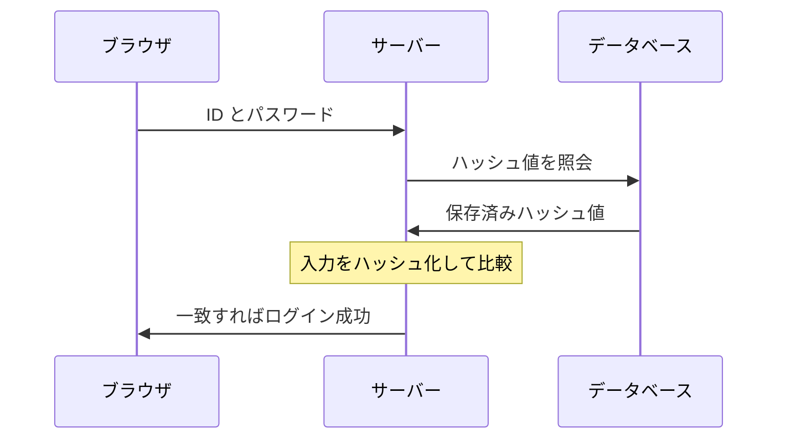

# パスワードの保存 — ハッシュとソルトという2つの防御

## 今日のゴール

- パスワードを平文で保存してはいけない理由を知る
- ハッシュ化とソルトがそれぞれ何の攻撃を防ぐかを知る
- パスワードの保存は bcrypt など専用のライブラリに任せるのが定石だと知る

## 入力したパスワードの行き先

会員登録のフォームにパスワードを入力して送信すると、パスワードはサーバーに届き、データベースに保存されます。次のログインで照合するためです。

問題は、**どんな形で保存するか**です。

- ここを間違えると、データベースが漏洩したときに全利用者のパスワードが流出する
- AI にログイン機能を任せるときも、この保存方法の判断は指示する側が持っておくべき土台になる

## 平文保存が危険な理由

入力された文字列をそのまま保存する形を**平文**（ひらぶん）と呼びます。`password123` と入力されたパスワードが、`password123` という文字列のままデータベースに入っている状態です。

「パスワードを平文で保存してはいけない」とよく言われるのは、漏洩したときの被害が桁違いだからです。

- データベースが漏れると、全員のパスワードがそのまま攻撃者の手に渡る
- 多くの人はパスワードを複数のサービスで使い回しているので、漏れたパスワードは他のサービスへの不正ログインにそのまま使える。この手口には**パスワードリスト攻撃**という名前が付くほど、定番の攻撃になっている
- 運営側の開発者や管理者からも、利用者のパスワードが見えてしまう

「うちのデータベースは漏れない」とは誰にも言い切れません。大手のサービスでも漏洩事故は繰り返し起きています。

> 「漏らさない」だけに頼るのではなく、**漏れても被害が広がらない形で保存しておく**のが定石。その形がハッシュ化

## ハッシュ化という一方向の変換

> **ハッシュ関数**: 入力の文字列から決まった手順で別の文字列を計算する関数。計算結果を**ハッシュ値**と呼ぶ

たとえば SHA-256 というハッシュ関数に通すと、こうなります。

```
sha256("password123")
→ ef92b778bafe771e89245b89ecbc08a44a4e166c06659911881f383d4473e94f

sha256("password124")   ← 最後の1文字を変えただけ
→ 33631376724e5d5480fa397dfcf03b66ad47b934ab495174d7058c38f2bb0087
```

ハッシュ関数には、次の性質があります。

- **同じ入力からは、必ず同じハッシュ値**が計算される
- 入力が1文字でも違えば、全く別の値になる
- ハッシュ値から元の文字列を計算で逆算することはできない。この後戻りできない性質を**一方向性**と呼ぶ

この性質を使うと、パスワードそのものを保存する必要がなくなります。

- 登録時にパスワードをハッシュ化して、**ハッシュ値だけを保存する**
- データベースが漏れても、攻撃者の手に入るのはハッシュ値だけで、元のパスワードは分からない

元に戻せない値でも、ログインの確認はできます。保存した値を復元するのではなく、**同じ計算をもう一度して比べる**からです。入力されたパスワードを同じ手順でハッシュ化し、保存してあるハッシュ値と一致するかを見るだけで済みます。



## 単純なハッシュ化に残る弱点

ハッシュ値からの逆算はできませんが、抜け道があります。**同じパスワードは常に同じハッシュ値になる**、という性質そのものです。

人が決めるパスワードには偏りがあり、`password123` や `123456` のようなよくあるパスワードは数がたかが知れています。攻撃者はここに目を付けます。

1. よくあるパスワードを大量に集める
2. それぞれのハッシュ値を**事前に**計算した対応表を用意しておく。この対応表は**レインボーテーブル**と呼ばれる
3. データベースが漏れたら、あとは盗んだハッシュ値を対応表から引くだけ

逆算はできなくても、「答え合わせ」は一瞬でできてしまいます。

もう1つ、同じハッシュ値の利用者が並んでいれば「この人たちは同じパスワードを使っている」と分かってしまう問題もあります。

## ソルトという2つ目の防御

この対応表への対策が**ソルト**です。利用者ごとにランダムな文字列を生成し、パスワードの後ろにつなげてからハッシュ化します。

```
利用者A: sha256("password123" + "x7Kp9f...")  → 利用者Aだけのハッシュ値
利用者B: sha256("password123" + "mQ2vL8...")  → 全く別のハッシュ値
```

同じ `password123` でも、ソルトが違えばハッシュ値は全く別になります。これで対応表は無力化されます。

- 攻撃者が事前に作った対応表は「ソルトなしのハッシュ値」の表なので、役に立たなくなる
- ソルト入りで作り直そうにも、ソルトは利用者ごとに違うため、1人分の表を作っても他の利用者には使えない

意外に思えるのが、**ソルトは秘密にしなくてよい**という点です。ソルトはハッシュ値と一緒にデータベースへ保存します。

- ソルトの目的は「隠すこと」ではなく「事前計算を無効にすること」
- ソルトが攻撃者に見えても、利用者1人ずつ総当たりをやり直すしかない状況は変わらず、事前の一括計算という近道は消えたまま

ここまでの保存方法を、データベースが漏れたときの被害で比べるとこうなります。

| 保存の仕方 | データベースが漏れたときに起きること |
|-----------|----------------------------------|
| 平文 | 全員のパスワードがそのまま漏れる |
| ハッシュ値だけ | よくあるパスワードは対応表で即座に割れる |
| ソルト付きハッシュ | 利用者ごとに総当たりをやり直すしかない |

## 総当たりを遅くする専用アルゴリズム

ソルトで事前計算は防げましたが、特定の利用者を狙った総当たりは残っています。ここで効いてくるのが、ハッシュ関数の計算の速さです。

SHA-256 のような汎用のハッシュ関数は、大量のデータを高速に処理するために作られています。この速さが、パスワード保存では逆に弱点になります。

- 速く計算できるほど、攻撃者が候補を試す速度も上がる
- GPU を使えば1秒間に数十億回の計算も可能とされ、短く単純なパスワードなら現実的な時間で割り出せてしまう

そこでパスワードのハッシュ化には、**意図的に計算を遅くした専用のアルゴリズム**を使うのが実務の標準です。代表が **bcrypt** や **Argon2** です。

- 1回の計算にわざと時間がかかる設計になっている。ログインする本人は1回だけなので気にならないが、何十億回も試したい攻撃者には致命的
- ソルトの生成と保存を内蔵していて、自分で管理する必要がない
- 計算の重さを設定で調整でき、コンピュータの性能が上がったら重くできる

コードの骨子で対比すると、避けたい形はこうです。

```js
// 危険な例1: 平文のまま保存する
await db.user.create({ data: { email, password } });

// 危険な例2: 高速なハッシュ関数を1回かけるだけ
const passwordHash = sha256(password);
await db.user.create({ data: { email, passwordHash } });
```

bcrypt のライブラリを使うと、こうなります。

```js
import bcrypt from "bcrypt";

// 登録時: ソルト付きでハッシュ化して保存する
const passwordHash = await bcrypt.hash(password, 10);
await db.user.create({ data: { email, passwordHash } });

// ログイン時: 入力と保存済みハッシュ値の比較もライブラリに任せる
const isValid = await bcrypt.compare(inputPassword, user.passwordHash);
```

`bcrypt.hash` の `10` は計算の重さの設定で、ソルトは内部で自動生成されます。できあがるハッシュ値の文字列にはソルトと重さの設定も埋め込まれているので、保存するカラムは1つで済みます。

> 大事なのは、**この処理を自分で組み立てないこと**。ソルトの生成やつなげ方、比較のしかたには細かい注意点が多く、自作の実装は事故のもと。実績のあるライブラリに任せるのが現実的な結論

## AI に指示するときの語彙

AI にログイン機能を頼むときに「パスワードは bcrypt でハッシュ化して保存して」と一言足せると、保存方法を運任せにせずに済みます。生成されたコードを見るときの確認ポイントも、今日の内容がそのまま使えます。

- パスワードのカラムに、入力された文字列がそのまま入っていないか
- `sha256(password)` のように、高速なハッシュ関数を1回かけるだけになっていないか
- ハッシュ化の処理を自作せず、bcrypt などのライブラリに任せているか

「このコード、パスワードをどう保存している？」と一度立ち止まって確認できることが、ログイン機能を任せるときの安全装置になります。

## まとめ

- パスワードは平文で保存せず、一方向のハッシュ値にして保存する
- ソルトで利用者ごとにハッシュ値を変え、事前計算した対応表を無効にする
- 実装は自作せず、bcrypt や Argon2 のような意図的に遅い専用ライブラリに任せる
