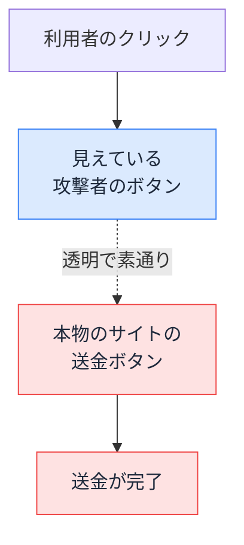

# クリックジャッキング — 透明な iframe で押させる攻撃

## 今日のゴール

- 透明にした本物のサイトを重ねて、利用者に本物のボタンを押させる攻撃だと知る
- X-Frame-Options と CSP の frame-ancestors で、埋め込み自体を拒否できると知る
- 送金確定など「1 クリックで完了する画面」ほど狙われると知る

## 正しく操作しているのに騙される

Web セキュリティの攻撃の多くは、「入力を信用しない」で身を守れます。フォームに変な文字列を入れられても、それをただの文字として扱えば被害は起きません。

クリックジャッキングにはこの発想が通じません。利用者は変な入力を一切せず、画面に見えているボタンをいつも通り正しく押しているだけです。それでも、押した先が見えているボタンとは別物なので、被害が起きます。

たとえば銀行の送金確認画面には「送金する」ボタンがあります。ログイン済みの利用者がこのボタンを押せば、それだけで送金が完了します。攻撃者はこの 1 クリックを、利用者に気づかせないまま踏ませようとします。送金確定や退会確定のように、1 クリックで重要な操作が完了する画面ほど、この攻撃の的になります。

## 透明な iframe を重ねる仕組み

`<iframe>` は、あるページの中に別のページを埋め込むための HTML 要素です。攻撃者はこれを使います。

1. 攻撃者が用意したページに、狙ったサイト（銀行の送金確認画面など）を `<iframe>` で埋め込む
2. その iframe を `opacity: 0` で透明にして、見えなくする
3. 透明な iframe の上に、「今すぐ受け取る」のような押させたいボタンを重ねて置く
4. 本物の「送金する」ボタンの真上に、攻撃者のボタンがぴったり重なるよう位置を合わせる

利用者の画面には、攻撃者の派手なボタンだけが見えています。それを押したつもりでも、指が触れているのは一番手前にある透明な iframe です。クリックは iframe を素通りして、その中の本物の「送金する」ボタンに届きます。

```html
<!-- 攻撃者のページ -->
<style>
  .attack-frame {
    position: absolute;
    top: 0;
    left: 0;
    width: 400px;
    height: 300px;
    opacity: 0; /* 透明にして見えなくする */
  }
  .attack-button {
    position: absolute;
    top: 120px; /* 本物の「送金する」ボタンの真上に重ねる */
    left: 100px;
  }
</style>

<button class="attack-button">今すぐ受け取る</button>
<iframe class="attack-frame" src="https://bank.example/transfer"></iframe>
```

見えているボタンと、実際に押されるボタンの位置関係はこうなります。



利用者から見えているのは攻撃者のボタンだけで、本物の送金ボタンは透明で見えません。「受け取る」を押したつもりが、透明な層の向こうで送金が実行されています。

## 見た目と操作対象がずれても気づけない

なぜこれが成立するかというと、ブラウザは「今このクリックが、実際にはどのページのどのボタンに届いたか」を利用者に見せてくれないからです。

一番手前の要素が透明で、奥が透けて見えていても、クリックを受け取るのは重なり順で一番手前の要素です。透明かどうかは操作の届き先に関係ありません。利用者にとっては、見えているものと押した結果が一致しているように感じられるので、ずれていることに気づけません。

しかも iframe の中身が本物のサイトである以上、そこは正規のログイン状態です。利用者はすでにログイン済みなので、Cookie も送られ、サーバーから見れば本人の正当な操作にしか見えません。

## 埋め込みを拒否する X-Frame-Options

この攻撃は、狙われるサイトが「他人のページに iframe で埋め込まれてしまう」ことが前提です。裏を返すと、埋め込みを禁止すれば攻撃は成立しません。

最初に広まった手段が **X-Frame-Options** という HTTP レスポンスヘッダーです。サーバーがページを返すときにこのヘッダーを付けると、ブラウザはそのページを iframe で表示すること自体を拒否します。指定できる値は 2 つです。

| 値 | 意味 |
|------|------|
| `DENY` | どのサイトからも iframe で埋め込ませない |
| `SAMEORIGIN` | 自分のサイトからの埋め込みだけ許可する |

```http
X-Frame-Options: DENY
```

`DENY` を付けたページは、攻撃者のページに iframe で置かれた時点でブラウザが表示を拒むので、透明にして重ねることもできなくなります。特別な理由がなければ `DENY` が安全側です。

なお、かつてあった `ALLOW-FROM`（特定のサイトだけ許可する指定）は現在のブラウザでは動きません。埋め込み元を細かく指定したいときは、次の CSP を使います。

## より柔軟な CSP frame-ancestors

X-Frame-Options は今では古い方式という位置づけで、後継として **CSP の `frame-ancestors` ディレクティブ**があります。CSP（Content-Security-Policy）は、ページの安全に関するさまざまな指示をブラウザに伝える HTTP レスポンスヘッダーです。その中の 1 つが frame-ancestors で、「このページを iframe で埋め込んでよい親サイト」を指定します。

```http
Content-Security-Policy: frame-ancestors 'none'
```

指定できる値は X-Frame-Options より柔軟です。

| 値 | 意味 |
|------|------|
| `'none'` | どこからも埋め込ませない（X-Frame-Options: DENY 相当） |
| `'self'` | 自分のサイトからだけ許可（SAMEORIGIN 相当） |
| `https://partner.example` | 指定したサイトからだけ許可（複数書ける） |

X-Frame-Options では表せなかった「この提携サイトからだけは許可する」といった指定ができるのが利点です。両方のヘッダーが付いている場合、対応するブラウザは frame-ancestors を優先します。古いブラウザのために両方書いておき、新しいブラウザは frame-ancestors で細かく制御する、という併記が実務では無難です。

`frame-ancestors` は HTTP レスポンスヘッダーでしか効かない点に注意が必要です。HTML の `<meta>` タグで書いた CSP には frame-ancestors は含められないので、必ずサーバー側でヘッダーとして付けます。

## Next.js での設定例

Next.js では `next.config.ts` の `headers` 設定で、これらのヘッダーを全ページに付けられます。

```ts
// next.config.ts
import type { NextConfig } from "next";

const nextConfig: NextConfig = {
  async headers() {
    return [
      {
        source: "/:path*", // すべてのパスに適用
        headers: [
          {
            key: "Content-Security-Policy",
            value: "frame-ancestors 'none'",
          },
          {
            key: "X-Frame-Options", // 古いブラウザ向けの保険
            value: "DENY",
          },
        ],
      },
    ];
  },
};

export default nextConfig;
```

この語彙があると、AI にも「送金確認ページは iframe に埋め込ませたくないので、X-Frame-Options と CSP の frame-ancestors で埋め込みを禁止して」と具体的に指示できます。返ってきた設定を見て、`frame-ancestors 'none'` が入っているか、`<meta>` タグに書いていないかを確認する目も持てます。

## まとめ

- クリックジャッキングは、透明な iframe 越しに本物のボタンを押させる攻撃
- X-Frame-Options と CSP の frame-ancestors で、埋め込み自体を拒否して防ぐ
- frame-ancestors はヘッダー専用で、meta タグには書けない
