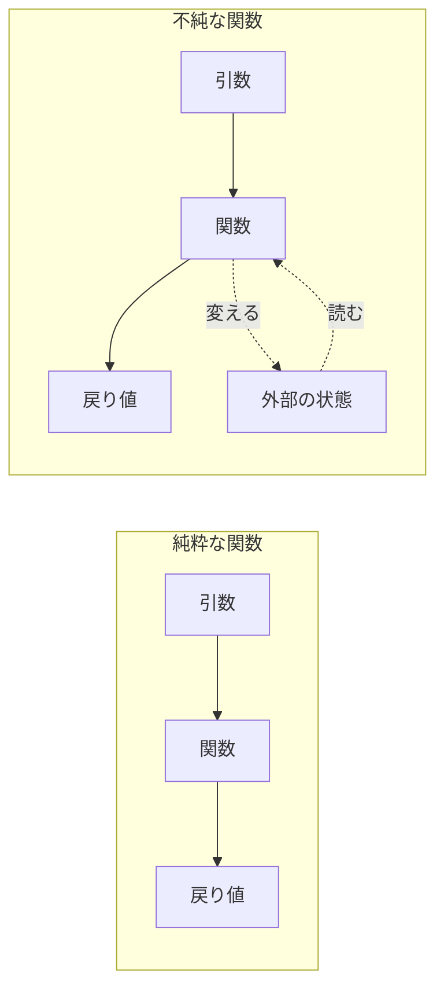

# 純粋関数 — 同じ入力なら同じ出力という約束

## 今日のゴール

- 同じ引数なら同じ結果を返し、外部に影響を与えない関数を純粋関数と呼ぶことを知る
- React がコンポーネントに純粋さを要求する理由を知る
- 純粋にできない処理は消すのではなく置き場を分ける、という考え方を知る

`sum(1, 2)` の結果は何回呼んでも 3 です。当たり前に聞こえますが、実際のコードには「同じ引数なのに、呼ぶたびに結果が変わる関数」が紛れ込みます。中で現在時刻を読んでいる、外の変数に頼っている、受け取ったデータを書き換えている。こうした関数と区別して、何回呼んでも同じ結果を返し、外に影響を残さない関数を**純粋関数**（pure function）と呼びます。React がコンポーネントに要求しているのも、まさにこの性質です。

## 純粋関数の条件

純粋関数は、次の 2 つを満たす関数です。

- 同じ引数を渡せば、必ず同じ結果を返す
- 戻り値を返す以外に、関数の外へ影響を与えない

2 つ目の「外への影響」を**副作用**（side effect）と呼びます。外の変数を書き換える、受け取ったオブジェクトを書き換える、通信する、画面に出力する。戻り値以外の形で外の世界に痕跡を残すことは、すべて副作用です。

送料込みの合計金額を計算する関数で確かめてみます。

```javascript
function totalWithShipping(prices) {
  const subtotal = prices.reduce((sum, price) => sum + price, 0);
  const shipping = subtotal >= 3000 ? 0 : 500;
  return subtotal + shipping;
}

totalWithShipping([1200, 800]); // 2500
totalWithShipping([1200, 800]); // 2500（何回呼んでも同じ）
```

結果は引数 `prices` だけで決まり、外には何の影響も残しません。純粋関数です。

この性質には**参照透過性**（referential transparency）という名前が付いています。式をその結果の値に置き換えても、プログラムの意味が変わらないという意味です。コード中の `totalWithShipping([1200, 800])` をすべて `2500` に書き換えても、動作は何も変わりません。逆に、この置き換えができない関数は、どこかで外部とつながっています。



純粋な関数は、引数から戻り値への一方通行の箱です。不純な関数には、外部の状態との隠れたつながりがあります。

## 純粋さが崩れるパターン

### 呼ぶたびに結果が変わる

```javascript
function createOrder(items) {
  return {
    items,
    id: Math.random().toString(36).slice(2), // 呼ぶたびに違う値
    orderedAt: Date.now(),                   // 呼ぶたびに違う値
  };
}
```

同じ `items` を渡しても、`id` と `orderedAt` は毎回変わります。`Math.random()` や `Date.now()` は、引数以外の場所から結果に影響する値を持ち込む代表格です。

### 外の変数に依存する

```javascript
let taxRate = 0.1;

function applyTax(price) {
  return price * (1 + taxRate);
}

applyTax(1000); // 1100

taxRate = 0.08;
applyTax(1000); // 1080（引数は同じなのに結果が変わった）
```

結果が引数だけでなく、外の変数 `taxRate` にも依存しています。`taxRate` を誰かが書き換えると、同じ呼び出しが違う結果を返すようになります。この関数だけを見ても結果を予測できず、外の変数の履歴まで追う必要があります。

### 外に影響を与える

```javascript
// 不純: 受け取った配列を書き換えている
function addItem(cart, item) {
  cart.push(item);
  return cart;
}

const cart = ["りんご"];
const newCart = addItem(cart, "みかん");

console.log(newCart); // ["りんご", "みかん"]
console.log(cart);    // ["りんご", "みかん"] ← 呼び出し側の cart まで変わっている
```

戻り値は期待どおりですが、渡した `cart` そのものが知らないうちに変わっています。呼び出し側から見えない影響を残す、典型的な副作用です。純粋に書くなら、受け取った配列には触れず、新しい配列を作って返します。

```javascript
// 純粋: 新しい配列を返す
function addItem(cart, item) {
  return [...cart, item];
}

const cart = ["りんご"];
const newCart = addItem(cart, "みかん");

console.log(newCart); // ["りんご", "みかん"]
console.log(cart);    // ["りんご"]（元の配列はそのまま）
```

`[...cart, item]` は、`cart` の中身をコピーした新しい配列の末尾に `item` を足す書き方です。元の配列は変わらないので、この関数は外に何の影響も残しません。

## React コンポーネントが純粋であるべき理由

React のコンポーネントは、props を受け取って JSX を返す関数です。React はこの関数が純粋であること、つまり**同じ props なら同じ JSX を返す**ことを前提に動いています。これは React の公式ドキュメントにルールとして明記されています。

純粋でないコンポーネントを見てみます。

```tsx
function WelcomeBanner({ userName }: { userName: string }) {
  const coupon = Math.random() < 0.5 ? "10%OFF" : "送料無料";
  return <p>{userName}さん、本日は{coupon}クーポンが使えます</p>;
}
```

同じ `userName` を渡しても、表示されるクーポンは呼び出しのたびに変わります。ここで問題になるのは、**このコンポーネント関数をいつ・何回呼ぶかは React が決める**という点です。React はパフォーマンスのために、呼び出しを省略したり、何度も実行したり、順番を変えたりします。

- 開発中の Strict Mode は、不純なコンポーネントをあぶり出すために、レンダリングをわざと 2 回実行します。本番ビルドでは 1 回に戻ります
- React Compiler は、同じ props なら同じ結果になることを前提に、一度計算した結果を使い回して呼び出しを省略します（メモ化）

コンポーネントが純粋なら、React が何回呼んでも、どの順番で呼んでも、画面は同じです。純粋でないと、Strict Mode の 2 回目の実行で表示が変わったり、使い回された結果と新しい結果が食い違ったりして、「たまに表示がおかしいが再現できない」というバグになります。

直すには、値を決める処理をコンポーネントの外に出します。クーポンの抽選はイベントハンドラやサーバー側で行い、決まった結果を props で渡します。

```tsx
function WelcomeBanner({ userName, coupon }: { userName: string; coupon: string }) {
  return <p>{userName}さん、本日は{coupon}クーポンが使えます</p>;
}
```

これで同じ props なら必ず同じ表示になり、React が何回呼び直しても安全です。

## 純粋関数の実務的なメリット

React に限らず、純粋関数には日々の開発で効いてくるメリットがあります。

| メリット | 理由 |
|---------|------|
| テストしやすい | 引数を渡して戻り値を確かめるだけでテストになる。外部状態の準備がいらない |
| 結果をキャッシュできる | 同じ入力なら同じ出力なので、一度計算した結果を使い回せる。メモ化の前提 |
| 呼ぶ順番や回数を変えても壊れない | 互いに影響し合わないので、呼び出し側が実行を自由に組み替えられる |

たとえばテストは、入力と出力の突き合わせだけで書けます。

```javascript
// データベースもモックも準備せず、入力と出力だけを見ればいい
expect(totalWithShipping([1200, 800])).toBe(2500);
```

不純な関数のテストでは「外の変数を先に設定する」「現在時刻を固定する」といった準備が要りますが、純粋関数にはそれがありません。

## 副作用の置き場を分ける

通信、乱数、現在時刻の取得。アプリはこれらなしには成り立たないので、すべての関数を純粋にはできません。目指すのは副作用をゼロにすることではなく、**純粋な部分と副作用のある部分を分ける**ことです。計算のロジックは純粋関数に寄せ、外の世界に触れる処理は境界に集めます。

React にはこの分け方が組み込まれています。レンダリング、つまり props と state から JSX を計算する部分は純粋に保ち、副作用は専用の置き場に出します。

- ユーザーの操作に反応する処理は、イベントハンドラに書く
- レンダリング後に外の世界と同期する処理は、useEffect に書く

useEffect の詳しい使い方には踏み込みませんが、「レンダリングに混ぜてはいけない副作用のための置き場が用意されている」ことを覚えておくと、React の設計が読み解きやすくなります。

この区別は、AI へ指示するときの語彙にもなります。「この関数は純粋に保って。副作用はイベントハンドラに分離して」と伝えられますし、出てきたコンポーネントのレンダリング部分で `Date.now()` や `Math.random()` を呼んでいないか、という確認の視点も持てます。

## まとめ

- 純粋関数は、同じ引数なら同じ結果を返し、外へ影響を残さない関数
- React はコンポーネントを何度も呼び直す前提で動くため、純粋さを要求する
- 副作用はゼロにするのではなく、イベントハンドラや useEffect に置き場を分ける
