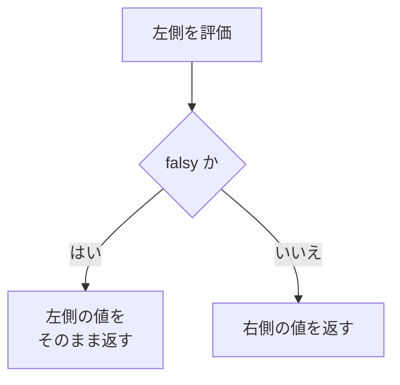

# truthy と falsy — `count && <Badge>` が 0 を表示するバグ

## 今日のゴール

- JavaScript のすべての値は truthy か falsy のどちらかだと知る
- `&&` は真偽値ではなく、左右どちらかの値をそのまま返すと知る
- React は `false` や `null` を描画しないが、`0` は描画すると知る

通販サイトのカートアイコンには、商品を入れると件数のバッジが付きます。この「1 件以上のときだけバッジを表示する」を React で書くとき、定番の書き方に有名な罠があります。**カートが空のときだけ、画面に謎の `0` が表示される**バグです。

## 0 件のときだけ画面に 0 が出るバグ

まずはバグが起きるコードです。カートに入っている件数 `count` を受け取り、1 件以上ならバッジを表示するつもりのコンポーネントです。

```jsx
function CartButton({ count }) {
  return (
    <button type="button" aria-label={`カートを開く（${count}件）`}>
      カート
      {count && <span className="cart-badge">{count}</span>}
    </button>
  );
}
```

- `count` が `3` のとき: 期待どおり、バッジに `3` と表示される
- `count` が `0` のとき: 「何も表示されない」はずが、バッジの位置に **`0` という文字がそのまま表示される**

`{count && <span>...</span>}` は React の条件表示の定番の形で、AI まかせで作った画面のコードにもよく入っています。原因は React だけの話ではなく、JavaScript の値の性質と `&&` の動きを順に追うと説明がつきます。

## すべての値は truthy か falsy のどちらか

JavaScript では、`if (count)` のように真偽値でない値を条件の場所に置くと、その値を true 相当か false 相当かに変換して判定します。

> **truthy / falsy** = 条件の場所に置いたとき、true 相当として扱われる値が truthy、false 相当として扱われる値が falsy

falsy な値は次の 8 つだけと決まっています。

| 値 | 説明 |
| --- | --- |
| `false` | 真偽値の false |
| `0` | 数値のゼロ |
| `-0` | 負のゼロ |
| `0n` | BigInt のゼロ |
| `""` | 空文字 |
| `null` | 値がないことを表す値 |
| `undefined` | 未定義 |
| `NaN` | 数値にできなかった計算の結果 |

- この 8 つ以外は、**すべて truthy**
- 意外なのは、空配列 `[]` や空オブジェクト `{}` も truthy だという点。「中身が空なら false 側だろう」という直感は通用しない

```js
if (0) console.log("A");   // 実行されない。0 は falsy
if ("") console.log("B");  // 実行されない。空文字は falsy
if ([]) console.log("C");  // 実行される。空配列は truthy
if ({}) console.log("D");  // 実行される。空オブジェクトも truthy
```

## `&&` が返すのは真偽値ではなく値そのもの

多くの言語で `&&` は「両方 true なら true」を返す演算子ですが、JavaScript の `&&` は真偽値を作りません。

- 左側が falsy なら、**左側の値そのもの**を返す
- 左側が truthy なら、**右側の値**を返す

左側が falsy だった時点で結果が確定するので、右側は評価すらされません。この動きを短絡評価（short-circuit evaluation）と呼びます。

```js
0 && "右側";      // 0
"" && "右側";     // ""
null && "右側";   // null
3 && "右側";      // "右側"
"あ" && 0;        // 0。左が truthy なので右側の値
```



`count && <span>...</span>` の `count` が `0` のとき、式全体の結果は `false` ではなく、**数値の `0` そのもの**になります。

## React が描画しない値と描画する値

もう半分の材料は React 側の決まりです。JSX の `{}` の中の値がどう画面になるかは、値の種類で決まっています。

| `{}` の中の値 | 画面 |
| --- | --- |
| `false` や `true` | 何も描画されない |
| `null` や `undefined` | 何も描画されない |
| 数値 | そのまま文字として描画される |
| 文字列 | そのまま文字として描画される |

`{count > 0 && <span>...</span>}` のような条件表示が成立するのは、条件が成り立たないとき式の結果が `false` になり、React が `false` を「何もない」ものとして扱うからです。

ところが `{count && <span>...</span>}` の `count` が `0` のときは、こうなります。

1. 式の結果は `false` ではなく、数値の `0`
2. 数値は「何もない」扱いにならず、そのまま文字として描画される

これが、0 件のときだけ画面に `0` が出るバグの全体像です。

## 直し方

`&&` の左側を、比較演算子で真偽値にします。

```jsx
function CartButton({ count }) {
  return (
    <button type="button" aria-label={`カートを開く（${count}件）`}>
      カート
      {count > 0 && <span className="cart-badge">{count}</span>}
    </button>
  );
}
```

`count > 0` の結果は必ず `true` か `false` です。`count` が `0` でも式の結果は `false` になり、React は何も描画しません。

三項演算子で「表示しない側」を明示する書き方もあります。

```jsx
{count > 0 ? <span className="cart-badge">{count}</span> : null}
```

どちらの書き方でも直ります。ポイントは、**`&&` の左側に `0` になりうる数値をそのまま置かない**ことです。

## `items.length` で起きる同じバグ

「配列が空でなければ一覧を表示する」でも同じことが起きます。

```jsx
{items.length && <ItemList items={items} />}
```

- 空配列 `[]` 自体は truthy だが、ここで条件に置いているのは `items.length`
- 空配列の `length` は `0` で、`0` は falsy なので、一覧の代わりに `0` が表示される
- 直し方も同じで、`items.length > 0` と比較して真偽値にする

## `??` との違い

`&&` と似た場面で出てくる演算子に `??`（Nullish coalescing 演算子）があります。左側が `null` か `undefined` のときだけ右側を返し、`0` や空文字のときは左側をそのまま返します。

```js
0 ?? "デフォルト";         // 0
"" ?? "デフォルト";        // ""
null ?? "デフォルト";      // "デフォルト"
undefined ?? "デフォルト"; // "デフォルト"
```

「値が未設定のときだけデフォルト値を使いたい」場面では、`??` のほうが向くことがあります。たとえば「未取得なら『-』、0 件なら `0` と表示したい」とき、結果はこう分かれます。

- `count || "-"`: `0` まで「-」に化ける
- `count ?? "-"`: `0` は `0` のまま表示される

区別はこうです。

- **`||` と `&&`**: falsy 全部を「値なし」とみなす
- **`??`**: `null` と `undefined` だけを「値なし」とみなす

## AI のコードを確認する視点

条件表示のコードを見かけたときの確認ポイントは、「`&&` の左側は真偽値か、それとも `0` になりうる数値か」の一点です。AI に条件表示を任せたあとも、こう指示できればこのバグは入り口で防げます。

- 「`count` が 0 のときの表示を確認して」
- 「`&&` の左側は比較演算子で真偽値にして」

## まとめ

- falsy は `false`・`0`・`""`・`null`・`undefined`・`NaN` を含む 8 つだけで、空配列や空オブジェクトは truthy
- `&&` は左側が falsy なら左側の値そのものを返し、React は数値の `0` をそのまま描画する
- `&&` の左側に `0` になりうる数値を置かず、比較で真偽値にする
