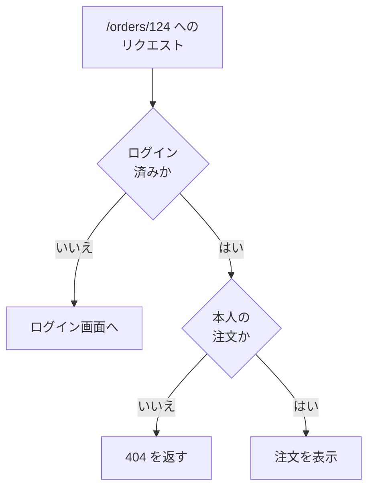

# IDOR — URL の数字を書き換えると他人のデータが見える

## 今日のゴール

- 認証と認可が別々の確認だと知る
- URL の ID を書き換えるだけで他人のデータに届く IDOR を知る
- 対策はサーバー側で毎回「本人のものか」を確認することだと知る

## ログイン機能はあるのに他人の注文が見える

通販サイトのマイページで注文詳細を開くと、URL はたいてい次のような形をしています。

```
https://example.com/orders/123
```

この `123` を `124` に書き換えて開いたとき、本来は「あなたの注文ではありません」と拒否されるべきです。ところが実際には、**他人の注文がそのまま表示されてしまう**サイトが珍しくありません。宛名も住所も注文内容も、番号を 1 つずらすだけで見えてしまう。

しかも、こういう事故を起こすサイトにもログイン機能はちゃんとあります。ログインしないとマイページには入れないのに、他人のデータは見えてしまう。原因は、サーバーがしている確認が 1 つ足りないことにあります。

## 認証と認可は別々の確認

ユーザーのデータを守る確認は 2 段階あります。

| | 問い | 確認していること |
|---|------|----------------|
| **認証**（authentication） | あなたは**誰**？ | ログインしているか。Cookie で届く ID をサーバーが照合して本人を特定する |
| **認可**（authorization） | あなたはこれを**見てよい**？ | そのデータ・操作が、その人に許されているか |

ログイン機能が担当するのは認証だけです。「この人は user_42 さんだ」までは分かる。でも「注文 124 は user_42 さんのものか」は別の確認で、書かなければ誰も確認してくれません。そして認可の確認を書き忘れても、アプリは普通に動いてしまいます。



事故を起こすアプリでは、この図の 2 つ目のひし形が丸ごと抜けています。

## 事故が起きるコード

Next.js の注文詳細ページで、事故が起きる形はこうです。

```tsx
// app/orders/[id]/page.tsx（悪い例）
import { redirect, notFound } from "next/navigation";
import { getCurrentUser } from "@/lib/auth";
import { db } from "@/lib/db";

type Props = { params: Promise<{ id: string }> };

export default async function OrderPage({ params }: Props) {
  const user = await getCurrentUser();
  if (!user) redirect("/login"); // 認証の確認はある

  const { id } = await params;
  // id だけで検索している。誰の注文かは見ていない
  const order = await db.order.findUnique({ where: { id } });
  if (!order) notFound();

  return (
    <section>
      <h1>注文 {order.id}</h1>
      <p>お届け先: {order.address}</p>
    </section>
  );
}
```

ログインの確認はあります。でもその後の検索条件は `id` だけ。ログインさえしていれば、他人の ID を指定するだけで他人の注文が返ってきます。SQL で見ると違いがはっきりします。

```sql
-- 悪い例: 番号さえ合えば誰の注文でも返る
SELECT * FROM orders WHERE id = 124;

-- 良い例: 本人の注文でなければ 0 件になる
SELECT * FROM orders WHERE id = 124 AND user_id = 'user_42';
```

直し方は、**ログイン中のユーザー ID を検索条件に加える**ことです。

```tsx
  // ログイン中のユーザーの注文だけを対象に検索する
  const order = await db.order.findFirst({
    where: { id, userId: user.id },
  });
  if (!order) notFound(); // 他人の注文は「存在しない」と同じ扱い
```

他人の注文だと分かったとき、403 で「アクセス禁止」と返す設計もあります。ただし 403 は「その番号の注文は存在する」というヒントを与えてしまうため、404 を返して存在ごと隠す設計もよく選ばれます。GitHub も、権限のないリポジトリには 404 を返します。

## この穴の名前は IDOR

URL やリクエストの中の ID を推測したり書き換えたりするだけで他人のリソースに届いてしまう穴を、**IDOR**（Insecure Direct Object References、安全でない直接オブジェクト参照）と呼びます。Web セキュリティの定番リスト「OWASP Top 10」では、認可の不備をまとめた **Broken Access Control**（アクセス制御の不備）という分類の代表例で、この分類は 2021 年版から 1 位が続いています。名前が付くほど、ありふれた事故です。

## テストしても気づきにくい

この穴のやっかいな点は、**自分のデータで動作確認している限り、正常に動いて見える**ことです。自分のアカウントで自分の注文を開けば、正しく表示される。表示が正しいのでテストは通り、「他人の ID に差し替えて開いてみる」という発想がないと、リリースまで誰も気づきません。

確かめ方は簡単です。ログインしたまま、URL の ID を 1 つ変えてアクセスしてみる。自分のものでないデータが表示されたら、認可の確認が抜けています。AI に作らせたアプリでも、この 1 回は試す価値があります。

## 画面で隠しても対策にならない

フロントエンド側には、もう 1 つ誤解しやすい点があります。「他人の注文へのリンクは画面に出していないから大丈夫」という考え方です。

画面にリンクやボタンが無くても、URL を直接入力すれば同じリクエストは送れます。fetch で叩く API も同じで、開発者ツールを開けばどんなリクエストを送っているかは全部見えるため、ID を書き換えて再送するのは簡単です。**見た目で隠すことはセキュリティの境界にならない**。ブラウザに届いたものはすべてユーザーの手の中にあり、守りが効くのはサーバー側の確認だけです。

ID を連番でなく推測しにくいランダムな文字列にする手もありますが、それは当てずっぽうを難しくするだけです。URL がどこかに漏れれば同じことなので、本命の対策はあくまで、サーバー側で毎回「本人のものか」を確認することです。

## AI のコードを見るポイント

1. **検索条件にユーザー ID があるか**: `where: { id }` のように ID だけで引くコードには、「ログイン中のユーザーと一致するかも条件に加えて」と指示する
2. **ログイン確認で満足していないか**: `redirect("/login")` があっても、それは認証。データを取得する行に認可の条件があるかを別に見る
3. **隠すだけの対策になっていないか**: 「ボタンを非表示にしました」という変更には「サーバー側の確認は入ってる？」と聞き返す

## まとめ

- 認証は「あなたは誰か」、認可は「これを見てよいか」の別々の確認
- ID だけで検索するクエリが IDOR を生むので、ログイン中のユーザー ID も条件に加える
- 画面で隠すのは対策にならず、守りはサーバー側の毎回の確認だけ
