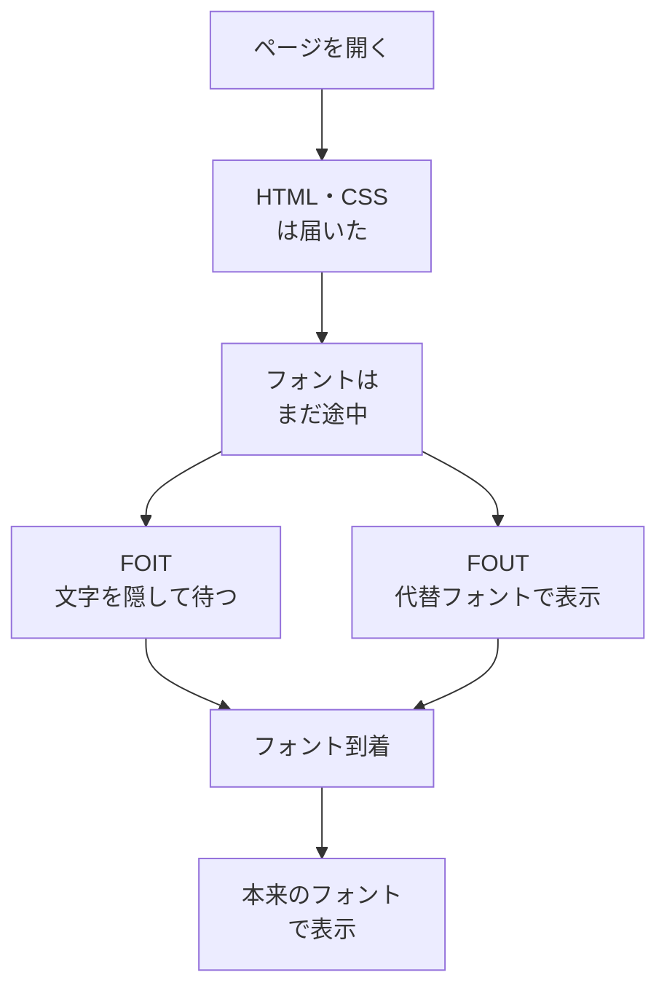

# フォントの遅延 — 文字が一瞬消える・ガタつく仕組み

## 今日のゴール

- Web フォントの表示が遅れる理由と FOIT・FOUT という 2 つの見せ方を知る
- font-display で読み込み中の文字の見せ方を選べることを知る
- フォントの差し替えで起きるレイアウトシフトと、その防ぎ方を知る

## フォントが遅れて届く理由

ニュースサイトやコーポレートサイトで、こんな場面を見たことがないでしょうか。

- サイトを開いた瞬間、最初は違う書体で文字が表示されて、コンマ何秒か遅れて本来の書体に変わる
- 一瞬文字が見えず、少し遅れて現れる

これは **Web フォント**を使っているサイトで起きる現象です。

> **Web フォント** = OS に入っている書体ではなく、サイト側で用意したフォントファイルをブラウザにダウンロードさせて使う仕組み

CSS では `@font-face` で指定します。

```css
@font-face {
  font-family: "My Sans";
  src: url("/fonts/my-sans.woff2") format("woff2");
}

body {
  font-family: "My Sans", sans-serif;
}
```

ポイントは、**フォントがファイルである**ことです。

- 画像と同じで、ダウンロードが終わるまで使えない
- 一方、HTML のテキスト自体は先に届いている
- つまりブラウザには「文字はもう手元にあるのに、それを描く書体がまだ無い」という時間があり、**その間テキストをどう表示するかを選ばなければならない**

日本語フォントは特に不利です。ひらがな・カタカナ・漢字で収録する文字が多く、ファイルが英語フォントの何十倍にもなるため、この「書体がまだ無い時間」が長くなりがちです。

## FOIT と FOUT

フォントが届くまでの見せ方は 2 通りしかありません。

- **FOIT**（Flash of Invisible Text）: フォントが届くまで**文字を表示しない**。書体の切り替わりは見えないが、読み込みが遅いと文字のない画面がしばらく続く
- **FOUT**（Flash of Unstyled Text）: まず代替フォント（OS のシステムフォントなど）で表示しておき、**届いたら本来のフォントに差し替える**。文字はすぐ読めるが、書体が変わる瞬間が見える



どちらを選んでも副作用があります。

| 見せ方 | 生まれる副作用 |
|--------|--------------|
| FOIT | 読めない時間 |
| FOUT | 書体が切り替わる瞬間 |

冒頭の現象はバグではなく、ブラウザがこの二択のどちらかを実行した結果です。

何も指定しない場合の挙動はブラウザ任せで、たとえば Chrome は 3 秒ほど文字を隠して待つ FOIT 寄りの動きをします。つまり回線が遅い利用者には、意図せず「文字のない 3 秒」を見せていることになります。

## font-display で見せ方を選ぶ

この挙動は `@font-face` の中に書く **`font-display`** で制御できます。

```css
@font-face {
  font-family: "My Sans";
  src: url("/fonts/my-sans.woff2") format("woff2");
  font-display: swap;
}
```

| 値 | 挙動 | 向いている場面 |
|----|------|--------------|
| `swap` | ほぼ待たずに代替フォントで表示し、届き次第差し替える。FOUT 寄り | 本文や見出しなど、すぐ読めることを優先したいテキスト |
| `block` | 3 秒ほど文字を隠して待ち、間に合わなければ代替フォントで表示して、届き次第差し替える。FOIT 寄り | 代替フォントでは意味が壊れるアイコンフォントなど |
| `fallback` | ごく短時間だけ隠した後に代替フォントで表示し、数秒以内に届いたときだけ差し替える | 表示の速さと差し替えの頻度のバランスを取りたいとき |
| `optional` | ごく短時間だけ待ち、間に合わなければそのページは代替フォントのまま表示する | 遅い回線では Web フォントを諦めてよいとき |

「文字が読めないのが最悪」という考え方から、一般には `swap` がよく使われます。ただし選び方には裏表があります。

- **swap**: 差し替えが必ず起きるので、次に説明するガタつきの問題を抱える
- **optional**: 差し替えをしないのでガタつきは起きないが、Web フォントが表示されないことを受け入れる必要がある

> **表示の速さとガタつきはトレードオフ**。`font-display` はその折り合いの付け方を選ぶプロパティ

## 差し替えの瞬間に起きるレイアウトシフト

FOUT にはもう 1 つ問題があります。代替フォントと本来のフォントでは、**同じ文章でも文字の幅が違う**ことです。

幅が違うと、差し替わった瞬間に折り返しの位置が変わります。

- 3 行だった段落が 2 行になれば、その下にあるボタンや画像は上にずれる
- ボタンを押そうとした瞬間に画面がガタッと動いて別の場所を押してしまう、という体験の原因の 1 つがこれ

この「表示中にレイアウトがどれだけ動いたか」を数値化した指標が **CLS**（Cumulative Layout Shift）です。

- Google がページ体験の指標として定める Core Web Vitals の 1 つで、検索順位にも関わる
- フォントの差し替えは、画像のサイズ未指定と並ぶ CLS の代表的な悪化要因

## ガタつきを防ぐ方法

### preload による先読み

ブラウザがフォントを取りに行くのは、CSS を読んで「このフォントを使うテキストがある」と分かってからです。つまり通常の流れでは、フォントの取得はどうしても後回しになります。

```html
<link
  rel="preload"
  href="/fonts/my-sans.woff2"
  as="font"
  type="font/woff2"
  crossorigin
/>
```

`rel="preload"` を書いておくと、ブラウザは HTML を読み始めた段階でフォントの取得を始めます。最初の描画にフォントが間に合えば、そもそも差し替えが起きません。

### 代替フォントの幅合わせ

差し替えでガタつくのは幅が違うからなので、**代替フォント側の表示幅を本来のフォントに近づける**という対策もあります。

- CSS には `size-adjust` など、代替フォントの表示サイズを補正する指定がある
- 幅がほぼ揃っていれば、差し替わっても折り返しが変わらずガタつかない

ただし、補正の数値はフォントの組み合わせごとに違い、手で調整するのは現実的ではありません。

### next/font の位置づけ

Next.js の **`next/font`** は、ここまでの対策を自動でまとめて行う仕組みです。

- ビルド時にフォントファイルを取得し、自分のサーバーから配信する
- フォントを自動で preload する
- フォントファイルから幅の補正値を計算し、`size-adjust` を含む代替フォントの CSS を生成する
- `font-display` の初期値は `swap`

「next/font を使う」という一手には、ここまで見てきた FOIT・FOUT・CLS への対策が全部詰まっています。仕組みを知っていれば、指示の語彙にもなります。

- **AI のコードで Google Fonts を `<link>` で読み込んでいるのを見つけたとき**: 「フォントの読み込みで文字が消えたりガタついたりしないように、next/font に置き換えて」と指示できる
- **素の HTML/CSS のプロジェクトのとき**: 「font-display は swap、フォントは preload して」と言い換えられる

## まとめ

- Web フォントはファイルで、届くまでの見せ方は FOIT か FOUT の二択
- font-display の swap・block・fallback・optional で、表示の速さとガタつきの折り合いを選ぶ
- 差し替えの幅ズレは CLS を悪化させるので、preload と幅合わせ、Next.js なら next/font で防ぐ
