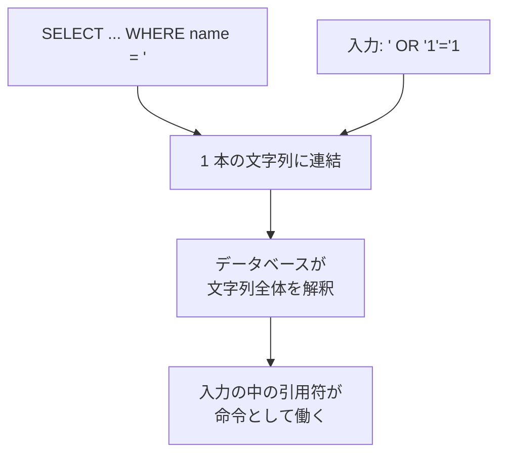

# SQL インジェクション — 文字列連結が入力を命令に変える

## 今日のゴール

- 入力を SQL に文字列連結すると命令が書き換わると知る
- 命令とデータを同じ文字列で組み立てるのが原因だと知る
- 対策はプレースホルダで構文と値を分けることだと知る

## 検索ボックスの入力から SQL 文を組み立てるコード

検索ボックスに入れた文字列で、データベースの `users` テーブルからユーザーを探す機能を考えます。素朴に書くと、こういう形になります。

```ts
// 悪い例: 入力を SQL 文字列にそのまま埋め込む
const input = "ozaki"; // 検索ボックスに入力された文字列
const sql = `SELECT * FROM users WHERE name = '${input}'`;
const rows = await db.query(sql);
```

`input` が `ozaki` なら、組み立てられる SQL はこうです。

```sql
SELECT * FROM users WHERE name = 'ozaki'
```

名前が `ozaki` の行だけが返ってきて、テストもふつうに通ります。ここまでは意図どおりです。

## 条件を常に真に書き換える入力

ところが攻撃する側は、検索ボックスに SQL の一部として意味を持つ文字を混ぜてきます。たとえば `name` 欄にこう入れたとします。

```
' OR '1'='1
```

さっきのコードは入力をそのまま連結するので、組み立てられる SQL はこう変わります。

```sql
SELECT * FROM users WHERE name = '' OR '1'='1'
```

意図した条件と並べると、変化がはっきりします。

| | 組み立てられた SQL | 返ってくる行 |
|---|---|---|
| 意図した検索 | `... WHERE name = 'ozaki'` | 名前が一致する行だけ |
| 攻撃された検索 | `... WHERE name = '' OR '1'='1'` | 全部の行 |

何が起きたかを分解するとこうです。

- 名前の条件は `name = ''`（空の名前の行）に変わった
- そこに `OR` でつないだ `'1'='1'` はいつでも成り立つので、条件全体が「名前が一致する行」ではなく「常に真」になった
- 結果として `users` テーブルの全行が返る。パスワードのハッシュでも他人の個人情報でも、テーブルにあるものがまとめて漏れる

これが **SQL インジェクション**です。

## 原因は命令とデータの混在

入力が命令を書き換えられる原因は、SQL 文の組み立て方そのものにあります。

文字列連結で作った SQL は、「命令」と「データ」が 1 本の文字列に溶け込んでいます。



1. データベースは、渡された文字列を頭から SQL の構文として読む
2. 入力の中にある `'`（引用符）が、名前を囲む引用符を途中で閉じてしまう
3. 閉じたあとの `OR '1'='1` は、データではなく SQL の命令の一部として解釈される

「入力はただのデータとして扱われるはず」という前提は、この作り方では成り立ちません。データのつもりで置いた文字列が、書き方しだいで命令として解釈されます。

## 対策はプレースホルダ

> **プレースホルダ**: SQL の命令とデータを別々にデータベースへ渡す仕組み。パラメータ化クエリとも呼ばれる

SQL 文には値を入れる穴だけを空けておき、実際の値は後から別の引数で渡します。穴は `?` で表すことが多いです。

```ts
// 良い例: 構文と値を分けて渡す
const input = "' OR '1'='1"; // どんな文字列が来ても
const rows = await db.query(
  "SELECT * FROM users WHERE name = ?", // 構文はここで確定
  [input], // 値は別枠で渡す
);
```

こう書くと、データベースの処理の順番が変わります。

1. 先に `SELECT * FROM users WHERE name = ?` を「命令」として受け取り、構文を確定させる
2. そのあとで `input` の中身を、ただの「探す値」として穴に当てはめる
3. 値の中に `'` や `OR` が入っていても、名前という文字列の一部として扱われ、SQL の構文としては解釈されない

だから `' OR '1'='1` で検索しても、「そういう名前の人」を探して 0 件になるだけです。

プレースホルダは、命令とデータの間に境界を引く書き方だと言い換えられます。境界の向こうから来た入力は、けっして命令に昇格しません。

## ORM と生の SQL

配属先で使う Prisma のような ORM（SQL を直接書かず、コードでデータベース操作を組み立てる仕組み）を使うと、この穴は多くの場合そもそも開きません。

```ts
// Prisma: 内部でプレースホルダ相当の組み立てをしてくれる
const users = await prisma.user.findMany({
  where: { name: input },
});
```

`findMany` のようなモデル経由の操作では、値は自動でパラメータとして渡されます。文字列連結の SQL を自分で書かないので、インジェクションが入り込む隙がありません。

ただし ORM にも、`$queryRaw` や `$queryRawUnsafe` のように生の SQL を書くための機能があります。ここで文字列連結に戻ると、危険も戻ってきます。

| 書き方 | 何が起きるか |
|---|---|
| `$queryRaw` をタグ付きテンプレートで書く | `${input}` の部分を自動でパラメータ化してくれる（安全） |
| `$queryRawUnsafe` に文字列連結した SQL を渡す | プレースホルダを通らないので同じ穴が開く |

「ORM を使っているから安全」は、モデル経由で書いている限りの話です。生の SQL を組み立てる関数に手を出すときは、素の SQL と同じ注意が必要になります。

AI が実装した検索機能にも、文字列連結でクエリを組み立てるコードが混じることがあります。SQL の中の `'${input}'` のような埋め込みや `...Unsafe` 系の関数が目印で、見つけたら「文字列連結ではなくプレースホルダを使って」と一言指示すれば、事故は入り口で止められます。

## まとめ

- 入力を SQL に文字列連結すると条件が書き換わる
- 原因は命令とデータを 1 本の文字列で組み立てること
- プレースホルダで構文と値を分ければ入力は命令にならない
