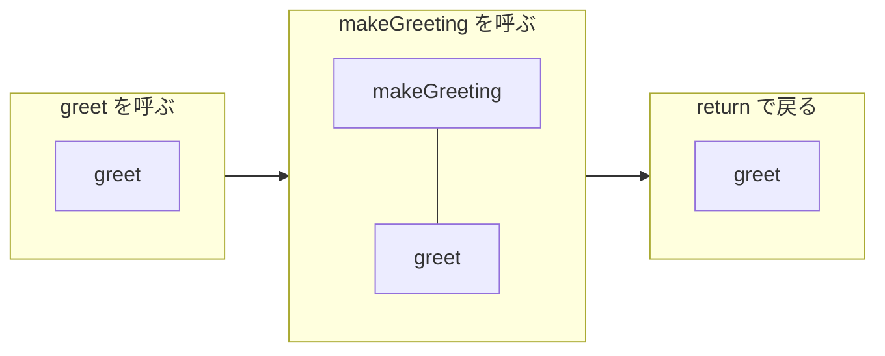
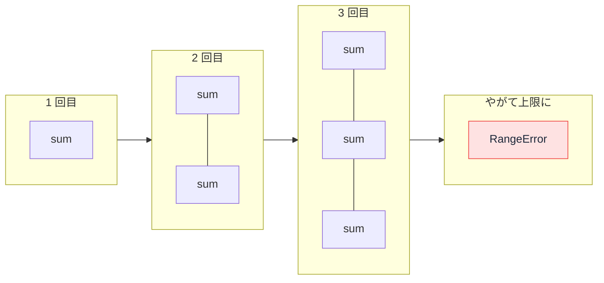

# コールスタック — 関数の呼び出し履歴が積み上がって溢れる仕組み

## 今日のゴール

- コールスタックが「呼び出し元に戻るための記録の積み重ね」だと知る
- 「Maximum call stack size exceeded」が記録の積みすぎで起きると知る
- 再帰関数を見たら終了条件を確認する視点を持つ

## Maximum call stack size exceeded というエラー

Web アプリを触っていて、画面が固まったあとにこんな赤い文字が出た経験があるかもしれません。

```
RangeError: Maximum call stack size exceeded
```

Chrome や Safari ではこの文言で、Firefox では `InternalError: too much recursion`（再帰が多すぎる）と表示されます。直訳すると「コールスタックの最大サイズを超えました」です。この **コールスタック（call stack）** が何かを知ると、このエラーの意味がそのまま読めるようになります。JavaScript が関数を動かす、いちばん土台の仕組みの話です。

## 関数が呼ばれるたびに積まれる記録

```js
function makeGreeting(name) {
  return `こんにちは、${name}さん`;
}

function greet(name) {
  const message = makeGreeting(name); // ここで makeGreeting を呼ぶ
  console.log(message);               // makeGreeting から戻ってきたら実行する
}

greet("田中");
```

`greet` の実行中に `makeGreeting` が呼ばれます。このとき JavaScript は、「`makeGreeting` が終わったら `greet` のこの行に戻って続きを実行する」という戻り先を覚えておく必要があります。

この戻り先の記録を、JavaScript は積み重ねて管理します。

- 関数が呼ばれると、記録を 1 つ上に積む（**プッシュ**）
- 関数が `return` などで終わると、一番上の記録を取り除いて戻り先の続きへ進む（**ポップ**）

この積み重ね全体が **コールスタック** です。スタック（stack）は「積み重ね」という意味で、最後に積んだものを最初に取り出す構造を **LIFO**（Last In First Out）と呼びます。重ねた皿の山と同じで、出し入れできるのは常に一番上だけです。



呼び出しが深くなるほど記録は高く積み上がり、関数が戻るたびに 1 段ずつ低くなります。プログラムが順調に動いている間、コールスタックは積んでは崩しを静かに繰り返しています。

## 終了条件のない再帰でスタックが溢れるまで

自分自身を呼ぶ関数を **再帰関数** と呼びます。配列の合計を再帰で書いてみます。

```js
// 終了条件を書き忘れた再帰
function sum(numbers) {
  const [first, ...rest] = numbers;
  return first + sum(rest); // rest が空になっても、さらに sum を呼んでしまう
}

sum([1, 2, 3]);
// RangeError: Maximum call stack size exceeded
```

`sum([1, 2, 3])` は中で `sum([2, 3])` を呼び、それが `sum([3])` を呼び、`sum([])` を呼びます。本来はここで止まるべきですが、この `sum` は空配列を渡されてもまた `sum([])` を呼びます。呼び出しがいつまでも終わらないので、戻り先の記録は積まれる一方で、1 つもポップされません。

コールスタックの置き場所には上限があります。積まれた記録が上限に達した瞬間、JavaScript は「Maximum call stack size exceeded」を投げて処理を止めます。これが **スタックオーバーフロー**（スタックの溢れ）です。止まらない処理がメモリを食い尽くす前に、安全装置が働いたと読めます。



直し方は、これ以上は自分を呼ばない条件、つまり **終了条件** を最初に書くことです。

```js
// 終了条件のある再帰
function sum(numbers) {
  if (numbers.length === 0) return 0; // 終了条件: 空になったら止まる
  const [first, ...rest] = numbers;
  return first + sum(rest);
}

sum([1, 2, 3]); // 6
```

`sum([])` に到達した瞬間に `return 0` で戻り始め、積まれていた記録が上から順にポップされて、最後に 6 が返ります。再帰関数を読むときは、終了条件があるか、そして必ずそこに到達するか、の 2 点を見ます。コードレビューで再帰を見かけたら「この再帰、終了条件は入っていますか」と確認する。AI の出力を評価するときもまったく同じ視点が使えますし、AI に処理を頼むときに「終了条件を必ず入れて」と指示する語彙にもなります。

## スタックトレースとのつながり

エラー画面で `at ...` が何十行も並ぶ一覧を **スタックトレース** と呼びます。あれはエラーが起きた瞬間のコールスタックの中身を、上から順にそのまま印刷したものです。

```
RangeError: Maximum call stack size exceeded
    at sum (cart.js:3:18)
    at sum (cart.js:3:18)
    at sum (cart.js:3:18)
    at sum (cart.js:3:18)
    ...
```

- 一番上が、エラーが起きたまさにその場所（最後にプッシュされた記録）
- 下に行くほど呼び出し元に遡り、一番下が最初の呼び出し

「上が最新、下が起点」という並びは、コールスタックの積み重ねをそのまま映しているからです。そして上の例のように **同じ関数名がずらりと並んでいたら**、再帰が止まらなくなっているサインです。犯人の関数名まで書いてあるので、このエラーは原因特定が比較的やさしい部類に入ります。

## ループでなく再帰を使う場面

合計を求めるだけなら `for` ループでも書けますし、ループなら溢れる心配もありません。それでも再帰が使われるのは、**ネストした（入れ子の）データを辿る処理** と相性がいいからです。

- フォルダの中にフォルダがあるディレクトリ構造
- カテゴリの下にサブカテゴリが続くメニュー
- コンポーネントの中にコンポーネントがある画面

深さが何段あるか事前に分からない構造は、「自分と同じ処理を一段深いところにも適用する」という再帰の形で書くと素直に収まります。React の公式ドキュメントも、コンポーネントの描画を再帰的な処理だと説明しています。JSX で `<Layout><Page /></Layout>` のようにいくらでもネストできるのは、React がコンポーネントの木を再帰的に辿って描画しているからです。

## まとめ

- コールスタックは戻り先の記録の積み重ねで、呼び出しで積み、終了で取り除く（LIFO）
- 終了条件のない再帰は記録が積まれる一方になり、上限で Maximum call stack size exceeded
- スタックトレースはコールスタックの写しで、同じ関数名の連続は再帰の暴走のサイン
