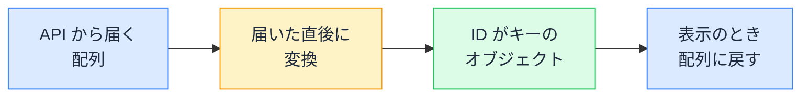

# 配列とオブジェクト — 並べるのか探すのかで選ぶ

## 今日のゴール

- 配列は順番を扱う操作、オブジェクトはキーで直接引く操作が得意だと知る
- ID を指定した参照や更新が多いデータは、ID をキーにしたオブジェクトで持つ型を知る
- 「順番が大事か、ID で引くか」でデータの持ち方を選ぶ判断軸を知る

## とりあえず配列で持ち始めた一覧画面

タスク管理アプリの一覧画面を考えます。API からタスクの一覧を取ってくると、データはたいてい配列で届きます。

```json
[
  { "id": "t-01", "title": "資料を送る", "done": false },
  { "id": "t-02", "title": "会議室を予約する", "done": true },
  { "id": "t-03", "title": "議事録を書く", "done": false }
]
```

届いた配列をそのまま状態に入れ、`map` で並べて表示する。ここまではまったく自然な流れで、表示するだけならこれで完成です。

事情が変わるのは、機能を足し始めてからです。

- チェックボックスで 1 件を完了にする
- タイトルを 1 件だけ書き換える
- クリックした 1 件の詳細を出す

機能が増えるたびに「**この ID のタスクはどれか**」を配列の中から探す処理が必要になります。

```tsx
"use client";

import { useState } from "react";

type Task = { id: string; title: string; done: boolean };

export function TaskList({ initialTasks }: { initialTasks: Task[] }) {
  // API から届いた配列を、そのまま状態として持つ
  const [tasks, setTasks] = useState<Task[]>(initialTasks);

  // 1 件を完了にする。対象を探すために全体をなめる
  const toggleDone = (id: string) => {
    setTasks((prev) =>
      prev.map((task) =>
        task.id === id ? { ...task, done: !task.done } : task
      )
    );
  };

  // 1 件のタイトルを変える。ここでも全体をなめて探す
  const renameTask = (id: string, title: string) => {
    setTasks((prev) =>
      prev.map((task) => (task.id === id ? { ...task, title } : task))
    );
  };

  return (
    <ul>
      {tasks.map((task) => (
        <li key={task.id}>
          <label>
            <input
              type="checkbox"
              checked={task.done}
              onChange={() => toggleDone(task.id)}
            />
            {task.title}
          </label>
        </li>
      ))}
    </ul>
  );
}
```

このコードは正しく動きます。ただ、よく見ると気になる点があります。

- `toggleDone` も `renameTask` も、やっていることの半分は「ID が一致する 1 件を探す」
- 「クリックした 1 件の詳細を出す」機能を足せば、`tasks.find((task) => task.id === selectedId)` がもう 1 か所増える
- 同じ探すロジックが関数の数だけ重複し、しかもどれも配列の先頭から 1 件ずつ照合する
- タスクが数千件になれば、1 件を触るたびに数千回の比較が走る

機能を足すたびに探すコードが増えていくのは、書き方が下手だからではありません。**配列という持ち方が「ID で 1 件を特定する」操作に向いていない**からです。

## 配列は順番が主役

配列は、値が順番に並んだ入れ物です。得意なのは順番を使った操作です。

- 先頭から順に処理する。`map` や `filter` で全件を変換・絞り込みする
- 並び替える。`toSorted` で並び順を変えた新しい配列を作る
- n 番目を取り出す。`tasks[0]` で先頭を見る
- 同じ値を複数回持てる。順番で区別できるので重複しても困らない

一方で「この ID の 1 件」を取り出す専用の口はありません。何番目にあるか分からない以上、`find` で先頭から照合していくしかありません。

## オブジェクトはキーが主役

同じデータは、ID をキーにしたオブジェクトとしても持てます。

```js
const tasksById = {
  "t-01": { id: "t-01", title: "資料を送る", done: false },
  "t-02": { id: "t-02", title: "会議室を予約する", done: true },
  "t-03": { id: "t-03", title: "議事録を書く", done: false },
};

tasksById["t-02"]; // 探すループなしで、この 1 件に直接届く
```

オブジェクトは「キーと値の対応表」で、得意なのはキーを使った操作です。

- **キーで直接引ける**: `tasksById[id]` と書けば、何件あっても探すループなしで目当ての 1 件に届く
- **キーは重複できない**: 同じ ID のデータが二重に紛れ込むこともない
- **代わりに順番を使う操作は苦手**: 「3 番目のタスク」という取り出し方はできず、並び順を情報として持たせる用途にも向かない

つまり配列とオブジェクトは、上位互換の関係ではなく**得意な操作が違う 2 つの持ち方**です。だから「そのデータを主にどう扱うか」で選びます。

## 届いた直後にキーで引ける形へ変換する

API が配列で返してくること自体は変えられません。そこで定番の型は、**届いた直後に ID をキーにしたオブジェクトへ変換してしまう**ことです。



先ほどのコンポーネントを、この型で書き直します。

```tsx
"use client";

import { useState } from "react";

type Task = { id: string; title: string; done: boolean };

export function TaskList({ initialTasks }: { initialTasks: Task[] }) {
  // 届いた直後に ID をキーにしたオブジェクトへ変換する
  const [tasksById, setTasksById] = useState<Record<string, Task>>(() =>
    Object.fromEntries(initialTasks.map((task) => [task.id, task]))
  );

  // 1 件を完了にする。探すループはもう出てこない
  const toggleDone = (id: string) => {
    setTasksById((prev) => ({
      ...prev,
      [id]: { ...prev[id], done: !prev[id].done },
    }));
  };

  // 1 件のタイトルを変える。キーで直接更新する
  const renameTask = (id: string, title: string) => {
    setTasksById((prev) => ({ ...prev, [id]: { ...prev[id], title } }));
  };

  // 一覧として表示するときだけ配列に戻す
  const tasks = Object.values(tasksById);

  return (
    <ul>
      {tasks.map((task) => (
        <li key={task.id}>
          <label>
            <input
              type="checkbox"
              checked={task.done}
              onChange={() => toggleDone(task.id)}
            />
            {task.title}
          </label>
        </li>
      ))}
    </ul>
  );
}
```

登場した部品はどれも JavaScript と TypeScript の標準です。

- `Record<string, Task>` は TypeScript の型で、「キーが文字列、値が Task のオブジェクト」を表す
- `Object.fromEntries` は `[キー, 値]` のペアの配列からオブジェクトを作る
- `Object.values` はオブジェクトの値だけを集めた配列を返す

- **変換は届いたときの 1 回だけ**: 以降の「この ID の 1 件を参照・更新したい」はすべて `tasksById[id]` で済み、関数ごとに重複していた探すロジックが消える
- **機能追加も 1 行**: 詳細表示を足すときも `tasksById[selectedId]` と書くだけ
- **表示のときだけ配列へ**: 一覧表示が必要な場面だけ `Object.values` で戻す

## 順番も大事なときの持ち方

1 つ注意があります。JavaScript のオブジェクトのキーが列挙される順番は、キーの種類で変わる仕様です。

| キーの種類 | 列挙される順番 |
|-----------|---------------|
| `"1"` や `"42"` のような整数に見える文字列 | 追加した順ではなく、数の昇順 |
| それ以外の文字列 | 追加した順 |

だから API が数値の ID を返す場合、`Object.values` で戻した配列の順番は届いた順と一致しないことがあります。

並び順に意味があるデータなら、順番だけを ID の配列として別に持ちます。

```js
// 中身は ID がキーのオブジェクト、順番は ID の配列で持つ
const taskIds = ["t-03", "t-01", "t-02"];
const orderedTasks = taskIds.map((id) => tasksById[id]);
```

「中身はキーで引ける対応表、順番は配列」という分担で、両方の得意分野を使えます。状態管理ライブラリのドキュメントでも紹介される定番の形で、会話やドキュメントで「正規化して持つ」「ID で引ける形にする」と言われたら、たいていこの持ち方を指しています。

なお、対応表の入れ物にはオブジェクトのほかに `Map` もあります。

- **Map の強み**: キーの追加と削除を大量に繰り返す用途に最適化されていて、文字列以外の値もキーにできる
- **React の状態なら**: スプレッド構文でそのまま更新できるオブジェクトのほうが手数が少なく、まずはオブジェクトで困らない

## 使い分けの目安

| データの性質・扱い方 | 向いている持ち方 |
|--------------------|------------------|
| 順番どおりに表示する、並び替える | 配列 |
| n 番目を取り出す | 配列 |
| 同じ値・項目が重複しうる | 配列 |
| ID を指定して 1 件を参照・更新する | オブジェクトや Map |
| キーの重複を許したくない | オブジェクトや Map |

ループの中の `includes` や `find` を Set や Map に置き換えて速くするのは、すでにあるコードの直し方です。今日の話はその一歩手前で、**最初からキーで引ける形で持っておけば、探す処理そのものを書かずに済みます**。

配列のままが間違いというわけではありません。

- 数十件の一覧を表示して、更新箇所も 1 つだけなら、配列のままで十分
- 判断の分かれ目は「**ID を指定した参照・更新が、コードのあちこちに出てくるか**」

ID 指定の更新が多いと分かっているなら、AI に設計を頼むときも「ID をキーにしたオブジェクトで持って、表示のときだけ配列に戻して」と最初から指定できます。

## まとめ

- 配列は順番を使う操作、オブジェクトや Map はキーで直接引く操作が得意
- ID 指定の参照・更新が多い一覧は、届いた直後に ID をキーにしたオブジェクトへ変換する
- 表示には `Object.values` で配列に戻し、並び順が大事なら ID の配列を別に持つ
