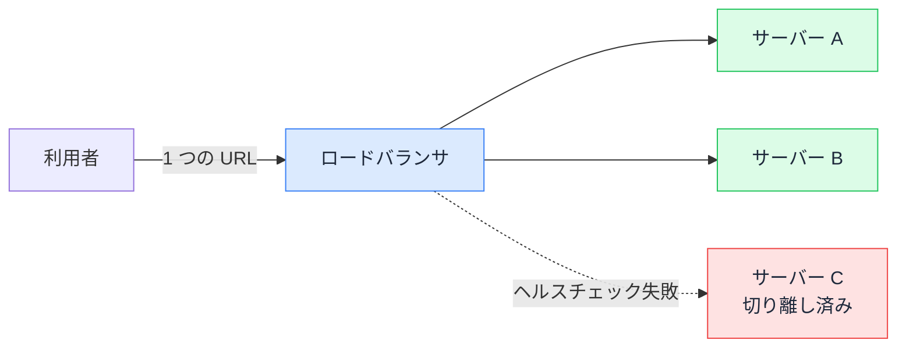

# ロードバランサ — 1 台落ちても止まらない仕組み

## 今日のゴール

- 本番のサービスは 1 つの URL の裏で複数のサーバーが動いていると知る
- ロードバランサがリクエストを複数のサーバーに振り分けていると知る
- ヘルスチェックで異常なサーバーが自動的に切り離されると知る

## サーバー 1 台構成の限界

よく使う SNS や動画サービスには、世界中から絶え間なくアクセスが届いています。1 台のコンピュータで捌ける量ではないので、裏では大量のサーバーが動いているはずです。それなのに、利用者が開く URL は 1 つだけで、どのサーバーに繋ぐかを選ぶ場面はありません。複数台あるのに窓口は 1 つ。今日はこれを成り立たせている仕組みの話です。

`npm run dev` で動かす開発用サーバーは 1 つなので、デプロイ先も「どこかのサーバーが 1 台あって、そこでアプリが動いている」という絵を思い浮かべるかもしれません。小さなサービスなら実際にそれで動きます。ただし 1 台の構成には弱点があります。

- 性能の上限がその 1 台で決まる。アクセスが増えて処理が追いつかなくなっても、それ以上は捌けない
- その 1 台が落ちたら、サービス全体が止まる。ハードウェアの故障でも再起動でも、理由を問わず全部止まる

「ここが壊れると全体が止まる」という箇所を**単一障害点**（single point of failure）と呼びます。サーバー 1 台の構成は、サーバーそのものが単一障害点です。

そこで、同じアプリを載せたサーバーを複数台並べます。2 台あれば捌ける量は増え、1 台壊れてももう 1 台が残ります。ただ、新しい問題が生まれます。利用者はどのサーバーにアクセスすればいいのでしょうか。URL をサーバー A 用と B 用に分けて利用者に選ばせるわけにはいきません。

## ロードバランサの役割

この交通整理を引き受けるのが**ロードバランサ**（load balancer）です。load は負荷、balance は釣り合いで、リクエストの負荷を複数のサーバーに偏りなく配る装置です。

- 利用者からのリクエストは、まずすべてロードバランサに届く
- ロードバランサは、背後に並んだサーバーのどれか 1 台を選んでリクエストを渡す
- サーバーが返した応答は、ロードバランサ経由で利用者に返る

利用者から見えるのは 1 つの URL だけです。その URL の先にいるのはロードバランサで、実際にリクエストを処理するサーバーは毎回変わりえます。さっきの表示はサーバー A が、リロード後の表示はサーバー B が処理したかもしれませんが、利用者には区別が付きませんし、区別する必要もありません。

Vercel のようなホスティングサービスに任せている場合、この振り分けはサービスの内部で行われていて、自分で設定することはまずありません。一方、配属先が自前のサーバーを立てて運用している構成なら、ロードバランサは構成図の入口の定番として登場します。

## 振り分け方の代表例

どのサーバーに渡すかの決め方には、いくつか定番があります。

| 方式 | 決め方 |
|------|--------|
| ラウンドロビン | 来たリクエストを 1 台ずつ順番に回す |
| 最小コネクション | 今処理している数が最も少ないサーバーに渡す |

ほかにも、同じ利用者からのリクエストを同じサーバーに固定する方式などがありますが、名前まで覚える必要はありません。特定の 1 台に負荷が偏らないように配る決め方がいくつかあって、設定で選べる、と知っていれば十分です。

## ヘルスチェックによる自動の切り離し

複数台に配るだけの仕組みだと、落ちたサーバーにもリクエストを送り続けてしまいます。それを防ぐのが**ヘルスチェック**です。

ロードバランサは、背後のサーバー 1 台ずつに、数秒から数十秒おきに「生きているか」を確かめるリクエストを送り続けます。送り先には `/health` のような確認専用のエンドポイントを用意しておくことが多く、サーバーが正常なら、正常を意味する応答をすぐ返します。

- 正常な応答が返っている間は、そのサーバーは振り分け先に入り続ける
- 応答がない、またはエラーが返る状態が数回続くと、そのサーバーは振り分け先から外される
- 回復して正常な応答が返るようになれば、また振り分け先に戻される

1 回の失敗で即座に外さないのは、たまたま一瞬混んでいただけのサーバーを切り離さないためです。裏を返すと、サーバーが落ちてから切り離されるまでには、失敗が数回積み重なるぶんの時間差があります。

## 1 台落ちても止まらない流れ

複数台への振り分けとヘルスチェックを組み合わせると、冒頭の「1 台落ちたら全部止まる」が解消されます。

サーバー C が落ちると、C へのヘルスチェックが失敗し始め、数回続いたところで C は振り分け先から外れます。以降のリクエストはすべて A と B が引き受けます。利用者は同じ URL を開き続けているだけで、裏で 1 台減ったことには気づきません。壊れた C は、サービスを止めずに落ち着いて調べたり入れ替えたりできます。

万能ではありません。切り離されるまでの時間差の間は、落ちた C に当たったリクエストが失敗します。ただしこの失敗は、少し待って送り直せば A か B に当たって成功する類のものです。通信に自動のリトライを入れておくと、利用者に気づかれる前に拾える場面がここでも出てきます。

## 複数台ならではの注意点

サーバーが複数になると、1 台のときには起きなかった問題も生まれます。代表が、サーバーのメモリに情報を抱え込む書き方です。

例えば「ログイン中の利用者一覧」をサーバー A のメモリ上に持っていたとします。ある利用者のログイン処理を A が受け持ち、次のリクエストが B に振り分けられると、B のメモリにその記録はないので「ログインしていない人」として扱われてしまいます。同じ利用者でも、リクエストごとに別のサーバーに当たりうるからです。

だから複数台で動かす前提のサーバーは、どの 1 台が受けても同じ結果になるように、処理に必要な情報を自分のメモリに抱え込まない作りにします。この設計はそれだけで 1 つのテーマになるので、今日のところは「複数台構成では、サーバー個体のメモリを当てにしない」とだけ覚えておけば十分です。

## 「本番だけたまに失敗する」の切り分け

本番で「たまにエラーになるが、リロードすると直る」「一部の人だけ調子が悪い」という現象に出会ったとき、複数台構成を知っていると切り分けの候補が 1 つ増えます。すべてのリクエストが同じサーバーで処理されているとは限らないので、特定の 1 台だけ調子が悪く、そこに当たったリクエストだけ失敗している可能性があるからです。

チームや AI に相談するときも、「本番でたまに 500 エラーが出る」で止めずに、「本番はロードバランサの向こうに複数台あるはずなので、特定のサーバーだけの問題か、全台で起きているのか切り分けたい」と伝えられると、調べる場所が一気に絞れます。ヘルスチェックは通っているか、切り離されたサーバーはいないか、という確認の観点もこの語彙から出てきます。

## まとめ

- 本番の 1 つの URL の裏では、ロードバランサが複数のサーバーにリクエストを振り分けている
- ヘルスチェックに失敗したサーバーは振り分け先から自動で外され、残りの台が引き受ける
- 本番でたまに失敗する現象は、特定の 1 台だけの不調という可能性も候補に入れて切り分ける
