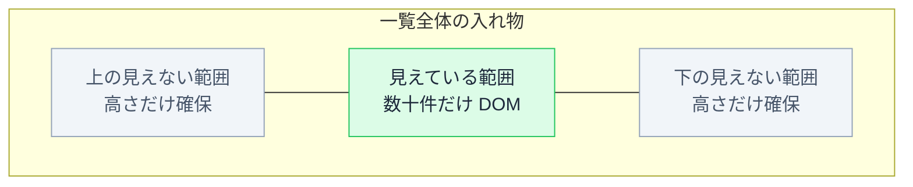

# 巨大リストの仮想化 — 見えている分だけ描画する

## 今日のゴール

- 一覧が重くなる原因のひとつに DOM 要素の数そのものがあると知る
- 見えている範囲の分だけ DOM を作る仮想化という手法を知る
- 仮想化が向く場面と向かない場面を知る

## 件数を増やした一覧がスクロールで固まる

取引履歴や検索結果の一覧画面で、手元の 10 件では滑らかに動いていたのに、本番相当の 1 万件に差し替えた途端、初回表示に時間がかかり、スクロールがカクカクし始めることがあります。

開発者ツールで調べても、怪しい場所が見つかりません。

- 通信はすぐ返ってきている
- データを加工するコードに重いループがあるわけでもない

計算は軽いのに、**画面に出した途端に重い**。この場合、原因はコードのロジックではなく、画面に出している要素の数そのものにあります。

## 1 万件のデータは 1 万個の DOM 要素になる

一覧の描画でいちばん素直な書き方は、配列を `.map()` で回して全件を要素にする形です。

```tsx
type Product = { id: string; name: string; price: number };

function ProductList({ products }: { products: Product[] }) {
  return (
    <ul>
      {products.map((product) => (
        <li key={product.id}>
          {product.name} {product.price.toLocaleString()} 円
        </li>
      ))}
    </ul>
  );
}
```

このコードは正しく動きます。ただし `products` が 1 万件なら、`<li>` が 1 万個作られます。

| 行 | 状態 |
|---|---|
| スクロール位置に応じた数十件 | 実際に画面に見えている |
| 残りの 9,900 件以上 | 一度も画面に映らないまま、ブラウザの中に DOM 要素として保持され続ける |

件数が多いこと自体より、**見えない行の分まで DOM を作っている**ことが重さの原因です。

## DOM 要素は保持するだけでコストがかかる

DOM 要素は、ブラウザにとって「ただのデータ」ではありません。1 個作るごとに、ブラウザが管理する対象が増えます。

- **レイアウト計算の対象**: どこに、どの大きさで置くかの計算に加わる
- **描画の対象**: 画面に映すかどうかに関わらず、描画処理の管理下に入る
- **監視の対象**: スタイルの変化やイベントの伝わり先として追跡される

数が増えるほど、影響はこう積み重なります。

- 初回表示では、全要素の位置計算が終わるまで画面に出ない
- 操作や表示の更新のたびに、再計算する範囲が広がる
- 1 万個の要素を持ったページでは、この再計算が積み重なってスクロールの表示更新が追いつかなくなる

どのくらいの数から問題になるかは、Chrome の計測ツール Lighthouse の基準が目安になります。

| DOM のノード数 | Lighthouse の指摘 |
|---|---|
| 約 800 超 | 警告 |
| 約 1,400 超 | エラー |

1 万件の `<li>` は、この基準を桁で超えています。

## 見えている分だけ DOM を作る仮想化

この問題への定番の対策が**仮想化**です。windowing と呼ばれることもあります。発想はシンプルで、**実際に見えている範囲の分だけ DOM を作り、見えない行は作らない**というものです。

仕組みはこうなっています。

- 入れ物には、1 万件分を合計した高さだけを数字で確保する。スクロールバーは、この高さのおかげで全件あるように見える
- その中の「今スクロールで見えている位置」に、該当する数十件だけを本物の要素として置く
- スクロールされるたびに表示すべき範囲を計算し直し、置いてある要素の中身を入れ替える。要素を毎回作り直すのではなく、使い回す実装が多い



コードの骨子だけを示すと、やっていることは「見えている範囲のインデックスを計算して、その範囲だけ map する」です。

```tsx
// 考え方を示す骨子。実務ではライブラリを使う
const rowHeight = 40; // 1 行の高さを 40px に固定した場合

// scrollTop はどこまでスクロールしたか、viewportHeight は表示領域の高さ
const start = Math.floor(scrollTop / rowHeight); // 何行目から見えるか
const end = start + Math.ceil(viewportHeight / rowHeight); // 何行目まで見えるか

// 入れ物の高さは全件分を数字で確保する
const totalHeight = products.length * rowHeight;

// 実際に描画するのは見えている範囲だけ
const visibleItems = products.slice(start, end + 1);
```

`products` が 1 万件でも、`visibleItems` は常に数十件です。DOM 要素の数がスクロール位置によらず一定に保たれるので、初回表示も表示の更新も件数に引きずられません。

|  | そのまま全件描画 | 仮想化 |
|---|---|---|
| DOM 要素の数 | 1 万個 | 常に数十個 |
| 初回表示 | 全件の計算を待つ | 見えている分だけ |
| データが 10 倍になったら | 10 倍重くなる | ほぼ変わらない |

身近な例では、SNS のタイムラインやチャットアプリがこの作りです。何千件と遡ってもスクロールが軽いのは、画面の外の投稿を DOM に持っていないからです。

## 実務では専用ライブラリを使う

骨子は上のとおりですが、実際に自前で作ろうとすると細かい難所が多くあります。

- 行の高さが内容によって変わる場合の計算
- 高速スクロールへの追従
- スクロール位置の復元

そのため実務では自作せず、専用のライブラリを使うのが一般的です。React なら TanStack Virtual のように「どの範囲を描画すべきか」の計算を引き受けてくれるライブラリがあり、使う側は返ってきた範囲を描画するだけで済みます。

## 向く場面と向かない場面

仮想化はどんな一覧にも入れるものではありません。

- **向く場面**: 件数の上限が読めない一覧、チャット履歴、行数の多いテーブルなど、DOM が数千個の規模になりうる画面
- **向かない場面**: 数十件で頭打ちの一覧。DOM は数百個にも届かず、仮想化を入れる複雑さのほうが高くつく

制約もあります。DOM に存在しない行は、ブラウザのページ内検索に引っかからず、スクリーンリーダーからも見えません。

全件がその場にあることに意味がある画面では、そもそも全件を一度に出さず、ページ分割や絞り込みを検討する手もあります。

引き出しとしての使いどころは、一覧画面の実装を頼むときです。

- **頼むとき**: 「この一覧は件数が多くなる想定だから、仮想化ライブラリを使って」と最初に指定できる
- **コードを見るとき**: 数十件しか出ない一覧に仮想化ライブラリが入っていたら、その複雑さが必要かを問い直せる

## まとめ

- 一覧の重さは件数そのものより見えない行まで DOM を作っていることが原因になりやすい
- 仮想化は全体の高さだけ確保し見えている数十件だけを DOM にする手法
- 件数が膨らむ想定の一覧はライブラリで仮想化し数十件の一覧には入れない
