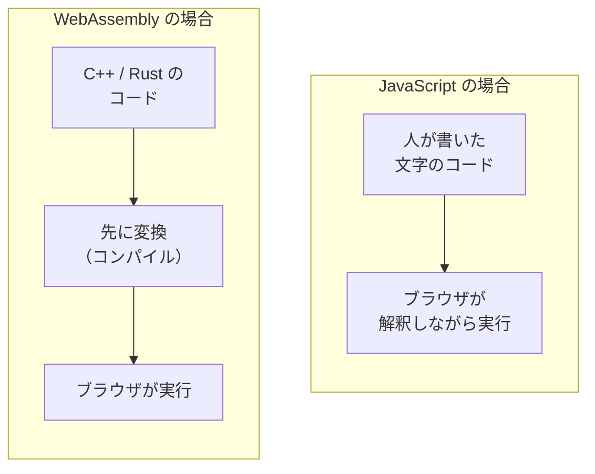
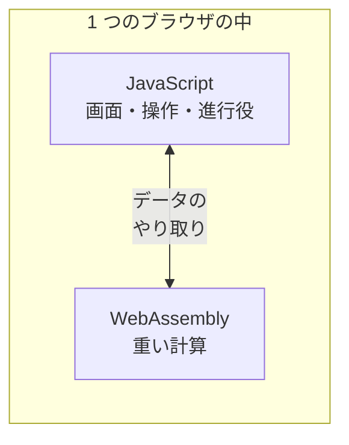

# WebAssembly — ブラウザで JavaScript 以外のプログラムが動く

## 今日のゴール

- ブラウザの中では JavaScript 以外のプログラムも動いていると知る
- WebAssembly が C++ や Rust をブラウザ向けに変換した形式だと知る
- JavaScript と WebAssembly が役割を分けて共存していると知る

## ブラウザで動く重たいアプリ

どちらも、使ったことがある人が多いはずです。

- **Figma**: デザインの共有リンクを開いたら、インストールなしでブラウザの中でそのまま動いた。拡大縮小もぬるぬる動く
- **Google Meet の背景ぼかし**: アプリを入れた覚えはないのに、映像の中の自分と背景がリアルタイムで切り分けられる

普段は気に留めませんが、裏でやっていることは軽くありません。

| アプリ | 裏で動いている処理 |
|--------|------------------|
| Figma | 図形を毎秒何十回も描き直す |
| Meet の背景ぼかし | 映像の一コマごとに「どこが人でどこが背景か」を計算し続ける |

こういう重たい処理が、なぜインストールなしのブラウザで動くのか。その答えが今日の主役、**WebAssembly**（Wasm）です。

## ブラウザが動かす言語は 1 つではない

「ブラウザで動くプログラムの言語は？」と聞かれたら、多くの人が JavaScript と答えます。実際、Web ページの動きのほとんどは JavaScript が担当していて、たいていの用途はこれで足ります。

ところが、大量の計算を毎秒こなし続ける種類のアプリになると、事情が変わります。

- 画像編集・動画処理
- 3D・ゲーム

こうした分野で昔から使われてきたのは、計算そのものに特化した **C++ や Rust** という言語です。パソコンにインストールするソフトの多くも、この系統の言語で書かれています。

「Web でも同じ種類のアプリを動かしたい」。そこで生まれたのが WebAssembly です。

> **WebAssembly** = C++ や Rust で書いたプログラムを、ブラウザがそのまま実行できる形式に変換したもの

ブラウザは、JavaScript に加えてこの形式も動かせます。冒頭の 2 つは、まさにその代表例です。

| アプリ | WebAssembly が動いている場所 |
|--------|------------------------------|
| Figma | C++ で書かれた描画エンジンを変換して実行 |
| Meet の背景ぼかし | 映像から人を切り出す計算の部分 |

「ブラウザで動くアプリ」の中身が、すべて JavaScript とは限らないわけです。

## なぜその形式だと動かせるのか

「変換したもの」という部分を、もう少し具体的に見ます。JavaScript との違いは、**実行前の準備をどこまで済ませてあるか**です。

- **JavaScript**: 人間が読める文字の並びのまま届き、ブラウザが解釈しながら動かす
- **WebAssembly**: 開発者の手元で、機械が実行しやすい形に**先に変換**（コンパイル）してから配る。届いた時点で実行に近い形になっている

先に変換してあることの利点はこうです。

| 性質 | 効くところ |
|------|-----------|
| 人間向けの文字ではなく、機械向けの詰まったデータ | ファイルが小さく、届くのが速い |
| 実行の準備が少ない | 重い計算をまとめて速く処理できる |

Figma がブラウザ版の読み込み時間を大きく短縮できたのも、この形式に切り替えたことが理由の 1 つでした。

ただし、WebAssembly は「速い魔法」ではなく、**得意分野がある道具**です。

- 向いている: 計算量が多くて、処理がまとまっている部分
- 向いていない: ボタンの配置や文字の表示など、Web ページの普通の組み立て（これまでどおり JavaScript のほうが素直に書ける）

## JavaScript と役割を分けて共存する

だから WebAssembly は、JavaScript を置き換えるものではありません。**役割を分けて共存する**関係です。

| 担当 | 仕事 |
|------|------|
| JavaScript | 画面の組み立て、ボタンやフォームの反応、全体の進行役 |
| WebAssembly | 画像・映像・3D の計算のように、重くてまとまった処理 |

Figma もこの分担です。

- メニューやパネルといった画面まわり → JavaScript（React）
- キャンバスの中の図形を描く計算 → WebAssembly

2 つは境界でデータをやり取りしながら、1 つのアプリとして動いています。

## 自分の開発との距離感

この分担を知っていると、ふだん自分が書くコードとの距離感もつかめます。

- **自分で書く場面はまず来ない**: Next.js で普通のアプリを作るぶんには不要。C++ や Rust のコードを用意して変換する、という専門的な手順が必要だから
- **「利用する側」としては、すでに出会っているかもしれない**: ブラウザ上で動画を変換するツール、画像を圧縮するツール、コードの構文を解析するツールなどには、中で WebAssembly を使っているものがある

使う側は、それが JavaScript で動いているのか WebAssembly で動いているのかを意識しないまま、ただ速いライブラリとして呼び出します。

## まとめ

- ブラウザは JavaScript に加えて WebAssembly も動かせる
- WebAssembly は C++ や Rust を先に変換した形式で、重い計算をまとめて処理するのに向く
- JavaScript が画面と進行を、WebAssembly が重い計算を担い、役割を分けて共存する
