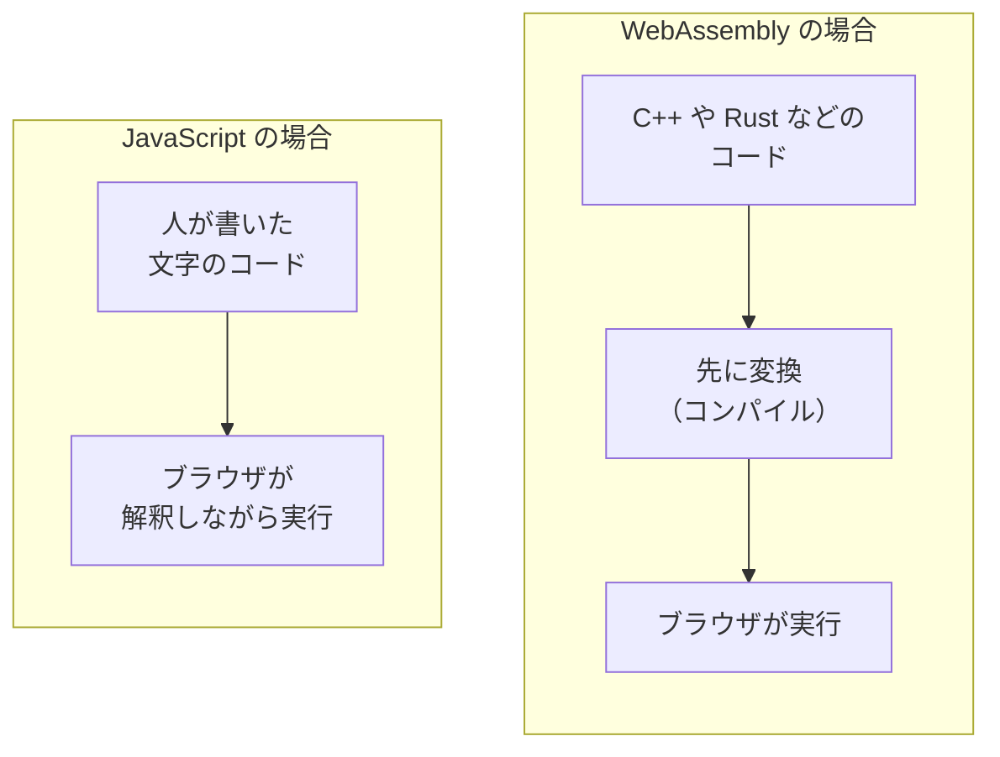
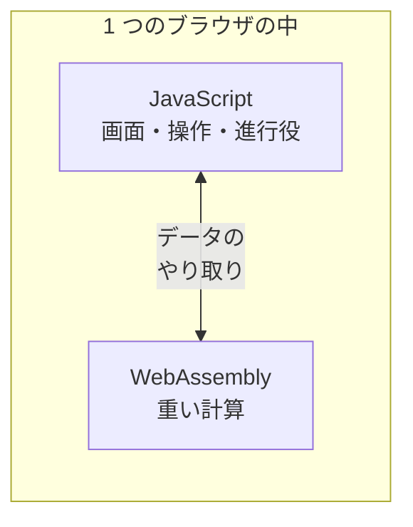

# WebAssembly — ブラウザで JavaScript 以外のプログラムが動く

## 今日のゴール

- ブラウザの中では JavaScript 以外のプログラムも動いていると知る
- WebAssembly は C++ や Rust などの変換先で、HTML や CSS と並ぶ Web 標準だと知る
- JavaScript と WebAssembly が役割を分けて共存していると知る

## ブラウザで動く重たいアプリ

どちらも、使ったことがある人が多いはずです。

- **Figma**: デザインの共有リンクを開いたら、インストールなしでブラウザの中でそのまま動いた。拡大縮小もぬるぬる動く
- **Google Meet の背景ぼかし**: 通話中、自分の後ろの背景だけを自動でぼかしてくれる、あの機能

普段は気に留めませんが、裏でやっていることは軽くありません。

| アプリ | 裏で動いている処理 |
|--------|------------------|
| Figma | 図形を毎秒何十回も描き直す |
| Meet の背景ぼかし | 映像の一コマごとに「どこが人でどこが背景か」を計算し続ける |

こういう重たい処理が、ふだん気づかないままブラウザの中で動いています。これを支えているのが今日のテーマ、**WebAssembly**（Wasm）です。

## ブラウザが動かす言語は 1 つではない

「ブラウザで動くプログラムの言語は？」と聞かれたら、多くの人が JavaScript と答えます。実際、Web ページの動きのほとんどは JavaScript が担当していて、たいていの用途はこれで足ります。

ところが、大量の計算を毎秒こなし続ける種類のアプリになると、事情が変わります。

- 画像編集・動画処理
- 3D・ゲーム

こうした分野を支えてきたのは、計算そのものに特化した **C++** という言語です。近年は同じ系統の言語として **Rust** も広く使われるようになりました。パソコンにインストールするソフトの多くも、この系統の言語で書かれています。

「Web でも同じ種類のアプリを動かしたい」。そこで生まれたのが WebAssembly です。

> **WebAssembly**: C++ や Rust などで書いたプログラムを、ブラウザがそのまま実行できる形式に変換したもの

ブラウザは、JavaScript に加えてこの形式も動かせます。冒頭の 2 つは、まさにその代表例です。

| アプリ | WebAssembly が動いている場所 |
|--------|------------------------------|
| Figma | C++ で書かれた描画エンジンを変換して実行 |
| Meet の背景ぼかし | C 言語の推論ライブラリ（XNNPACK）を変換して実行 |

「ブラウザで動くアプリ」の中身が、すべて JavaScript とは限らないわけです。

## HTML・CSS・JavaScript に並ぶ Web 標準

WebAssembly は、特定の会社の製品でも、流行り廃りのあるライブラリでもありません。HTML や CSS の仕様を管理している **W3C** という標準化団体が仕様を定めた、正式な Web 標準です。2019 年に標準となったとき、W3C は「HTML・CSS・JavaScript に続く、Web の 4 つ目の言語」と紹介しました。

- **主要ブラウザすべてに組み込み済み**: Chrome・Safari・Firefox・Edge が対応している
- **プラグインではない**: ひと昔前は、ブラウザで重い処理を動かすには Flash のような**プラグイン**を別途インストールしてもらう必要があった。WebAssembly はブラウザ本体の機能なので、利用者は何も入れなくてよい
- **人が直接書く言語ではない**: 「4 つ目の言語」と呼ばれてはいるが、開発者がこの形式を手で書くことはまずない。開発者はふだんの言語で書き、WebAssembly はその**変換先**になる
- **JavaScript の後継ではない**: 置き換えるためのものではなく、JavaScript と並んで動く 2 つ目の実行形式

変換元にできる言語は、C++ や Rust に限りません。

| 言語 | WebAssembly との関わり |
|------|----------------------|
| C・C++、Rust | 重い計算を速く動かす用途の定番。Figma の描画エンジンは C++ |
| Go、C# | 公式に変換へ対応している。C# には、ブラウザの画面を C# で作る Blazor というフレームワークもある |
| Kotlin、Swift | 対応が進んでいる |
| Python、Ruby | 言語の実行環境ごと WebAssembly に変換して、ブラウザの中で動かす仕組みがある |
| AssemblyScript | TypeScript に似た文法で WebAssembly を書くために作られた言語 |

どの言語で書いても、変換して届く形式は同じ 1 つの WebAssembly です。だからブラウザは、言語ごとの対応を増やすことなく、これだけ幅広い言語のプログラムを動かせます。

冒頭の Figma が「インストールなしでそのまま動いた」のは、この位置付けの結果です。ブラウザさえあれば、重たいアプリでも追加のインストールなしで動きます。

## 先に変換してから届く形式

JavaScript との違いは、**実行前の準備をどこまで済ませてあるか**です。

- **JavaScript**: 人間が読める文字の並びのまま届き、ブラウザが解釈しながら動かす
- **WebAssembly**: 開発者の手元で、あらかじめ機械向けの形に**変換**（コンパイル）してから配る

この「事前の変換」は、開発者の手元でソースコードを WebAssembly のバイナリに変換する工程です。ブラウザに届いたあとも CPU 向けの機械語に変換する工程は残りますが、すでに機械向けの形をしているぶん、テキストを解釈する JavaScript よりずっと速く終わります。

届くファイルの実体は、0 と 1 が並んだ**バイナリ形式**で、拡張子は `.wasm` です。

- JavaScript と違い、開発者ツールで中身をそのまま読むことはできない
- 動くのは JavaScript と同じ**サンドボックス**（ブラウザが用意した、隔離された実行環境）の中。パソコンの中のファイルを勝手に読み書きすることはできない
- この隔離があるから、初めて開いたサイトのプログラムでも、ブラウザは安心して実行できる

先に変換してあることの利点はこうです。

| 性質 | 効くところ |
|------|-----------|
| 人間向けの文字ではなく、機械向けの詰まったデータ | 同じ処理を書いた場合、JavaScript より小さくなりやすい |
| 実行の準備が少ない | 重い計算をまとめて速く処理できる |

Figma がブラウザ版の読み込み時間を大きく短縮できたのも、この形式に切り替えたことが理由の 1 つでした。

ただし、WebAssembly にすれば何でも速くなるわけではなく、向き不向きがはっきりしています。

- 向いている: 計算量が多くて、処理がまとまっている部分
- 向いていない: ボタンの配置や文字の表示など、Web ページの普通の組み立て（これまでどおり JavaScript のほうが素直に書ける）
- サイズにも注意: 変換元のコードが大きいと `.wasm` 自体が数 MB 規模になり、通信環境によっては読み込みがかえって遅くなる

## JavaScript と役割を分けて共存する

だから WebAssembly は、JavaScript を置き換えるものではありません。**役割を分けて共存する**関係です。

| 担当 | 仕事 |
|------|------|
| JavaScript | 画面の組み立て、ボタンやフォームの反応、全体の進行役 |
| WebAssembly | 画像・映像・3D の計算のように、重くてまとまった処理 |

Figma もこの分担です。

- メニューやパネルといった画面まわり → JavaScript（React）
- キャンバスの中の図形を描く計算 → WebAssembly

2 つは境界でデータをやり取りしながら、1 つのアプリとして動いています。

## WebAssembly が選ばれる場面

実際に WebAssembly が選ばれるのは、たとえばこんな場面です。

| 場面 | 例 |
|------|-----|
| 既存の C++ や Rust の資産を Web に持ち込む | Figma、Photoshop の Web 版、Google Earth。デスクトップ向けに磨いてきたエンジンを、JavaScript で書き直さずに移植する |
| 重いファイル処理をブラウザ内で完結させる | 動画を変換する ffmpeg.wasm、画像を圧縮する Squoosh。ファイルをサーバーに送らないので、プライバシーにもサーバー代にも効く。Meet の背景ぼかしも、映像を外に送らずその場で処理するこの仲間 |
| JavaScript では速度が足りない計算を回す | 3D・ゲーム（Unity のブラウザ向け出力先は WebAssembly）、ブラウザの中で動くデータベース（SQLite の WebAssembly 版） |
| 別言語の実行環境ごとブラウザに載せる | Python を丸ごと変換した Pyodide。ブラウザだけで完結するプログラミング学習サイトの土台になっている |

逆に、フォームや一覧が中心の普通の Web アプリでは、出番はほぼありません。

自分の開発でいちばん思い出す価値があるのは、重いファイル処理をブラウザ内で完結させる使い方です。「この重い処理、サーバーに送らずブラウザ内で完結できないか」という相談が出たら、WebAssembly を使ったライブラリを探すのが選択肢になります。

## 自分の開発との距離感

この使われ方を知っていると、ふだん自分が書くコードとの距離感もつかめます。

- **自分で書く場面はまず来ない**: Next.js で普通のアプリを作るぶんには不要。C++ や Rust などのコードを用意して変換する、という専門的な手順が必要だから
- **「利用する側」の接点はすでにある**: さきほどの表に挙げたようなツールやライブラリを、それと意識しないまま使っていることがある

使う側は、それが JavaScript で動いているのか WebAssembly で動いているのかを意識しないまま、ただ速いライブラリとして呼び出します。

## まとめ

- ブラウザは JavaScript に加えて WebAssembly も動かせる
- WebAssembly は W3C が定めた Web 標準で、ブラウザ本体に組み込まれている
- 実体は C++ や Rust などを先に変換した形式で、重い計算をまとめて処理するのに向く
- JavaScript が画面と進行を、WebAssembly が重い計算を担い、役割を分けて共存する
