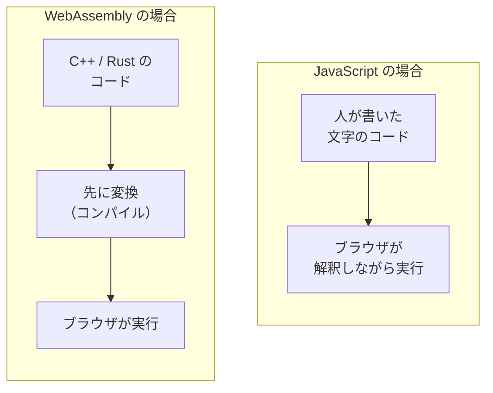
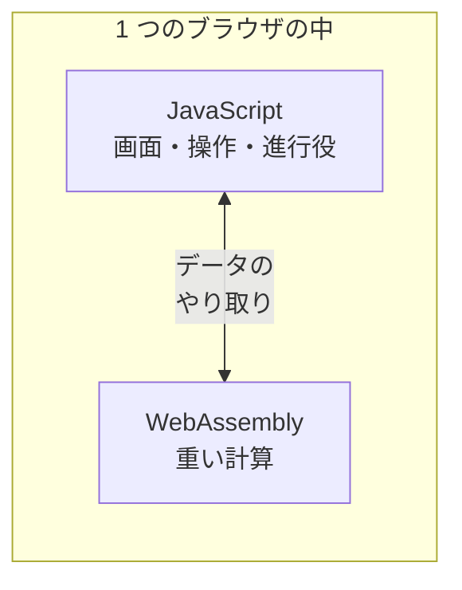

# WebAssembly — ブラウザで JavaScript 以外のプログラムが動く

## 今日のゴール

- ブラウザの中では JavaScript 以外のプログラムも動いていると知る
- WebAssembly が C++ や Rust をブラウザ向けに変換した形式だと知る
- JavaScript と WebAssembly が役割を分けて共存していると知る

## ブラウザで動く重たいアプリ

デザインの共有リンクを開いたら、Figma がブラウザの中でそのまま動いた。ダウンロードもインストールもしていないのに、拡大縮小もぬるぬる動く。Google Meet で背景をぼかしたときも、アプリを入れた覚えはないのに、映像の中の自分と背景がリアルタイムで切り分けられていました。

どちらも「ブラウザで開くアプリ」として、多くの人が使ったことがあるはずです。普段は気にも留めませんが、やっていることは軽くありません。Figma は図形を毎秒何十回も描き直していますし、Meet の背景ぼかしは映像の一コマごとに、どこが人でどこが背景かを計算し続けています。

こういう重たい処理が、なぜインストールなしのブラウザで動くのか。その答えが今日の主役、**WebAssembly**（Wasm）です。

## ブラウザが動かす言語は 1 つではない

「ブラウザで動くプログラムの言語は？」と聞かれたら、多くの人が JavaScript と答えます。実際、Web ページの動きのほとんどは JavaScript が担当していて、たいていの用途はこれで足ります。

ところが、画像編集・動画処理・3D・ゲームのように、大量の計算を毎秒こなし続ける種類のアプリになると、事情が変わります。こうした分野では、計算そのものに特化した C++ や Rust という言語が昔から使われてきました。パソコンにインストールする Photoshop のようなソフトも、この系統の言語で書かれています。

Web でも同じ種類のアプリを動かしたい。そこで生まれたのが WebAssembly です。**C++ や Rust で書いたプログラムを、ブラウザがそのまま実行できる形式に変換したもの**、それが WebAssembly です。ブラウザは、JavaScript に加えて、この形式も動かせるようになっています。

Figma は、この仕組みの代表例です。Figma の描画エンジンは C++ で書かれていて、それを WebAssembly に変換してブラウザで動かしています。Meet の背景ぼかしも、映像から人を切り出す計算の部分を WebAssembly で動かしています。「ブラウザで動くアプリ」の中身が、すべて JavaScript とは限らないわけです。

## なぜその形式だと動かせるのか

WebAssembly の「変換したもの」という部分を、もう少し具体的に見ます。

私たちが書く JavaScript は、人間が読める文字の並びです。ブラウザは受け取ったあと、それを実行できる形に解釈しながら動かします。

WebAssembly は、この解釈の手間を先に済ませてあります。C++ や Rust のコードを、開発者の手元で**あらかじめ機械が実行しやすい形に変換**（コンパイル）してから配ります。ブラウザに届く時点で、すでに実行に近い形になっているわけです。

この形式は、人間が読む文字ではなく、機械が扱いやすい詰まったデータになっています。ファイルとして小さく、実行の準備も少なくて済むので、重い計算をまとめて速く処理するのに向いています。Figma がブラウザで動くソフトの読み込みを大きく短縮できたのも、この形式に切り替えたことが理由の 1 つでした。

ここで注意したいのは、WebAssembly は「速い魔法」ではなく、**得意分野がある道具**だという点です。向いているのは、計算量が多くて処理がまとまっている部分です。ボタンを配置する、文字を表示する、といった Web ページの普通の組み立ては、これまでどおり JavaScript のほうが素直に書けます。

## JavaScript と役割を分けて共存する

だから WebAssembly は、JavaScript を置き換えるものではありません。**役割を分けて共存する**関係です。

- **JavaScript**: 画面の組み立て、ボタンやフォームの反応、全体の進行役
- **WebAssembly**: 画像・映像・3D の計算のように、重くてまとまった処理

Figma でいえば、メニューやパネルといった画面まわりは JavaScript（React）で作られ、キャンバスの中の図形を描く計算は WebAssembly が担当しています。2 つは境界でデータをやり取りしながら、1 つのアプリとして動いています。

この分担を知っていると、ふだん自分が書くコードとの距離感もつかめます。Next.js で普通のアプリを作るぶんには、WebAssembly を自分で書く場面はまず来ません。C++ や Rust のコードを用意して変換する、という専門的な手順が必要だからです。

多くの場合は、WebAssembly を使ったライブラリを「利用する側」として出会います。ブラウザ上で動画を変換するツール、画像を圧縮するツール、コードの構文を解析するツールなどには、中で WebAssembly を使っているものがあります。使う側は、それが JavaScript で動いているのか WebAssembly で動いているのかを意識しないまま、ただ速いライブラリとして呼び出します。

## まとめ

- ブラウザは JavaScript に加えて WebAssembly も動かせる
- WebAssembly は C++ や Rust を先に変換した形式で、重い計算をまとめて処理するのに向く
- JavaScript が画面と進行を、WebAssembly が重い計算を担い、役割を分けて共存する
