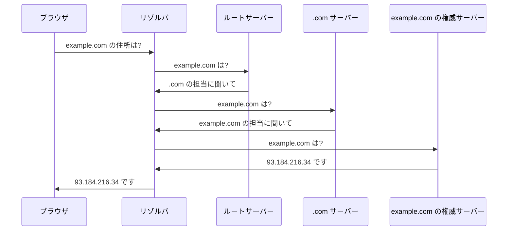

# DNS — ドメイン名が IP アドレスに変わる仕組み

## 今日のゴール

- ブラウザはドメイン名を IP アドレスに翻訳してから通信すると知る
- リゾルバがルートから順にたどる流れと、多段キャッシュの仕組みを知る
- 「反映待ち」が TTL とキャッシュから生まれる理由を知る

## その名前のままでは通信できない

`https://example.com` を開くとき、ブラウザは `example.com` という名前のままでは通信できません。ネットワーク上の住所は `93.184.216.34` のような数字の **IP アドレス** だからです。

この名前から住所への変換を担うのが **DNS** です。Domain Name System の略で、名前から番号を引く電話帳のような仕組みだと考えると分かりやすいです。

## 名前解決の流れ

ブラウザは自分で問い合わせるのではなく、**リゾルバ** に取り次ぎを頼みます。リゾルバは多くの場合、プロバイダや公共の DNS が用意しているサーバーです。

リゾルバは 1 台に聞いて終わりではありません。ルートサーバーから始めて、担当を教えてもらいながら順にたどっていきます。

図のように、リゾルバはまずルートに「.com の担当はどこか」を聞き、次に .com のサーバーに「example.com の担当はどこか」を聞きます。最後に、そのドメインの住所を実際に持つ **権威サーバー** から答えを受け取ります。

各サーバーは全部の答えを持たず、次にどこへ聞けばよいかを返すだけです。この受け渡しをくり返して、リゾルバが最終的な住所を突き止めます。

## 多段のキャッシュで毎回引かない

毎回ルートからたどると遅いので、一度引いた結果は各所で一定時間キャッシュされます。次に同じドメインを開くときは、キャッシュがあればそこで即座に答えが返ります。

キャッシュは 1 か所ではなく、手前から順に何段も重なっています。

- ブラウザ: 自分が最近引いた住所を覚えている
- OS: そのパソコンやスマホ全体で使う住所を覚えている
- リゾルバ: 多くの利用者の問い合わせ結果をまとめて覚えている

手前の段でヒットすればそこで終わり、ルートまで行かずに済みます。だから 2 回目以降のアクセスは名前解決が速くなります。

## 階層で分けて任せる構造

世界中のドメインは膨大で、1 台のサーバーに全部の対応表を持たせることはできません。そこで DNS は、名前を階層に分けて管理を各所へ任せています。

- ルートサーバーは「.com や .jp などの担当がどこか」だけを知っている
- .com のサーバーは「.com で終わるドメインの担当がどこか」だけを知っている
- 個々の住所は、そのドメインの持ち主が用意した権威サーバーが持つ

この分担のおかげで、新しいドメインを作っても中央に登録し直す必要がありません。持ち主が自分の権威サーバーを用意すれば、上の階層からたどり着けるようになります。

## TTL と反映待ち

キャッシュをどのくらいの時間覚えておくかは **TTL** で決まります。Time To Live の略で、ドメインの持ち主が「この住所は何秒有効か」を指定する値です。

TTL があるおかげでキャッシュは自動で期限切れになり、いずれ新しい情報へ更新されます。ただし、これが「反映待ち」の原因にもなります。

サーバーを引っ越して IP アドレスを変えても、世界中のキャッシュは TTL が切れるまで古い住所を覚え続けます。だから新しい住所が全体に行き渡るまで時間がかかります。

引っ越しの前に TTL を短くしておくと、古い住所が早く期限切れになり、切り替えがスムーズに進みます。

## まとめ

- DNS はドメイン名を IP アドレスに翻訳する仕組み
- 名前解決はリゾルバがルートから .com、権威サーバーへと順にたどる
- 結果はブラウザ・OS・リゾルバに多段でキャッシュされる
- TTL が切れるまで古い住所が残ることが「反映待ち」の原因
