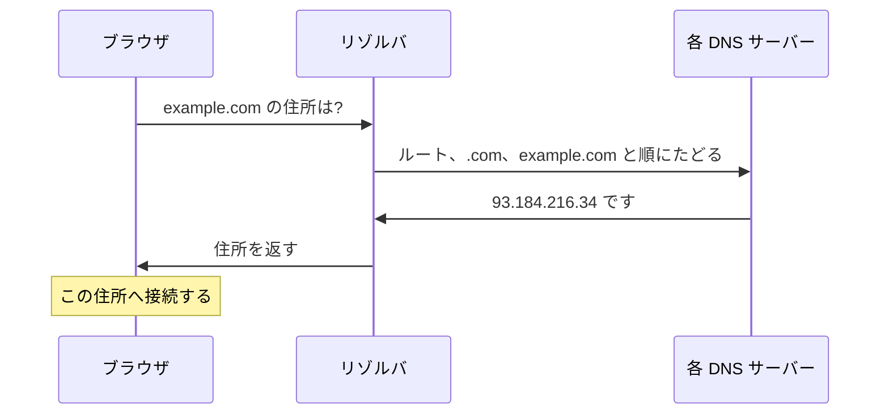

# DNS — ドメイン名が IP アドレスに変わる仕組み

## 今日のゴール

- ブラウザはドメイン名を IP アドレスに翻訳してから通信すると知る
- 名前解決の流れと、結果がキャッシュされる仕組みを知る
- 「DNS の反映に時間がかかる」の正体を知る

## その名前のままでは通信できない

`https://example.com` を開くとき、ブラウザは `example.com` という名前のままでは通信できません。ネットワーク上の住所は `93.184.216.34` のような数字の **IP アドレス**だからです。

この「名前から住所」への変換を担うのが **DNS**（Domain Name System）です。電話帳で名前から番号を引くのに似ています。

## 名前解決の流れ

ブラウザが `example.com` の住所を知るまで、複数のサーバーに順に問い合わせます。

問い合わせを取りまとめる **リゾルバ**（多くはプロバイダや公共の DNS）が、ルートのサーバーから順にたどって最終的な住所を突き止めます。

## 一度引いた結果はキャッシュされる

毎回この問い合わせをすると遅いので、結果は各所でキャッシュされます。ブラウザ・OS・リゾルバが、この対応を一定時間だけ覚えておきます。

どのくらい覚えるかは **TTL**（Time To Live）で決まります。ドメインの持ち主が「この住所は何秒有効」と指定した値です。

## 「反映待ち」が起きる理由

サーバーを引っ越して IP アドレスを変えても、世界中のキャッシュは古い住所を TTL の間は覚えています。だから新しい住所が行き渡るまで時間がかかります。

これが「DNS の反映待ち」の正体です。引っ越しの前に TTL を短くしておくと、切り替えが速く進みます。

## まとめ

- DNS はドメイン名を IP アドレスに翻訳する仕組み
- 名前解決はリゾルバがルートから順にたどって住所を突き止める
- 結果は TTL の間キャッシュされ、それが「反映待ち」の主な理由
