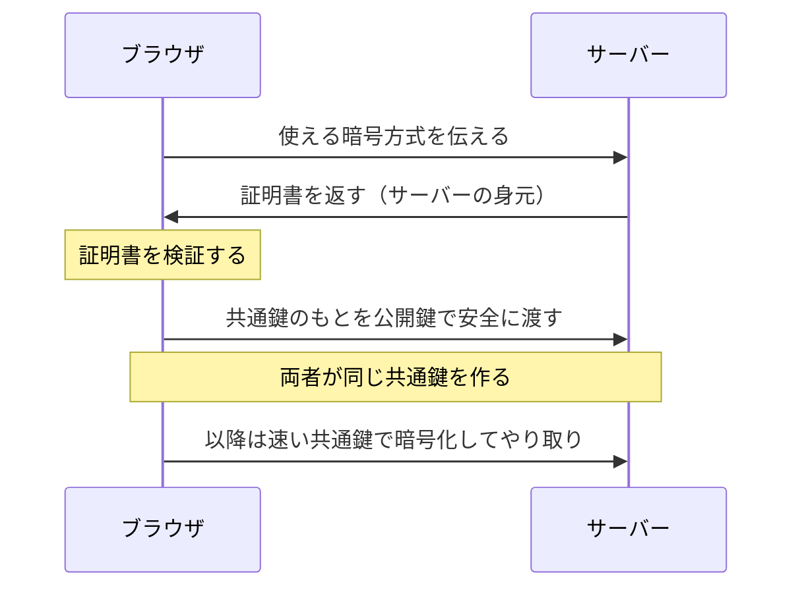
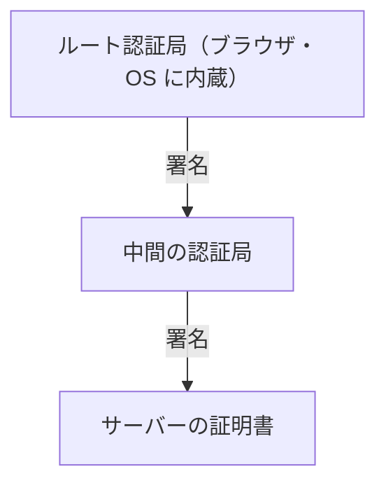

# HTTPS と TLS — 🔒 マークが保証していること

## 今日のゴール

- 🔒 が盗聴・改ざん・なりすましの 3 つをどう防ぐか知る
- 暗号化が「最初だけ公開鍵、あとは共通鍵」で成り立つと知る
- 証明書の信頼がブラウザ内蔵のルートまでさかのぼると知る

## 🔒 が守っている 3 つのこと

アドレスバーの 🔒 は、その通信が TLS で守られた **HTTPS** であることを示します。http（TLS なし）だと、通信は経路上の機器（Wi-Fi ルーター、プロバイダなど）を平文で通るので、次の 3 つが起こりえます。

- **盗聴**: パスワードやカード番号をそのまま読まれる
- **改ざん**: 表示内容や返ってくるコードを書き換えられる
- **なりすまし**: 偽のサーバーが本物のふりをして応答する

HTTPS は、この 3 つに 1 つずつ対策を当てています。

| 脅威 | 対策 |
|---|---|
| 盗聴 | 中身を**暗号化**する |
| 改ざん | 書き換えを検知する**改ざんチェック**を付ける |
| なりすまし | 相手の身元を**証明書**で確かめる |

公衆 Wi-Fi が危ないと言われるのは、この経路に他人が入り込みやすいからです。

## 暗号化 — 重い方式と速い方式の組み合わせ

暗号化には、性質の違う 2 種類の鍵があります。

- **公開鍵方式**: 鍵が 2 つ 1 組で、相手にだけ安全に渡せる。ただし計算が重い
- **共通鍵方式**: 鍵は 1 つで速い。ただしその 1 つを相手に安全に渡す手段が要る

HTTPS はこの 2 つを組み合わせます。本文をやり取りする前に、**ハンドシェイク**という準備の通信を行い、重い公開鍵方式を使って「共通鍵のもと」だけを安全に受け渡します。

一度共通鍵を共有できれば、あとは速い共通鍵方式で本文を暗号化します。重い公開鍵は最初の受け渡しだけに使うので、安全と速さを両立できます。

改ざんの検知は、暗号化とは別の仕組みです。送るデータに検査値を付けておき、途中で 1 文字でも書き換えられると検査値が合わなくなるので、受け取った側が改ざんに気づけます。

## 身元の確認 — 証明書と信頼の連鎖

暗号化できても、その相手が本物かどうかが分からなければ、偽サーバーと安全に通信しているだけになります。そこで **証明書**を使います。

証明書は、信頼された発行機関（認証局）が「このドメインの持ち主は本物だ」と署名したものです。ただ、その認証局自体は信用できるのか、という疑問が残ります。

答えが**信頼の連鎖**です。認証局の証明書は、さらに上位の認証局が署名し、最終的にブラウザや OS に最初から組み込まれた**ルート証明書**までつながります。

上位が下位を署名していく形です。ブラウザは受け取ったサーバーの証明書から上へたどり、内蔵のルートに行き着けば本物と判断します。

だから、初めて訪れるサイトでも、この連鎖がルートまでつながっていれば身元を確認できます。🔒 は、この検証まで通ったことの印です。

## 証明書エラーは身元確認の失敗

「この接続ではプライバシーが保護されません」という警告を見たことがあるかもしれません。あれは、ブラウザが身元確認に失敗したサインです。

- 証明書の**有効期限が切れている**
- アクセス先と**証明書のドメインが一致しない**
- 上位の署名がない**自己署名**（いわゆるオレオレ証明書）

警告を無視して進むのは、身元確認をあきらめたまま通信することになります。だから、むやみにクリックして先に進んではいけません。

## まとめ

- HTTPS は暗号化・改ざんチェック・証明書で、盗聴・改ざん・なりすましを 1 つずつ防ぐ
- 暗号化は最初だけ公開鍵で共通鍵を渡し、以降は速い共通鍵で行う
- 証明書の信頼は、ブラウザ内蔵のルート証明書までさかのぼる
- 証明書エラーは、ブラウザが身元確認に失敗した警告
