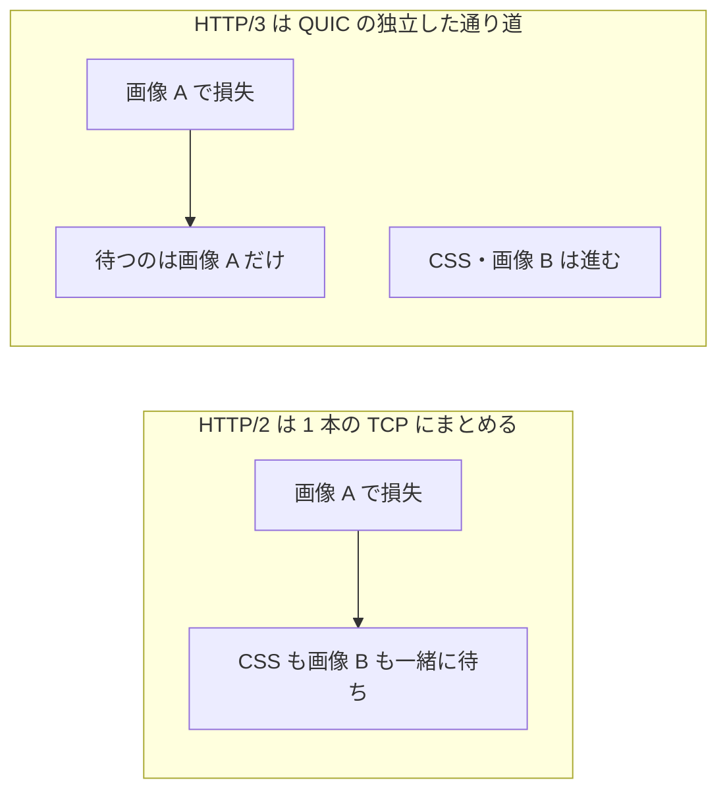

# HTTP の進化 — なぜ今のサイトは速いのか

## 今日のゴール

- HTTP のバージョン差が「1 本の接続で何本運べるか」だと知る
- keep-alive でも 1 個ずつになる理由と、多重化がそれを解く仕組みを知る
- HTTP/3 が回線の切り替えや損失に強い理由を知る

## 1 ページに何十個ものリクエスト

今のサイトは、1 ページ表示するのに HTML・CSS・JS・画像など何十個ものファイルを取りに行きます。この何十個をどれだけ効率よく運べるかで、体感の速さが大きく変わります。

HTTP はこの運び方を、バージョンを重ねて改善してきました。共通する軸は「1 本の接続で何本のやり取りを運べるか」です。

## HTTP/1.1 — 接続の使い回しと 1 個ずつの制約

HTTP のやり取りは、まず相手と接続を開くところから始まります。この接続を開く手続きにも時間がかかるため、HTTP/1.1 では一度開いた接続を使い回す keep-alive が標準になりました。

keep-alive のおかげで、ファイルごとに接続を開き直す無駄は減りました。ただし 1 本の接続で運べるのは 1 度に 1 つのやり取りだけで、前のファイルが返るまで次は待たされます。

ブラウザは接続を数本開いて並行させますが、同じ相手に対して開ける本数には上限があり、多くのブラウザで 6 本前後です。だから昔は、限られた接続を使い切るための工夫が定番でした。

- 小さな画像を 1 枚の大きな画像に結合する。スプライトと呼ばれる手法
- 画像などを別ドメインに分けて、開ける接続の上限そのものを増やす。ドメインシャーディングと呼ばれる手法

いずれも接続の本数をやりくりするための苦肉の策でした。今となっては不要になっており、その理由は次の HTTP/2 にあります。

## HTTP/2 — 1 本の接続で同時並行

HTTP/2 は、1 つの接続の中で複数のやり取りを同時に流せるようにしました。これを多重化と呼びます。

仕組みは、やり取りを小さな単位に分けて番号を付けることです。混ぜて送っても、受け取った側が番号を頼りに元へ戻せます。

改善は多重化だけではありません。毎回のリクエストで繰り返し送られるヘッダを圧縮する仕組みも入り、通信量そのものを減らせるようになりました。

多重化のおかげで、接続を増やす小細工は要らなくなりました。スプライトやドメイン分割はむしろ逆効果になり、役目を終えます。

ただし土台には弱点が残ります。HTTP/2 の多重化は 1 本の TCP 接続の上で動いており、その TCP に詰まりの原因があります。

## TCP が順序を守るための詰まり

多重化で同時に送れるようになっても、それらは結局 1 本の TCP 接続をまとめて通ります。TCP は、データが送った順番どおりに届くことを保証する仕組みです。

順序を守るため、途中で 1 つのパケットが失われると厄介です。その後ろに届いたパケットは正しい順に並べ直せず、失われた分の再送を待つ間そろって足止めされます。

問題は、この足止めが無関係なやり取りにまで及ぶことです。画像 A のパケットが 1 つ欠けただけで、同じ接続を通る CSS や画像 B まで一緒に待たされます。

この詰まりをヘッドオブラインブロッキングと呼びます。行列の先頭がつかえると、後ろ全体が進めなくなる状態です。

## HTTP/3 — TCP をやめて QUIC へ

HTTP/3 は、土台を TCP から QUIC に変えました。QUIC は UDP をベースに作られた新しい輸送の仕組みで、やり取りごとに独立した通り道を持ちます。

だから 1 つの通り道でパケットが失われても、他の通り道はそのまま進めます。画像 A の損失は画像 A だけを待たせ、CSS や画像 B は止まりません。

QUIC のもう 1 つの利点が、回線が変わっても接続を保てることです。TCP の接続は通信相手の IP アドレスと結びついているため、Wi-Fi からモバイル通信へ切り替わると接続が切れてやり直しになります。

QUIC は接続そのものに固有の識別子を持たせ、IP アドレスが変わっても同じ接続だと分かるようにしました。だから移動中に Wi-Fi が切れてモバイル通信へ移っても、ダウンロードや再生が途切れにくくなります。

CDN を経由するサイトの多くは、すでに HTTP/3 で配信されています。UDP を止める環境では自動で HTTP/2 に戻るため、使えないときも通信そのものは続きます。

## まとめ

- HTTP は「1 本の接続で何本運べるか」を軸に進化してきた
- HTTP/1.1 は keep-alive で接続を使い回すが、やり取りは 1 個ずつ
- HTTP/2 は多重化で同時並行にし、スプライトやドメイン分割を不要にした
- HTTP/3 は TCP をやめ、損失や回線変更に強い QUIC を土台にした
