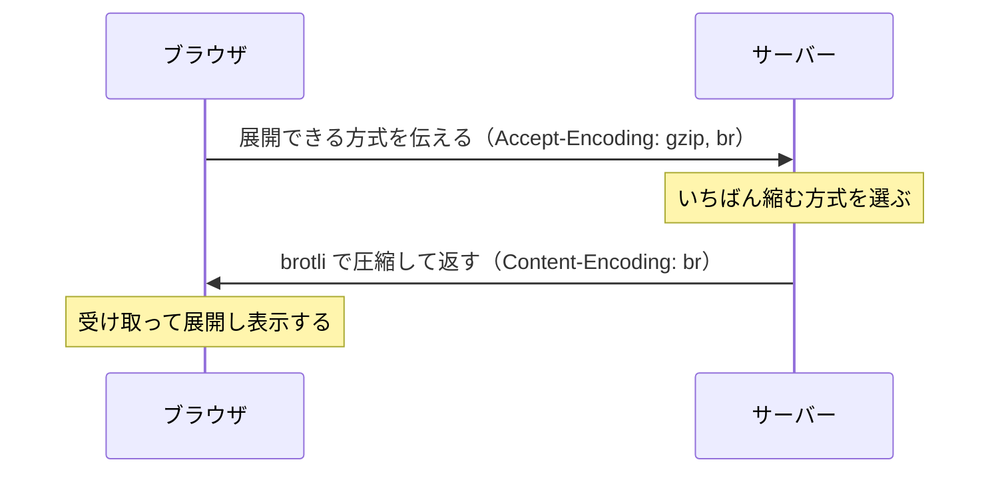

# 圧縮 — なぜ転送は軽くなるのか

## 今日のゴール

- テキストは繰り返しを参照に置き換えて縮め、受け取って展開すると知る
- 画像がこれ以上縮まないのは、すでに圧縮済みだからと知る
- gzip と brotli を場面で使い分ける理由を知る

## 圧縮の仕組み — 繰り返しを参照に置き換える

HTML や CSS、JavaScript のようなテキストには、同じ単語や並びが何度も出てきます。圧縮は、こうした繰り返しを見つけて「さっき出たあの並びをもう一度」という短い参照に置き換え、全体を縮めます。

たとえば `class="button"` が何十回も出てくるページなら、2 回目からは「1 個目と同じ並び」という印だけを置けば済みます。受け取った側は、その印を元の並びに戻して復元します。

元のデータと復元後のデータは、1 バイトも違わず一致します。中身を削って軽くするのではなく、同じ内容をそのまま小さくして運ぶ方式です。

## 画像に効きにくい理由 — すでに圧縮済み

圧縮が効くのは、繰り返しの多いデータだけです。JPEG や PNG、動画のようなファイルは、作られた時点でその形式専用の圧縮がすでにかかっています。

すでに縮んだデータには、置き換えられる繰り返しがほとんど残っていません。そこへ gzip や brotli をかけても、ほぼ縮まないうえ、管理用の情報が足されてかえって大きくなることもあります。

だから圧縮の対象は、繰り返しの多いテキスト（HTML・CSS・JS・JSON・SVG）に絞ります。画像や動画は、圧縮をかけずにそのまま送るのが基本です。

## gzip と brotli の使い分け

どの方式で圧縮するかは、ブラウザとサーバーの相談で決まります。

- ブラウザは「自分が展開できる方式」を伝える（`Accept-Encoding: gzip, br`）
- サーバーは選んだ方式で圧縮し、「これで圧縮した」と返す（`Content-Encoding: br`）

対応していない古いブラウザには、圧縮なしや gzip で返す、といった切り替えができます。

今よく使われるのは **gzip** と **brotli** の 2 つです。

| 方式 | 特徴 | 向いている場面 |
|---|---|---|
| gzip | 昔からあり、ほぼ全ブラウザが対応。展開が速い | その場で圧縮する動的な応答 |
| brotli | 新しく、より小さく縮む（`Content-Encoding` は `br`） | 事前に強く圧縮しておく静的ファイル |

使い分けの理由は、圧縮にかかる時間にあります。圧縮には強さの段階（レベル）があり、強く縮めるほど小さくなる代わりに、圧縮そのものに時間がかかります。

この時間差が、事前に圧縮しておくか、その場で圧縮するかの分かれ目になります。

- **事前圧縮**: ビルド時に一度だけ強くかけ、`.gz` や `.br` として置いておく。何度配信しても圧縮は 1 回で済む
- **その場圧縮**: 毎回内容が変わる応答を、リクエストのたびに軽めのレベルで圧縮する

だから、内容が変わらない静的ファイルには、時間をかけて強く縮められる brotli が向きます。毎回作られる動的な応答には、生成も展開も速い gzip を軽めのレベルで使うことが多いです。

## まとめ

- テキストは繰り返しを参照に置き換えて縮め、受け取って展開する
- 画像や動画はすでに圧縮済みで、これ以上は縮まない
- 方式は Accept-Encoding と Content-Encoding の相談で決まる
- 静的ファイルは brotli、動的な応答は gzip が向く
