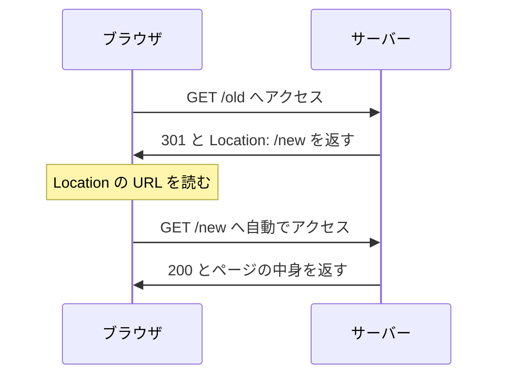
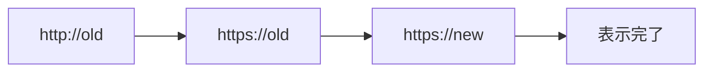

# リダイレクトの仕組み — サーバーが返す「別の場所へ行け」

## 今日のゴール

- 3xx はサーバーが「別の場所へ行け」と返す仕組みだと知る
- 301 と 302 系でキャッシュとメソッドの扱いが違うと知る
- リダイレクトの連鎖が表示を遅くすると知る

## アドレスバーの URL が勝手に変わるとき

ある URL を開いたら、アドレスバーの表示が別の URL に変わっていた経験はないでしょうか。`http://` で開いたのに `https://` になっていたり、古いドメインを開いたら新しいドメインに移っていたりします。

これは、行き先を指定されて自動で移動が起きている状態です。この移動を指示しているのが **リダイレクト** です。

リダイレクトは、サーバーが「そのページはここにはない、別の場所へ行け」と返すことで起きます。ブラウザはその指示に従い、示された URL へ自動でもう一度アクセスします。

## リダイレクトの中身

リダイレクトの実体は、2 つの部品を持ったレスポンスです。ステータスコードの **3xx** と、行き先を示す **Location** ヘッダーです。

サーバーが返すレスポンスは、たとえばこうなっています。

```
HTTP/1.1 301 Moved Permanently    ← 3xx で「移動した」
Location: https://example.com/new ← 行き先の URL
```

ブラウザはこの `Location` を読み取り、その URL へ自動で新しいリクエストを送ります。利用者は何もしていないのに、画面が新しい URL の内容に切り替わります。



## 3xx の使い分け

3xx にはいくつか種類があり、2 つの観点で分かれます。移動が恒久的か一時的か、そして元のメソッドを保つかどうかです。

| コード | 恒久 / 一時 | メソッド | 主な用途 |
|--------|------------|----------|----------|
| 301 | 恒久 | 保証しない | URL の恒久的な引っ越し |
| 308 | 恒久 | 保つ | 恒久の移動で POST も保ちたいとき |
| 302 | 一時 | 保証しない | 一時的な移動 |
| 307 | 一時 | 保つ | 一時の移動で POST も保ちたいとき |
| 303 | - | GET に変える | フォーム送信後の遷移 |

### 301 はブラウザに覚え込まれる

301 は「恒久的な移動」なので、ブラウザは行き先を強くキャッシュします。一度 301 を受け取ると、次からはサーバーに問い合わせず、覚えた行き先へ直接向かうことがあります。

これは速さの利点でもありますが、設定を間違えると厄介です。誤って 301 を返すと、あとでサーバーを直しても、利用者のブラウザが古い行き先を覚え続けて戻りにくくなります。

一時的な移動を表す 302 は、ここまで強くはキャッシュされません。恒久だと確信できるまでは 301 を避けるのが無難です。

### メソッドを保つか変えるか

古い 301 と 302 には、POST でリクエストしても、リダイレクト後に GET へ変わる挙動があります。送ったデータが次のリクエストで失われることがあります。

これを避けるために作られたのが 307 と 308 です。この 2 つは元のメソッドをそのまま保つので、POST は POST のままリダイレクトされます。

303 は逆に、あえて GET へ変えるためのコードです。フォームを送信したあと結果ページへ移すときに使い、再読み込みによる二重送信を防ぎます。

## リダイレクトの連鎖と遅さ

リダイレクトは、行った先でさらにリダイレクトが起きることがあります。`http://old` から `https://old`、そして `https://new` のように何段も続く状態を **リダイレクトチェーン** と呼びます。

チェーンが長いほど、表示は遅くなります。1 段ごとにサーバーへの往復が増え、その分だけ利用者を待たせるからです。



段数を減らせば速くなります。`http://old` から一気に `https://new` へ 1 回で飛ばせるなら、途中を省いたほうが待ち時間は短くなります。

### 古い URL から新しい URL へ引き継ぐ

サイトの URL を変えるとき、古い URL をただ消すと、ブックマークや検索結果から来た人が行き止まりに当たります。古い URL に 301 を置いて新しい URL へ案内すれば、この行き止まりを防げます。

検索エンジンも 301 を恒久的な移動と受け取り、古い URL への評価を新しい URL へ引き継ぎます。だから URL を変える移行では、恒久の 301 が基本になります。

## まとめ

- リダイレクトは 3xx と Location ヘッダーでブラウザを別の URL へ導く
- 301 は恒久で強くキャッシュされ、302 は一時で戻りやすい
- 307 と 308 はメソッドを保ち、303 はあえて GET に変える
- チェーンが長いほど遅く、URL 移行は 301 で古い URL から引き継ぐ
