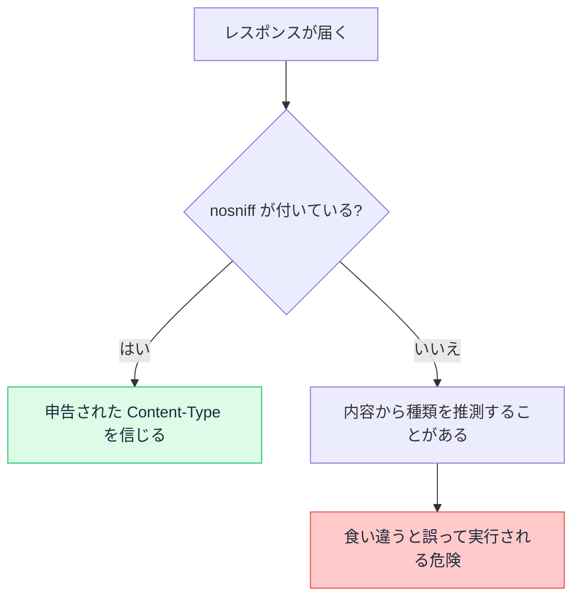

# Content-Type と MIME タイプ — ブラウザが中身をどう扱うか決めるヘッダー

## 今日のゴール

- 同じ中身でも Content-Type で扱われ方が変わると知る
- MIME タイプが type/subtype の形で種類を表すと知る
- 表示かダウンロードかや文字化けがヘッダーで決まると知る

## 同じ中身でも扱いが変わる

ブラウザで PDF のリンクを開くと、その場でビューアが開くこともあれば、ファイルとしてダウンロードされることもあります。画像やテキストでも、画面に表示されたり保存を促されたりします。

同じデータを送っても、この扱いは変わります。何を根拠にブラウザが決めているかというと、レスポンスに付く **Content-Type** というヘッダーです。

Content-Type は「このデータはどんな種類か」をブラウザに伝えます。ブラウザはこの申告を見て、HTML なら描画し、画像なら表示し、種類に応じた扱い方を選びます。

## MIME タイプの形

Content-Type が伝える種類の名前を **MIME タイプ** と呼びます。データの種類を表す世界共通のラベルで、`type/subtype` という形をしています。

| MIME タイプ | 中身 |
|-------------|------|
| text/html | HTML 文書 |
| text/plain | ただのテキスト |
| application/json | JSON データ |
| image/png | PNG 画像 |
| application/pdf | PDF 文書 |

スラッシュの前の `type` が大きな分類、後ろの `subtype` が具体的な形式です。`image/png` なら「画像という分類の中の PNG 形式」を表します。

### charset で文字化けを防ぐ

テキスト系のデータには、文字コードを添える指定があります。`text/html; charset=utf-8` のように書き、どのルールで文字を解釈するかを伝えます。

この指定がずれると **文字化け** が起きます。UTF-8 で書かれた日本語を別の文字コードとして解釈すると、読めない記号の羅列になります。

だから日本語を含むページでは、`charset=utf-8` を正しく添えることが文字化けを防ぐ基本になります。

## 表示するかダウンロードするか

同じ PDF でも、その場で開くか保存させるかを分けたいことがあります。これを決めるのが **Content-Disposition** というヘッダーです。

| 指定 | 挙動 |
|------|------|
| inline | ブラウザ内で表示する |
| attachment | ダウンロードする |
| attachment; filename="report.pdf" | この名前で保存する |

`inline` はその場で開き、`attachment` はダウンロードを促します。`filename` を添えると、保存するときのファイル名を指定できます。

請求書やレポートのように「開くより保存してほしい」ファイルでは `attachment` を使い、画像や PDF をその場で見せたいなら `inline` を使います。

## ブラウザの推測とその危うさ

Content-Type が付いていなかったり、内容と食い違っていたりすると、ブラウザは中身を覗いて種類を推測することがあります。この推測を **MIME スニッフィング** と呼びます。

一見便利ですが、これは危険の元になります。利用者が投稿した画像のはずのファイルに HTML が仕込まれていると、ブラウザがそれを HTML と推測して実行し、攻撃が成立することがあります。

これを止めるのが `X-Content-Type-Options: nosniff` というヘッダーです。これを付けると、ブラウザは推測をやめ、申告された Content-Type をそのまま信じます。

nosniff を付けるなら、Content-Type を正しく設定することがより大切になります。ブラウザが推測で補ってくれなくなるので、申告が間違っていれば表示もそのまま失敗するからです。

## まとめ

- Content-Type はデータの種類を伝え、ブラウザの扱い方を決める
- MIME タイプは type/subtype の形で、charset のずれは文字化けを招く
- Content-Disposition の inline と attachment で表示かダウンロードかが変わる
- MIME スニッフィングは危険で、nosniff で推測を止められる
