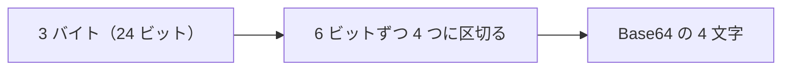

# Base64 と Data URL — バイナリを文字だけで表す仕組み

## 今日のゴール

- Base64 がバイナリを文字だけで表す符号化だと知る
- 3 バイトが 4 文字になり容量が約 33% 増えると知る
- Data URL で画像を埋め込める利点と欠点を知る

## 文字しか通れない場所にバイナリを流す

画像や PDF のようなファイルの中身は、文字ではなくバイナリと呼ばれるデータです。0 と 1 の並びで、そのままでは文字として意味を持ちません。

ところが世の中には、文字しか安全に運べない場所があります。メールの本文や、HTML や CSS のソースコードの中などです。

こうした場所にバイナリをそのまま置くと壊れてしまいます。そこで、バイナリを文字だけで表し直す方法が要ります。

それを実現するのが **Base64** です。

## 3 バイトが 4 文字になる仕組み

Base64 は、その名のとおり 64 種類の文字だけを使います。アルファベットの大文字と小文字、数字、それに記号を 2 つ加えた 64 種類です。

64 種類は 6 ビットで表せます。元のデータは 8 ビット単位のバイトなので、6 ビットとの間にズレがあります。

このズレを、24 ビットずつの固まりでそろえます。3 バイトは 24 ビットで、これを 6 ビットずつ 4 つに区切ると、64 種類の文字 4 つで表せます。



ここが容量の増える理由です。3 バイトが 4 文字になるので、文字 1 つを 1 バイトと数えると、量はおよそ 3 分の 4、つまり約 33% 増えます。

元のデータが 3 の倍数で割り切れないときは、足りない分を `=` という記号で埋めます。Base64 の末尾に `=` が付いていることがあるのは、この穴埋めのためです。

## Data URL で埋め込む

Base64 にした画像は、URL の形に仕立てて HTML や CSS へ直接書き込めます。この形式を **Data URL** と呼びます。

Data URL は、外部ファイルの場所ではなく、データそのものを URL の中に持ちます。形はこうなっています。

```
data:image/png;base64,iVBORw0KGgoAAAANSUhEUg...
```

先頭の `data:` に続けて MIME タイプ、`base64` という印、そして Base64 にしたデータ本体が並びます。これを `img` の `src` や CSS の `background-image` に書くと、画像を別ファイルにせず、その場に埋め込めます。

```html

```

### 利点と欠点

埋め込みの利点は、ファイルを取りに行く通信が減ることです。小さなアイコンなら、別途ダウンロードする往復を省けるので、その分だけ速くなります。

欠点は容量です。Base64 で約 33% 増えるうえ、埋め込んだデータはキャッシュされにくく、大きな画像だと HTML や CSS 自体が重くなります。

だから Data URL が向くのは、小さなアイコンのような軽い画像に限られます。大きな画像は、素直に別ファイルとして読み込むほうが速くなります。

## 暗号化ではない

Base64 は文字が並び替わったように見えるので、暗号のように中身が隠れていると思われがちです。しかしこれは誤解です。

Base64 は決まった手順の変換にすぎず、鍵もパスワードもありません。誰でも同じ手順で元のデータに戻せます。

だから、パスワードや個人情報を Base64 にしただけで「隠した」と考えるのは危険です。中身を守りたいなら、Base64 ではなく暗号化が必要です。

## まとめ

- Base64 はバイナリを 64 種類の文字だけで表す符号化
- 3 バイトが 4 文字になり、容量は約 33% 増える
- Data URL は小さな画像の埋め込みに向き、大きな画像には不向き
- Base64 は暗号化ではなく、誰でも元に戻せる
