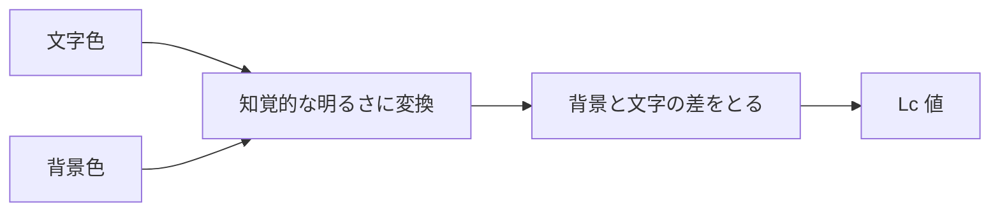

# APCA — 知覚に合わせたコントラスト判定

## 今日のゴール

- WCAG 2 の 4.5 対 1 が実感とずれる理由を知る
- APCA が明るさの差を Lc で測り、極性や文字の大きさ・太さで基準が変わると知る
- APCA は WCAG 3 の候補で、現行の基準は今も WCAG 2 だと知る

## 通ったのに読みにくい配色

コントラストチェッカーで 4.5 対 1 を満たしたのに、実際に見ると読みにくい配色があります。

白地にオレンジの文字はその一つです。数字の上では基準を満たしますが、長く読むと目が疲れると感じる人が多くいます。

もっとはっきり出るのがダークモードです。黒に近い背景に濃いグレーの文字は、比の上では基準を通ることがありますが、実際にはほとんど読めません。

WCAG 2 のコントラスト比は、こうしたダークモードの配色にはそのまま使えない、と APCA の提案者は指摘しています。

## WCAG 2 の比がずれる理由

WCAG 2 のコントラスト比は、文字色と背景色の **明るさの比** です。明るい方の明るさを暗い方の明るさで割った、1 対 1 から 21 対 1 までの数字になります。

この割り算に、実感とずれる原因があります。

- **明るさの水準を捨てている**: 比は 2 色の割合だけを見る。人間の目は暗い場所ほどコントラストを感じにくいのに、比はそれを反映しないので、暗い色どうしの読みやすさを高く見積もる
- **向きを区別しない**: 明るい背景に暗い文字と、暗い背景に明るい文字は、同じ比なら同じ点数になる。実際の読みやすさは違うのに区別できない
- **文字の形を見ていない**: 同じ配色でも細い文字は太い文字より読みにくいが、比の計算に文字の太さや大きさは入らない

つまり比は、色だけを単純に割った数字で、人間の見え方の多くを取りこぼしています。

## APCA はどう測るか

APCA は Accessible Perceptual Contrast Algorithm の略で、この取りこぼしを埋めるために作られました。人間の知覚に寄せて測り直す方式です。

流れはこうです。文字色と背景色それぞれの **知覚的な明るさ** を求め、その差をとって、Lc という値にします。

Lc は知覚に沿うように作られています。だから色が明るくても暗くても、同じ Lc なら同じくらいの読みやすさになります。

極性も区別します。明るい背景に暗い文字は少ない Lc で足り、暗い背景に明るい文字はより多くの Lc が要ります。

計算では暗い背景に明るい文字を負の値で返して向きを表し、基準と照らすときは符号を外して絶対値を使います。

## 基準は 1 つの数字ではない

WCAG 2 は「本文なら 4.5 対 1」と 1 つの数字で決めていました。APCA は違います。

必要な Lc が、文字の大きさと太さで変わります。

| 用途 | 必要な Lc の目安 | 文字の例 |
|---|---|---|
| 本文（推奨） | Lc 90 | 18px の細字、または 14px の標準 |
| 本文（最低） | Lc 75 | 24px 細字・18px 標準・16px 中字・14px 太字 |
| 読ませたい短い文字 | Lc 60 | 24px 標準、または 16px の太字 |
| 大きな見出し | Lc 45 | 大きく太い文字 |

大きく太い文字は少ないコントラストでも読めるので、必要な Lc は下がります。小さく細い文字ほど、高い Lc が要ります。

だから APCA が返すのは「この配色は OK か」ではなく「この配色は、この大きさと太さなら OK か」です。

## 実務での立ち位置

いま押さえておきたいのは、APCA はまだ標準ではないことです。WCAG 3 の候補として開発が進んでいますが、その WCAG 3 自体がまだドラフトの段階です。

だから仕事で「アクセシビリティ基準を満たしたか」を判定するなら、現時点では引き続き WCAG 2 の 4.5 対 1 で見ます。

APCA の価値は、その先にあります。WCAG 2 を通したのに読みにくい、という食い違いが起きたとき、なぜかを説明してくれます。

デザインツールやコントラストチェッカーにも APCA が入り始めています。Lc という数字を見かけたら、知覚に寄せた新しい指標だと思い出せます。

## まとめ

- WCAG 2 の比は明るさの割合だけを見て、水準・極性・文字の形を取りこぼす
- APCA は知覚的な明るさの差を Lc で表し、知覚に沿って読みやすさを測る
- 必要な Lc は文字の大きさと太さで変わり、極性でも変わる
- APCA は WCAG 3 の候補で、現行の適合基準は今も WCAG 2
