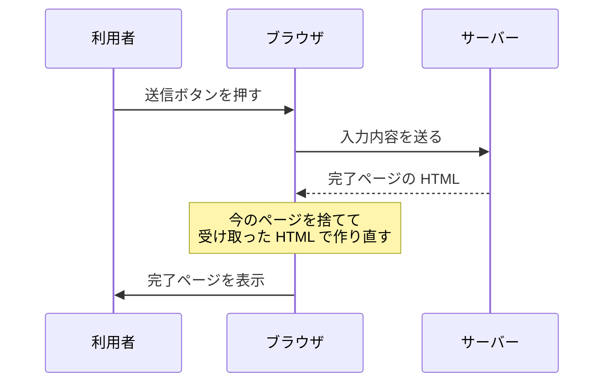
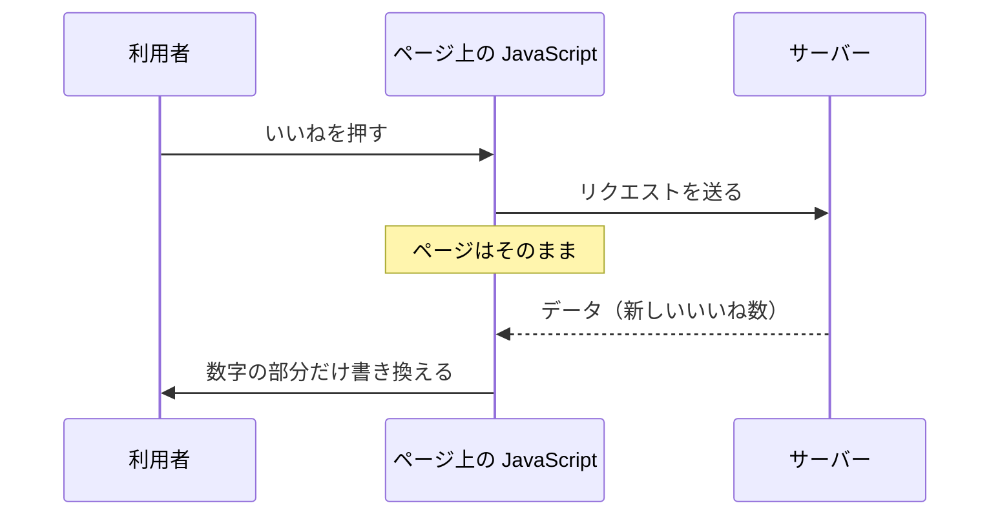

# 同期通信と非同期通信 — ページごと替わるか、一部だけ替わるか

## 今日のゴール

- `a` タグや form での通信と、JavaScript が行う通信の違いを知る
- ブラウザが通信するのか、ページ上の JavaScript が通信するのかで違いが生まれると分かる
- 画面を保つと、状態を保つ仕事がこちら側に来ると分かる

## 同じ通信なのに画面の動きが違う

お問い合わせフォームに入力して送信ボタンを押すと、画面が切り替わって「送信が完了しました」というページに変わります。

一方、SNS で「いいね」を押したときは、画面はそのままです。数字だけが増えて、スクロール位置も動きません。

どちらもサーバーとやりとりしているのに、片方はページごと替わり、もう片方は一部しか替わりません。この違いはどこから来るのでしょうか。

## ブラウザが通信するとページごと替わる

お問い合わせフォームは、こう書きます。

```html
<form action="/contact" method="post">
  <label for="message">お問い合わせ内容</label>
  <textarea id="message" name="message"></textarea>
  <button type="submit">送信</button>
</form>
```

送信ボタンを押すと、ブラウザはこう動きます。

1. 入力内容を `/contact` に送る
2. サーバーが返してきた HTML を受け取る
3. **今表示しているページを捨てて**、受け取った HTML で画面を作り直す



ブラウザは今のページに手を加えるのではなく、**まるごと捨てて新しく作り直します**。

このとき捨てられるのは、目に見える画面だけではありません。ブラウザは今のページを閉じてしまうので、そのページの上で動いていた JavaScript も終わります。

**変数に入れていた値も、登録しておいたボタンの反応も、全部消えます。**

そして受け取った HTML から、新しいページと新しい JavaScript の環境を作り直します。ゼロからのやり直しです。

だから、こうなります。

- 入力途中だった別の欄の内容は消える
- スクロール位置は先頭に戻る
- 開いていたメニューやタブの選択も初期状態に戻る

しかも、変わったのが画面のごく一部でも関係ありません。1つの数字を増やすだけでも、ヘッダーもナビもフッターも全部作り直してもう一度届きます。

リンクも同じです。

```html
<a href="/about">会社概要</a>
```

押すとブラウザが `/about` の HTML を取ってきて、今のページと差し替えます。

フォームは送る、リンクは取ってくる、という違いはあります。ただ**どちらもブラウザがページを取り替える**点は同じです。

今日見ているのはそこなので、送るか取ってくるかは別の話として置いておきます。

どちらにも JavaScript は出てきません。**同期通信はブラウザに元から付いている機能**なので、`a` タグや `form` を書けばそれだけで動きます。

そして、この仕組みで通信すると必ずページが取り替わります。昔は、**利用者の操作をサーバーに伝える方法が、これしかありませんでした。**

## JavaScript が通信するとページは残る

ここで JavaScript が出てきます。

JavaScript はページの上で動くプログラムです。ブラウザが読み込んだページの中にいて、ボタンが押されたことを受け取ったり、画面の文字を書き換えたりします。

サーバーへの通信も、自分でできます。

`fetch` を使うと、ブラウザは裏でリクエストを送るだけで、ページには手を付けません。ページを閉じる処理が走らないので、そのページの上で動いている JavaScript も止まりません。

**画面も、変数に入れた値も、そのまま生き続けます。** 返事が返ってきたら、生きているプログラムがそれを受け取って、画面の一部を書き換えます。



さっきの図と違うのは、真ん中にいるものだけです。ブラウザが通信するとページが取り替えられ、ページの上のプログラムが通信するとページは残ります。

## 返ってくるのは HTML ではなくデータ

誰が通信するかが替わると、サーバーが返すものも替わります。

ページを取り替えるなら、サーバーは新しいページの HTML を丸ごと作って返さないといけません。でも画面を取り替えないなら、要るのは**変わった値だけ**です。

いいねを押したとき、サーバーが返すのはこれだけです。

```json
{ "count": 43 }
```

いいね数が 43 になった、と言っているだけです。ヘッダーもナビも投稿本文も入っていません。

この書き方を JSON と呼びます。

JavaScript はこの 43 を受け取って、画面の数字だけを書き換えます。

```js
// いいねボタンが押されたときの処理
async function like(postId) {
  // サーバーに「いいねした」と伝える
  const res = await fetch(`/api/posts/${postId}/like`, { method: "POST" });
  // 返ってきた JSON を取り出す（{ count: 43 } が入る）
  const data = await res.json();
  // 画面の中からいいね数の表示を探して、その文字だけ差し替える
  document.querySelector("#like-count").textContent = data.count;
}
```

通信しているのは `fetch` の行です。最後の行では、`#like-count` という目印を付けておいた場所の文字を、返ってきた数に差し替えています。

ページを取り替える処理はどこにもありません。だから押した瞬間に数字だけ変わって、スクロール位置も他の入力も残ります。

いいねは送る例ですが、取ってくる場合も同じです。検索欄に文字を打つと候補が出てくるのは、JavaScript が候補を取ってきて、その部分だけ書き換えているからです。

やりとりするデータが小さいので、通信も軽くなります。ページ全体の HTML を毎回作って送り直すのと比べると、`{ "count": 43 }` はほとんど何もないような量です。

## どこが違うのか

| | 同期通信 | 非同期通信 |
|---|---|---|
| 通信するのは | ブラウザ | ページ上の JavaScript |
| 書くもの | `a` タグ、`form` | JavaScript の `fetch` |
| 返ってくるもの | ページの HTML | データ（JSON） |
| 画面 | まるごと作り直される | 一部だけ書き換わる |
| ページ上の JavaScript | 終わって作り直される | 動き続ける |
| 変数に入れた値 | 消える | 残る |

取ってくる場合と送る場合、どちらにも同期と非同期があります。

| | 取ってくる | 送る |
|---|---|---|
| 同期通信 | リンクを押して次のページへ | フォームを送信して完了ページへ |
| 非同期通信 | 検索候補、無限スクロール | いいね、フォームの下書き保存 |

ページ遷移する通信を同期通信、ページを保ったまま行う通信を非同期通信と呼びます。

::: tip 用語の注意
同期・非同期という言葉は、コードの書き方を指すこともあります。「返事が来るまで次に進まない書き方」を同期、「待たずに次へ進む書き方」を非同期と呼ぶ使い方で、async/await はこちらの話です。

どちらの意味も現場で使われます。話がかみ合わないと感じたら、ページが遷移するかどうかの話か、コードが待つかどうかの話かを確かめると早いです。
:::

## 画面のつじつまを合わせるのは誰か

便利になった分、引き受けたものがあります。

ページごと替わるなら、毎回ゼロからやり直しです。変数も消えるので、**状態を保つ必要がそもそもありませんでした**。

届いた HTML がそのまま正解で、こちら側で気にすることはありません。

ページを保つと、そうはいきません。JavaScript が動き続けて値も残るので、画面に出ている内容が今も正しいかを、こちら側で保ち続けることになります。

いいね1つでも、決めることが出てきます。

- 押した直後に数字を増やすのか、サーバーの返事を待ってから増やすのか
- 返事が失敗したら数字を戻すのか
- 通信中はボタンを押せないようにするのか
- 連続で押されたらどうするのか

ページごと替わっていた時代には考えなくてよかったことです。**サーバーが作り直してくれなくなった分を、こちら側で持つことになりました。**

React のような道具が要るのは、ここに理由があります。画面の一部を書き換えながら今の状態を保ち続けるのは、手作業でやると大変だからです。

## まとめ

- ブラウザが通信するとページごと替わり、JavaScript が通信するとページは残る
- ページごと替わるのが同期通信、保ったままなのが非同期通信
- 非同期通信では HTML ではなくデータが返り、画面の一部だけを書き換える
- 画面が作り直されなくなった分、今の状態を保つ仕事がこちら側に来た
