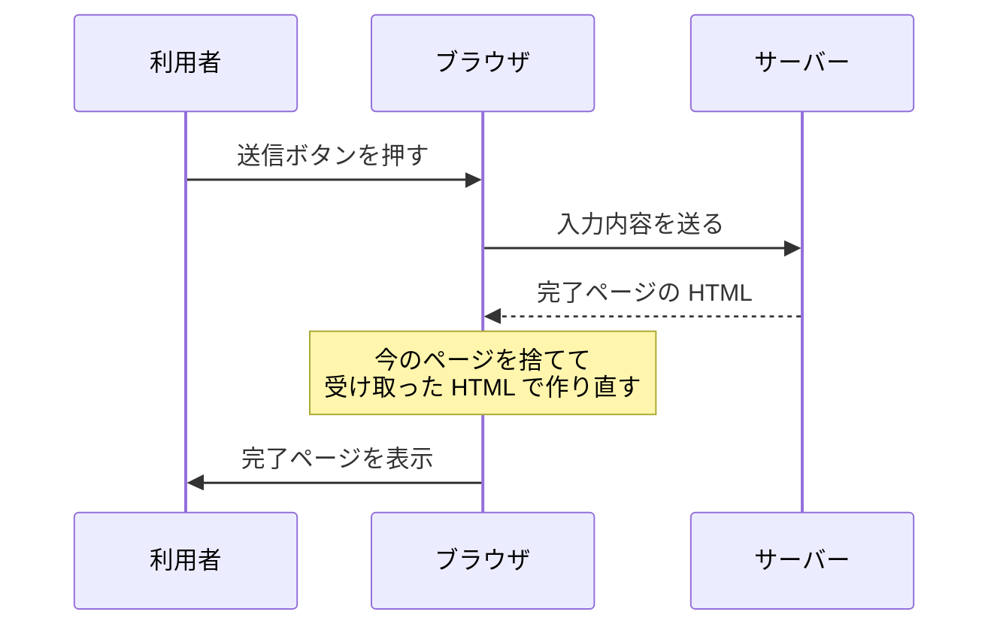
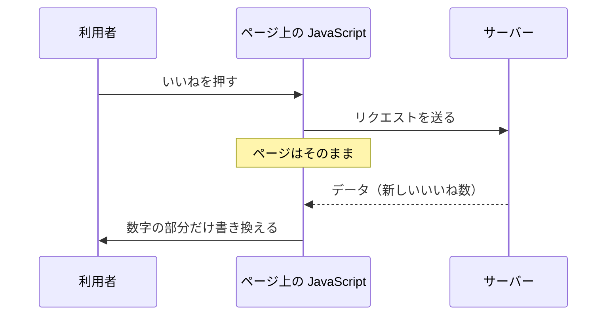

# 同期通信と非同期通信 — ページごと替わるか、一部だけ替わるか

## 今日のゴール

- ページ遷移する通信と、ページを保ったまま行う通信の違いを知る
- ブラウザが通信するのか、ページの上の JavaScript が通信するのかで違いが生まれると分かる
- 非同期通信と Ajax という言葉を、意味とセットで持ち帰る

## 同じ通信なのに画面の動きが違う

お問い合わせフォームに入力して送信ボタンを押すと、画面が切り替わって「送信が完了しました」というページに変わります。

一方、SNS で「いいね」を押したときは、画面はそのままです。数字だけが増えて、スクロール位置も動きません。

どちらもサーバーとやりとりしているのに、片方はページごと替わり、もう片方は一部しか替わりません。この違いはどこから来るのでしょうか。

## ページごと替わる通信

まずフォーム送信のほうを追います。送信ボタンを押したとき、ブラウザは次のことをします。

1. 入力内容をサーバーに送る
2. サーバーが返してきた HTML を受け取る
3. **今表示しているページを捨てて**、受け取った HTML で画面を作り直す



大事なのは3番目です。**ページは作り直されるので、それまでの状態は残りません。**

入力途中だった別の欄の内容も、スクロール位置も消えます。

これがブラウザに元々備わっている通信の仕組みです。リンクをクリックしたときも同じで、ブラウザはページを取り替えることでサーバーとやりとりします。

つまり、**利用者の操作をサーバーに伝えるには、ページを丸ごと取り替えるしかありませんでした。**

## ページを保ったまま行う通信

ここで JavaScript が登場します。JavaScript は自分でサーバーに通信できます。

ブラウザのページ移動の仕組みを使わないので、ページは取り替えられません。

いいねを押したときに起きていることです。

1. JavaScript がサーバーにリクエストを送る
2. ページはそのまま。画面は何も替わらない
3. サーバーが返してくるのは HTML ではなく、**データ**（新しいいいね数など）
4. JavaScript がそのデータを受け取って、数字の部分だけ書き換える



2枚の図を見比べると、違いがはっきりします。**通信しているのが、ブラウザからページ上の JavaScript に替わっています。**

ブラウザが通信するとページが取り替えられ、JavaScript が通信するとページはそのまま。ここが分かれ道です。

コードにすると、こういう数行です。

```js
// いいねボタンが押されたときの処理
async function like(postId) {
  const res = await fetch(`/api/posts/${postId}/like`, { method: "POST" });
  const data = await res.json();
  // 返ってきた数で、数字の部分だけを書き換える
  document.querySelector("#like-count").textContent = data.count;
}
```

`fetch` がサーバーへの通信で、最後の行が画面の書き換えです。ページを取り替える処理はどこにもありません。

## 追ってきた違いの整理

| | 同期通信 | 非同期通信 |
|---|---|---|
| 通信するのは | ブラウザ | ページ上の JavaScript |
| 返ってくるもの | ページの HTML | データ |
| 画面 | 作り直される | 一部だけ書き換わる |
| それまでの状態 | 消える | 残る |
| 例 | フォーム送信、リンク | いいね、検索候補、無限スクロール |

ページ遷移する通信を同期通信、ページを保ったまま行う通信を非同期通信と呼びます。

::: tip 用語の注意
同期・非同期という言葉は、コードの書き方を指すこともあります。「返事が来るまで次に進まない書き方」を同期、「待たずに次へ進む書き方」を非同期と呼ぶ使い方で、async/await はこちらの話です。

どちらの意味も現場で使われます。話がかみ合わないと感じたら、ページが遷移するかどうかの話か、コードが待つかどうかの話かを確かめると早いです。
:::

## Ajax という名前

この、ページを保ったまま通信して画面の一部を書き換える手法には名前があります。**Ajax** です。

2005年に Jesse James Garrett が名付けました。Asynchronous JavaScript + XML の頭文字で、A は非同期を意味します。

命名のきっかけになった実例のひとつが Google マップです。それまでの地図サイトは、矢印ボタンを押すたびにページごと読み込み直していました。

ドラッグすると地図の続きがそのまま出てくるのは、当時としては驚きでした。

名前に XML が入っていますが、今やりとりするデータは JSON が主流です。通信に使う道具も、当時の XMLHttpRequest から今の `fetch` に変わりました。

名前だけが残っているので、コードや記事で `ajax` という語に出会ったら、この話だと分かれば十分です。

## まとめ

- ブラウザが通信するとページごと替わり、JavaScript が通信するとページは保たれる
- ページごと替わるのが同期通信、保ったままなのが非同期通信
- 非同期通信では HTML ではなくデータが返り、画面の一部だけを書き換える
