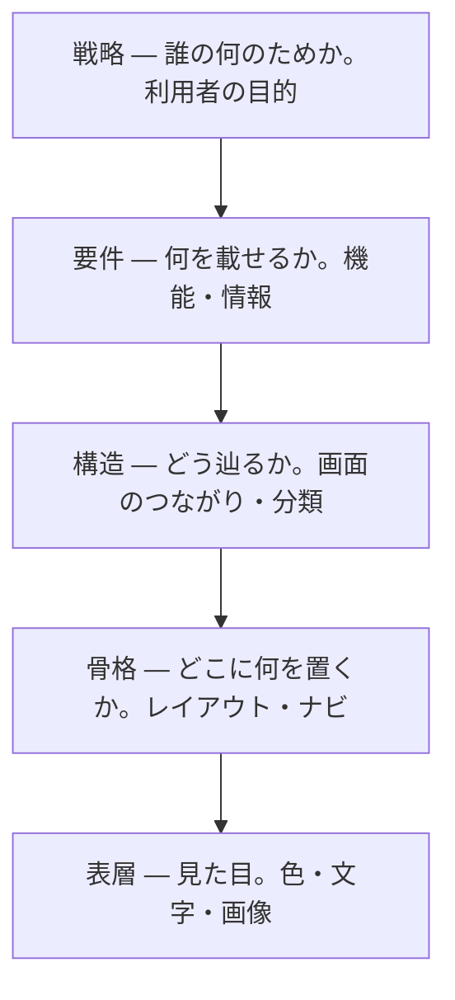

# UX の5層 — 見た目は一番上でしかない

## 今日のゴール

- きれいな画面は、その下にある戦略・要件・構造・骨格の上に乗っていると知る
- 見た目から作り始めると的外れになるのは、下の層を飛ばしているからだと分かる
- 画面の違和感を「どの層の話か」で切り分け、言葉にして直せる

## 見た目から作りたくなる

画面を作るとき、つい色やレイアウトから手をつけたくなります。Figma を開いて最初に触るのも、見た目の部分です。

一方で、見た目のきれいなアプリが、使うと妙に使いにくいことがあります。欲しい情報が見つからなかったり、よく使う操作が奥にあったりします。

見た目は良いのに中身が的外れになるのは、なぜでしょうか。

## 画面は一番上の層でしかない

その答えは、画面の「見た目」が一番上の薄い層でしかない、というところにあります。見た目の下には、目に見えない4つの層が積み重なっています。

Jesse James Garrett が『The Elements of User Experience』で示した、UX の5層という捉え方があります。下の抽象的な土台から、上の具体的な見た目へと積み上がります。

大事なのは並び順です。下の層が決まらないと、上の層は決められません。

## 下から積み上がる

タスク管理アプリを例に、下から順に追います。各層の決定が、1つ上の層の選べる範囲をどう縛るかに注目してください。

- **戦略**: 誰が何のために使うのか。ここでは「チームが今日やることを見失わないため」とし、これが上の4層すべての判断基準になります
- **要件**: その目的のために何を載せるか。今日の分を見分けられる一覧と、終わったものを消す完了チェックが要ります
- **構造**: 載せた物をどう辿るか。一覧から1件を開いて直して戻る、この道筋が短いほど目的に近づきます
- **骨格**: 1画面のどこに何を置くか。今日のタスクを上に、といった配置を Figma のワイヤーフレームで描きます
- **表層**: 最後の見た目。色・文字・余白で、骨格に沿って仕上げます

戦略が要件を決め、要件が構造を、構造が骨格を、骨格が表層を決める。こうして下の決定が、上で選べる範囲を1つずつ狭めていきます。

Figma で手を動かすのは、主に上の骨格と表層です。研修で描くのは上2層で、その下に3つの層が隠れている、と考えると位置がつかめます。

## 層を飛ばすと何が起きるか

下の層を決めないまま上を作ると、具体的にどう壊れるのか。同じタスク管理アプリで見てみます。

**戦略を外すと**、全タスクをただ期限順に並べた画面ができます。見た目はきれいでも、「今日やること」が先の予定に埋もれて、目的そのものを果たせません。

**要件が足りないと**、完了チェックのない一覧ができます。終わったタスクを消すには編集して削除するしかなく、毎日使うには重すぎます。

**構造がまずいと**、編集が別ページの奥に置かれます。1件直すたびにページを移動して戻る羽目になり、操作が回りくどくなります。

どれも「見た目が悪い」わけではありません。下の層の判断が抜けているために、上の見た目が整っていても使えない、という壊れ方です。

## 下から決めると筋が通る

だから、作るときも直すときも、下の層から手をつけると筋が通ります。表層から始めると、下の3層を勘で埋めることになり、さっきの壊れ方をします。

「今日やることを見失わないため」という目的を先に決めれば、載せる情報が決まり、辿り方が決まり、置き場所が決まって、最後の見た目まで一本の線で繋がります。

誰かに作ってもらうときや AI に頼むときも同じです。下の層を言葉にして渡すほど、返ってくるものが目的からぶれません。

## 違和感をどの層で切り分けるか

この見方は、できあがった画面を直すときにも効きます。「なんか使いにくい」を、どの層の問題かに翻訳できるからです。

| 気になったこと | たぶんこの層 | どう直すか |
|---|---|---|
| 色や余白が地味・古い | 表層 | 配色や余白を整える |
| 押しにくい・目的の物が探しにくい | 骨格 | よく使う操作を上に固定する |
| 手順が回りくどい | 構造 | 編集を一覧のその場でできるようにする |
| 欲しい情報が載っていない | 要件 | 締め切りなど必要な情報を足す |
| きれいだが目的に合わない | 戦略 | 誰が何のために使う画面かから見直す |

上ほど直すのが軽く、下ほど作り直しが大きくなります。だから違和感を覚えたら、まず「これは表層の話か、それとももっと下か」を見極めるのが早道です。

## 一直線ではない

5層は、下から1つずつ完成させてから次へ進む工程ではありません。実際は行き来しますし、層の境目もくっきり分かれるわけではありません。

それでも、下が上を支える関係は変わりません。表層をいくら磨いても、戦略がぶれていれば的外れは直りません。

5層は順番に作る手順ではなく、どの層に問題があるかを見る地図として使います。

## まとめ

- 見た目は一番上の層で、下に戦略・要件・構造・骨格がある
- 土台の層がぶれると、見た目を磨いても的外れなまま
- 作るときは表層でなく、下の層（誰が・何を・どう辿る）から決める
- 違和感を「どの層の問題か」で切り分ける（上ほど直しは軽い）
