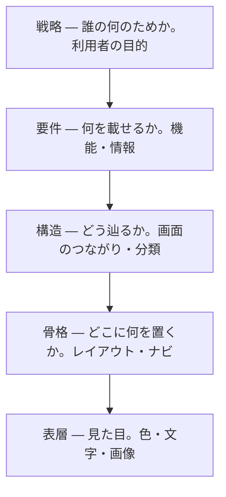

# UX の5層 — 見た目は一番上でしかない

## 今日のゴール

- きれいな画面は、その下にある戦略・要件・構造・骨格の上に乗っていると知る
- 「いい感じに作って」が的外れになるのは、一番上の見た目しか指定していないからだと分かる
- 困りごとを「どの層の話か」で切り分ける言葉を持つ

## AI に頼んだ「いい感じの画面」

AI に「管理画面をいい感じに作って」と頼むと、見た目の整った画面が返ってきます。色は揃い、余白もきれいです。

でも使ってみると、欲しい情報がどこにもなかったり、よく使う操作が何クリックも奥にあったりします。見た目は良いのに中身が的外れになるのは、なぜでしょうか。

## 画面は一番上の層でしかない

その答えは、画面の「見た目」が一番上の薄い層でしかない、というところにあります。見た目の下には、目に見えない4つの層が積み重なっています。

Jesse James Garrett が『The Elements of User Experience』で示した、UX の5層という捉え方があります。下の抽象的な土台から、上の具体的な見た目へと積み上がります。

下の層が決まらないと、上の層は決められません。見た目は、その下の4層の上に乗っているだけです。

## 下から積み上がる

タスク管理アプリを例に、下から順に追います。

- **戦略**: 誰が、何のために使うのか。ここでは「チームが今日やることを見失わないため」。すべての土台
- **要件**: その目的のために何を載せるか。タスクの一覧・追加・完了チェック
- **構造**: それらをどう辿るか。一覧から1件を開いて編集する、という道筋
- **骨格**: 1画面のどこに何を置くか。追加ボタンの位置、リストの並び。ワイヤーフレームで描く部分
- **表層**: 最後に見た目。色・文字・アイコン・余白

戦略が「今日やることを見失わないため」だから、要件に「完了チェック」が入ります。要件にタスク一覧があるから、骨格に縦のリストが要ります。

こうして下の決定が、上で選べる範囲を決めていきます。

Figma で描くのは、主にこの上の骨格と表層です。研修で手を動かすのは上の2層で、その下に3つの層が隠れている、と考えると位置がつかめます。

## なぜ「いい感じに作って」は的外れになるのか

最初の疑問に戻ります。「いい感じに作って」は、一番上の表層だけを指定して、下の4層を相手の推測に任せる頼み方です。

AI は下の層を自分で埋めて画面を作ります。その推測がこちらの意図とずれれば、見た目が整っていても中身は的外れになります。

誰が使い、何を載せ、どう辿るのかを渡していないのだから、無理もありません。

だから、指示は下の層から渡すと筋が通ります。

- 誰が何のために使うか（戦略）
- どんな情報と操作が要るか（要件）
- どういう流れで使うか（構造）

ここまで言葉にすれば、AI が作る表層まで一本の筋が通ります。

返ってきた画面に違和感があったときも、同じ地図が効きます。「これは色の問題ではなく、そもそも載せる情報が足りない」と気づければ、それは表層ではなく要件の話だと分かります。

## 一直線ではない

5層は、下から1つずつ完成させてから次へ進む工程ではありません。実際は行き来しますし、層の境目もくっきり分かれるわけではありません。

それでも、下が上を支える関係は変わりません。表層をいくら磨いても、戦略がぶれていれば的外れは直りません。

5層は順番に作る手順ではなく、どの層に問題があるかを見る地図として使います。

## まとめ

- 見た目（表層）は一番上の層で、下に戦略・要件・構造・骨格がある
- 土台の層がぶれると、見た目をいくら磨いても的外れなまま
- 指示は表層だけでなく、下の層（誰が・何を・どう辿る）から渡す
- 違和感は「どの層の問題か」で切り分ける
