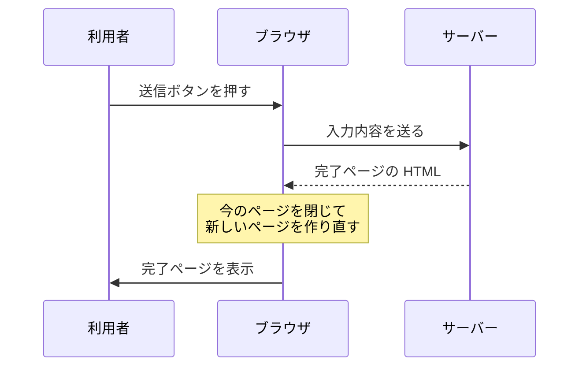
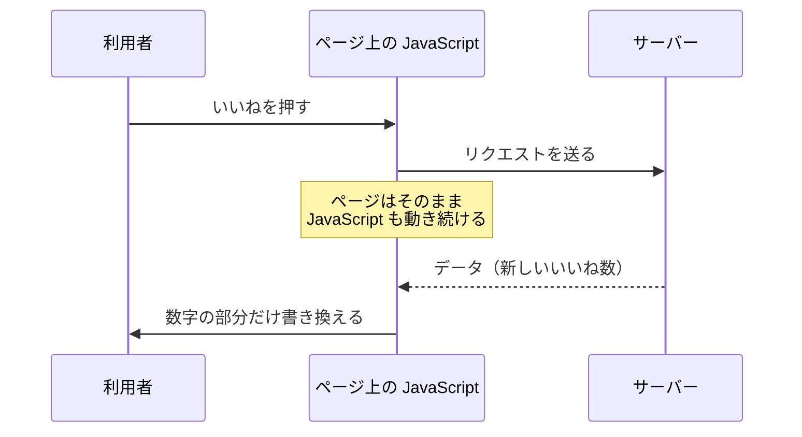

# 同期通信と非同期通信 — ブラウザが通信するか、JavaScript が通信するか

## 今日のゴール

- ページごと替わる通信と一部だけ替わる通信の違いが、誰が通信するかで決まると分かる
- ページを保てるようになると、小さい通信を何度もできるようになると分かる
- 遷移させるかどうかを「利用者が別の画面に来たと思うべきか」で判断できるようになる

## 同じ通信なのに画面の動きが違う

お問い合わせフォームに入力して送信ボタンを押すと、画面が切り替わって「送信が完了しました」というページになります。

一方、SNS で「いいね」を押したときは、画面はそのままです。数字だけが増えて、スクロール位置も動きません。

どちらもサーバーとやりとりしているのに、片方はページごと替わり、もう片方は数字しか替わりません。この違いはどこから来るのでしょうか。

## ブラウザが通信するとページごと替わる

お問い合わせフォームは、HTML でこう書きます。

```html
<!-- action に書いた /contact へ、入力内容が送られる -->
<form action="/contact" method="post">
  <label for="message">お問い合わせ内容</label>
  <textarea id="message" name="message"></textarea>
  <button type="submit">送信</button>
</form>
```

JavaScript は1行も出てきません。フォームの送信は**ブラウザに元から付いている機能**なので、HTML を書くだけで動きます。

送信ボタンを押すと、ブラウザはこう動きます。

1. 入力内容を `/contact` に送る
2. サーバーが返してきた HTML を受け取る
3. 今のページを閉じて、受け取った HTML から新しいページを作り直す



閉じられるのは、目に見える画面だけではありません。ページの上で動いていた JavaScript も一緒に終わります。

**変数に入れていた値も、登録しておいたボタンの反応も、ここで全部消えます。** 新しいページでは、JavaScript も新しい環境で読み込み直されます。

だから、送信のたびにこうなります。

- 入力途中だった別の欄の内容が消える
- スクロール位置が先頭に戻る
- 開いていたメニューやタブの選択が初期状態に戻る

変わったのが画面のごく一部でも、この動きは同じです。数字を1つ増やすだけでも、ヘッダーもナビもフッターも全部作り直されてもう一度届きます。

リンクも同じ仕組みで動きます。

```html
<!-- 押すとブラウザが /about の HTML を取ってきて、今のページと差し替える -->
<a href="/about">会社概要</a>
```

フォームは入力を送り、リンクはページを取ってきます。向きの違いはありますが、**どちらもブラウザがページを取り替える**点は同じです。

ページごと替わるかどうかを決めているのは、送るか取ってくるかではなく、通信しているのがブラウザだという点です。

かつては、利用者の操作をサーバーに伝える方法がこれしかありませんでした。どんな小さな操作でも、ページごと替わっていました。

ページを保ったまま通信するには、ブラウザではない誰かが通信するしかありません。

## ページ上の JavaScript が通信するとページは残る

JavaScript は、ページの上で動くプログラムです。ブラウザが読み込んだページの中にいて、ボタンが押されたことを受け取ったり、画面の文字を書き換えたりします。

サーバーへの通信も、自分でできます。`fetch` という命令を使うと、JavaScript が自分でサーバーにリクエストを送り、返事を受け取ります。

`fetch` はページに手を付けません。ページを閉じる処理が走らないので、その上で動いている JavaScript も止まりません。

**画面も、変数に入れた値も、そのまま生き続けます。** 返事が返ってきたら、生きているプログラムがそれを受け取って、画面の一部だけを書き換えます。



図の並びはさっきと同じで、替わったのは真ん中にいるものだけです。ブラウザが通信するとページが取り替えられ、ページの上の JavaScript が通信するとページは残ります。

そして、誰が通信するかが替わると、サーバーが返すものも替わります。

## 返ってくるのは HTML ではなくデータ

ページを取り替えるなら、サーバーは新しいページの HTML を丸ごと作って返す必要があります。ページを取り替えないなら、要るのは**変わった値だけ**です。

いいねを押したとき、サーバーが返すのはこれだけです。

```json
{ "count": 43 }
```

「いいね数が 43 になった」と言っているだけで、ヘッダーもナビも投稿本文も入っていません。この書き方を JSON と呼びます。

JavaScript はこの 43 を受け取って、画面の数字だけを書き換えます。

```js
// いいねボタンが押されたときに呼ばれる処理
async function like(postId) {
  // サーバーに「いいねした」と伝える。await を付けると返事が来るまでここで待つ
  const res = await fetch(`/api/posts/${postId}/like`, { method: "POST" });
  // 返ってきた JSON を取り出す。data には { count: 43 } が入る
  const data = await res.json();
  // id="like-count" を付けておいた場所の文字を、返ってきた数に差し替える
  document.querySelector("#like-count").textContent = data.count;
}
```

通信しているのは `fetch` の行だけで、ページを取り替える処理はどこにもありません。だから押した瞬間に数字だけ変わり、スクロール位置も他の入力もそのまま残ります。

やりとりする量も違います。ページ全体の HTML を毎回作って送り直すのと比べると、`{ "count": 43 }` はほとんど何もないような量です。

ページを取り替える通信を**同期通信**、ページを保ったまま行う通信を**非同期通信**と呼びます。

::: tip 用語の注意
同期・非同期は、コードの書き方を指すこともあります。「返事が来るまで次に進まない書き方」が同期、「待たずに次へ進む書き方」が非同期で、async/await はこちらの話です。

どちらの意味も現場で使われます。話がかみ合わないと感じたら、ページが遷移するかどうかの話か、コードが待つかどうかの話かを確かめると早いです。
:::

遷移せずに済むようになると、画面の使い勝手が変わります。

## ページを保つと通信を細かくできる

まず、作業が途切れなくなります。長い申込フォームの途中で郵便番号から住所を引くとき、そのたびにページが替わっていたら、入力した内容が消えてしまいます。

ページが残るなら、入力を保ったまま住所の欄だけ埋められます。

待たされる範囲も狭くなります。一覧の続きを読み込んでいる間も、今読んでいる部分は見えたままです。

そして、いちばん大きいのは、小さい通信を何度もできるようになったことです。

ページを取り替えるのはコストの高い操作です。状態が全部消えて、HTML も丸ごと作り直しになるからです。

だから遷移する作りでは、通信をまとめて1回にするしかありません。全部入力してから送信する、検索条件を決めてから検索する、という形です。

遷移しなくてよくなると、この縛りが外れます。

- 1文字打つたびに検索候補を取ってくる
- 一覧の下までスクロールしたら続きを取ってくる
- 押した瞬間にいいねを反映する

「とうk」まで打ったときの通信を、両方の作りで並べてみます。

| | 遷移する作り | 遷移しない作り |
|---|---|---|
| 「と」を打つ | 何も起きない | 候補を取ってくる |
| 「とう」を打つ | 何も起きない | 候補を取ってくる |
| 「とうk」を打つ | 何も起きない | 候補を取ってくる |
| 検索ボタンを押す | ページごと替わる | ボタンを押す必要がない |
| 通信の回数 | 1回 | 3回 |
| 1回で受け取る量 | ページの HTML を丸ごと | 候補の一覧だけ |

大きな通信を1回で済ませるか、小さな通信を何度も重ねるか。遷移する作りで打つたびに通信すると、1文字ごとに画面が作り直されてしまいます。

検索欄に文字を打つと候補が出てくるあの動きも、チャットで送った瞬間に吹き出しが出るのも、ページを取り替える作りでは成り立ちません。

ただ、遷移にしかできないこともあります。

## 遷移させるかどうかの決め方

判断の軸は、**利用者が「別の画面に来た」と思うべきかどうか**です。

商品の詳細を開いたときや、決済を終えたときは、利用者は別の場所に来たと感じるはずです。こういう場面では遷移させます。

遷移には、ページが替わること自体の良さがあります。

- URL が変わるので、その画面を人に共有したりブックマークしたりできる
- 戻るボタンで1つ前の画面に戻れる
- 状態がゼロに戻るので、ログアウトや決済完了のように前の状態が残ると困る場面に合う

逆に、同じ画面のまま何かが変わるだけなら、遷移させません。いいねも検索候補も、利用者は別の画面に来たとは思っていません。

| 操作 | 別の画面に来たと思うか | どちらにするか |
|---|---|---|
| 商品の詳細を開く | 思う | 遷移させる |
| ログアウトする | 思う | 遷移させる |
| いいねを押す | 思わない | 遷移させない |
| 入力内容をその場でチェックする | 思わない | 遷移させない |
| 一覧を絞り込む | どちらとも言える | 迷うところ |

気を付けたいのは、**遷移しないと URL が変わらない**ことです。

絞り込みやタブ切り替えを全部遷移なしで作ると、その状態を人に共有できません。戻るボタンを押すと、1つ前の状態ではなく前のページまで飛んでしまいます。

検索結果や絞り込み、ページ送りのような中間にあるものは、どちらにも見えるので判断を間違えやすいところです。

遷移しない作りには、便利さと引き換えに引き受けるものもあります。

## 状態を保つ仕事がこちらに来た

ページごと替わる作りでは、毎回ゼロからやり直しです。変数も消えるので、**状態を保つ必要がそもそもありませんでした**。

届いた HTML が、そのまま正解でした。

ページを保つと、そうはいきません。JavaScript が動き続けて値も残るので、画面に出ている内容が今も正しいかを、自分で保ち続けることになります。

いいね1つでも、決めることが出てきます。

- 押した直後に数字を増やすか、サーバーの返事を待ってから増やすか
- 返事が失敗したら数字を戻すか
- 通信中はボタンを押せなくするか
- 連続で押されたらどうするか

ページごと替わっていた頃には、考えなくてよかったことばかりです。サーバーがページを作り直してくれなくなった分を、こちらで持つことになりました。

React のような道具が使われるのは、ここに理由があります。画面の一部を書き換えながら今の状態を保ち続けるのは、手作業でやると大変だからです。

## まとめ

- ブラウザが通信するとページごと替わり、ページ上の JavaScript が通信するとページは残る
- ページを保てるようになって、1文字ごとの検索候補のような細かい通信が成り立つようになった
- 遷移させるかどうかは、利用者が別の画面に来たと思うべきかどうかで決める
- ページを保つ分、今の状態を保つ仕事がこちらに来た
