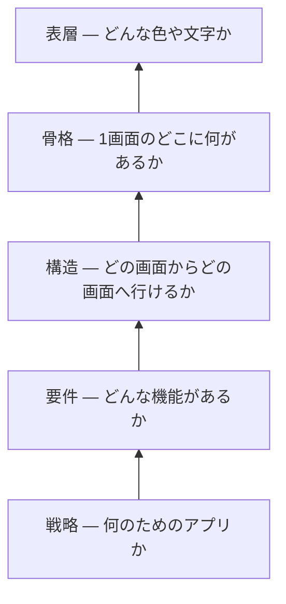

# UX の5層 — 見た目は一番上でしかない

## 今日のゴール

- 画面は見た目だけでなく、戦略から表層まで5つの層でできていると知る
- 下の層が上の層を決めるので、見た目だけ直しても下の層の問題は直らないと分かる
- 「なんか使いにくい」を、どの層の話かまで切り分けて言葉にできる

## 画面は5つの層でできている

アプリでも Web サイトでも、画面でまず目に入るのは色やレイアウト、つまり見た目です。けれど見た目は、画面を成り立たせている一番上の層にすぎません。

その下には、目に見えない4つの層があります。Jesse James Garrett は『The Elements of User Experience』で、画面を戦略・要件・構造・骨格・表層の5つの層に分けて説明しています。

一番下が抽象的な土台で、上にいくほど具体的な見た目に近づきます。

大事なのは並び順です。下の層が決まらないと、上の層は決められません。

## 戦略 — 何のためのアプリか

一番下の土台で、そのアプリが誰の、何のためにあるかを決めます。使う人が何をしたくて開くのか、作る側は何をもって成功とするのか、の2つです。

たとえば同じ「地図アプリ」でも、目的が「知らない土地で迷わないため」か「近くの店を探すため」かで、この先の4層は別物になります。

ここが曖昧なままだと、上の層は何を基準に決めればいいか分からなくなります。

## 要件 — どんな機能があるか

目的が決まると、そのために何が必要かが決まります。決めるのは、何ができるか（機能）と、何が表示されるか（情報）の2つです。

「迷わないため」の地図なら、現在地の表示とルート案内が要ります。店のクーポン一覧は、この目的には要りません。

目的が違えば、必要な機能も変わります。

## 構造 — どの画面からどの画面へ行けるか

必要な機能が決まると、それをどの画面に分けて、どうつなぐかが決まります。何を押すとどの画面へ行くのか、という道順です。

検索して、結果を選んで、案内が始まる。この道順が短いほど、目的にすばやくたどり着けます。

逆に、目的の操作までに何画面も挟むと面倒になります。

## 骨格 — 1画面のどこに何があるか

道順が決まると、1画面の中のどこに何を置くかが決まります。地図を画面いっぱいに広げ、検索欄を上に、現在地ボタンを親指の届く位置に置く、といった配置です。

色や装飾を省いて配置だけを決めた下書きを、Figma ではワイヤーフレームと呼びます。

## 表層 — どんな色や文字か

最後に、配置した要素へ色・文字・余白・アイコンをのせます。目的地を目立つ色にし、通った道を薄くします。

使う人の目に触れるのはこの層だけですが、ここで選べるのは下の4層が許した範囲だけです。

## 下の層が上の層を決める

こうして、戦略が要件を、要件が構造を、構造が骨格を、骨格が表層を決めます。下で決めたことが、1つ上で選べる範囲を順に狭めていきます。

逆から見ると、一番下を変えると上は総取っ替えになります。地図アプリの目的が「迷わないため」から「近くの店を探すため」に変われば、要件は店の一覧と絞り込みに変わり、構造も骨格も表層も別物になります。

見た目は下の層の結果であって、出発点ではありません。

Figma で手を動かすのは、この5つのうち上の2つ、骨格と表層だけです。その下の戦略・要件・構造は、Figma を開く前に決まっているべきことです。

## 「なんか使いにくい」はどの層の話か

この5層は、できあがった画面を評価するときに効きます。「なんか使いにくい」で止まらず、どの層の問題かまで言えるようになるからです。

たとえば、ある画面が使いにくいとします。よく見ると、今日必要な情報が過去の分に埋もれている。

これは配色の問題ではなく、「今必要な分だけ出す」という要件が抜けているサインです。

別の画面では、情報はそろっているのに操作が面倒に感じる。1件直すたびに別画面へ移動している。

これは足りない機能（要件）ではなく、画面のつながり（構造）の問題です。

こうして症状を層に対応させると、次のように切り分けられます。

| 気になったこと | たぶんこの層 | どう直すか |
|---|---|---|
| 色や余白が地味・古い | 表層 | 配色や余白を整える |
| 目当ての操作が見当たらない | 骨格 | よく使う操作を目立つ位置に置く |
| 目的までに何画面も挟んで面倒 | 構造 | 途中の画面を減らし、その場でできるようにする |
| 欲しい情報が載っていない | 要件 | 必要な情報を足す |
| きれいだが目的に合わない | 戦略 | 誰が何のために使う画面かから見直す |

上ほど直すのが軽く、下ほど作り直しが大きくなります。色の変更はすぐでも、要件の抜けは画面の作り直しになりがちです。

だから違和感を覚えたら、まず「これは表層の話か、それとももっと下か」を見極めるのが早道です。

## 見た目だけ直しても直らない

層を取り違えると、直したつもりで直らないことが起きます。

必要な情報が載っていない画面は、配色をどれだけ洗練させても使えるようになりません。操作までに何画面も挟む画面は、ボタンをきれいにしても面倒なままです。

作るときも同じで、下の層から手をつけると筋が通ります。人に頼むときも、下の層を言葉にして渡すほど、出来上がりが目的からぶれません。

## 5層は一直線の工程ではない

5層は、下から1つずつ完成させてから次へ進む工程ではありません。実際は行き来しますし、層の境目もくっきり分かれるわけではありません。

それでも、下が上を支える関係は変わりません。表層をいくら磨いても、戦略がぶれていると的外れなままです。

5層は順番に作る手順ではなく、どの層に問題があるかを見分けるために使います。

## まとめ

- 画面は見た目だけでなく、戦略・要件・構造・骨格・表層の5層でできている
- 下の層が上の層を決め、一番下を変えると上は総取っ替えになる
- 「使いにくい」をどの層の問題かまで切り分けて言葉にする
- 層を取り違えると、直したつもりで直らない
