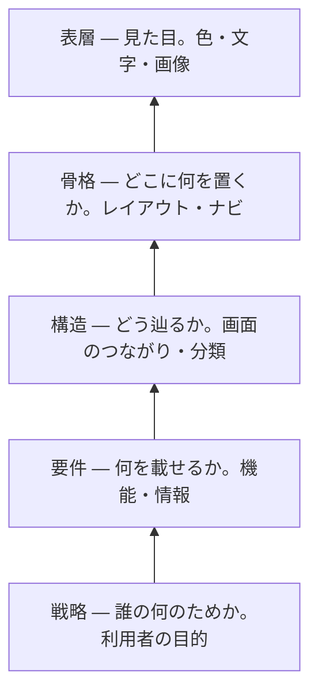

# UX の5層 — 見た目は一番上でしかない

## 今日のゴール

- 画面は見た目だけでなく、戦略から表層まで5つの層でできていると知る
- 下の層が上の層を決めるので、見た目だけ直しても下の層の問題は直らないと分かる
- 画面の不具合を「どの層の話か」で切り分けて言葉にできる

## 画面は5つの層でできている

アプリでも Web サイトでも、画面でまず目に入るのは色やレイアウト、つまり見た目です。けれど見た目は、画面を成り立たせている一番上の層にすぎません。

その下には、目に見えない4つの層があります。Jesse James Garrett は『The Elements of User Experience』で、画面を戦略・要件・構造・骨格・表層の5つの層に分けて説明しています。

一番下が抽象的な土台で、上にいくほど具体的な見た目に近づきます。使う人に見えるのは一番上の表層だけです。

大事なのは並び順です。下の層が決まらないと、上の層は決められません。

## 下の層が上の層を決める

例として、あるチームのタスク管理アプリを、一番下から順に作ってみます。各層の決定が、1つ上の層で選べる範囲をどう狭めるかに注目してください。

- **戦略**: 誰が何のために使うのか。ここでは「チームが今日やることを見失わないため」とします。進捗を上司に報告するためでも、長期の計画を立てるためでもありません。この一文が、上の4層すべての判断のよりどころになります
- **要件**: その目的のために何を載せるか。「今日やることを見失わない」ためなら、今日の分を見分けられる一覧と、タスクを足す手段と、終わったものを消す完了チェックが要ります。ガントチャートや工数レポートは、今回の目的には要りません
- **構造**: 載せた物をどう辿るか。一覧を開き、1件をその場で直し、終わったら消す。この道筋が短いほど、毎日の「今日は何をやるか」の確認が苦になりません
- **骨格**: 1画面のどこに何を置くか。今日のタスクを画面の上に、追加ボタンを親指の届く位置に、完了チェックを各行に。色や装飾を省いて配置だけを決めた下書きを、Figma ではワイヤーフレームと呼びます
- **表層**: 最後の見た目。今日の日付を目立たせ、終わったタスクを薄い色にし、フォントや余白を整えます。ここでようやく色が付きます

こうして、戦略が要件を決め、要件が構造を、構造が骨格を、骨格が表層を決めます。下で決めたことが、1つ上の層で選べる範囲を順に狭めていきます。

Figma で手を動かすのは、この5層のうち上の2つ、骨格と表層です。その下の戦略・要件・構造は、Figma を開く前に決まっているべきことです。

## 一番下を変えると上が総取っ替えになる

この「下が上を決める」の強さは、一番下の戦略を差し替えると分かります。

同じ「タスク管理」でも、戦略が「上司がチーム全員の負荷を把握するため」なら、要件は各人の担当数と工数に、構造は人ごとの集計に、骨格は一覧ではなく表やグラフに、表層まで別物になります。

一番下の一文が変わるだけで、上の4層は丸ごと入れ替わります。見た目は下の層の結果であって、出発点ではありません。

## 層を飛ばすと何が起きるか

では、下の3つ（戦略・要件・構造）を決めないまま上を作るとどうなるか。最初のタスク管理アプリで、層ごとに壊れ方を見てみます。

**戦略が抜けると**、全タスクをただ期限順に並べた画面ができます。見た目はきれいでも、「今日やること」が先の予定に埋もれて、目的そのものを果たせません。

**要件が足りないと**、完了チェックのない一覧ができます。終わったタスクを消すには編集画面を開いて削除するしかなく、毎日使うには重すぎます。

**構造がまずいと**、編集画面が別ページの奥にあります。1件直すたびにページを移動して戻ることになり、操作が回りくどくなります。

どれも「見た目が悪い」わけではありません。下の層が抜けていると、見た目をどれだけ磨いても使えるようにはなりません。

## 作るときは下の層から決める

だから、作るときは下の層から手をつけます。目的、載せる情報、辿り方を先に決めてから見た目に入ると、表層まで筋が通ります。

人に頼むときも同じで、下の層を言葉にして渡すほど、出来上がりが目的からぶれません。

## 違和感をどの層で切り分ける

この見方は、できあがった画面を直すときにも効きます。「なんか使いにくい」で止まらず、どの層の問題かまで言えるようになるからです。

たとえば「このタスク画面、使いにくい」と感じたとします。よく見ると、今日やる3件が先の予定に埋もれている。

これは配色の問題ではなく、「今日の分だけ出す」という要件が抜けているサインです。直すのは表層ではなく要件です。

別の画面では、情報はそろっているのに操作が面倒に感じる。1件直すたびに別画面へ移動している。

これは載せる情報（要件）ではなく、辿り方（構造）の問題です。

こうして症状を層に対応させると、次のように切り分けられます。

| 気になったこと | たぶんこの層 | どう直すか |
|---|---|---|
| 色や余白が地味・古い | 表層 | 配色や余白を整える |
| 目当ての操作が見当たらない | 骨格 | よく使う操作を目立つ位置に置く |
| 目的までの手順が回りくどい | 構造 | 途中の画面を減らし、その場でできるようにする |
| 欲しい情報が載っていない | 要件 | 締め切りなど必要な情報を足す |
| きれいだが目的に合わない | 戦略 | 誰が何のために使う画面かから見直す |

上ほど直すのが軽く、下ほど作り直しが大きくなります。色の変更はすぐでも、要件の抜けは画面の作り直しになりがちです。

だから違和感を覚えたら、まず「これは表層の話か、それとももっと下か」を見極めるのが早道です。

## 5層は一直線の工程ではない

5層は、下から1つずつ完成させてから次へ進む工程ではありません。実際は行き来しますし、層の境目もくっきり分かれるわけではありません。

それでも、下が上を支える関係は変わりません。表層をいくら磨いても、戦略がぶれていると的外れなままです。

5層は順番に作る手順ではなく、どの層に問題があるかを見分けるために使います。

## まとめ

- 画面は見た目だけでなく、戦略から表層まで5つの層でできている
- 下の層が上の層を決め、見た目だけ直しても下の問題は直らない
- 一番下を変えると、上の層は総取っ替えになる
- 違和感を「どの層の問題か」で切り分ける（上ほど直しは軽い）
