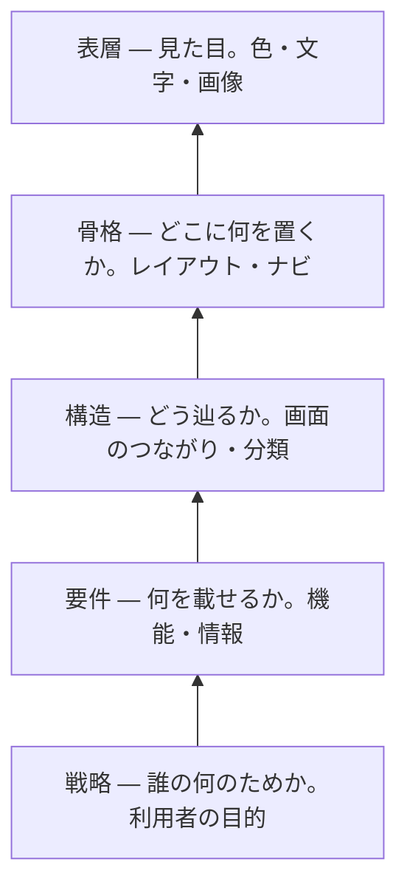

# UX の5層 — 見た目は一番上でしかない

## 今日のゴール

- 画面は見た目だけでなく、戦略から表層まで5つの層でできていると知る
- 下の層が上の層を決めるので、見た目だけ直しても下の層の問題は直らないと分かる
- 画面の不具合を「どの層の話か」で切り分けて言葉にできる

## 画面は5つの層でできている

アプリでも Web サイトでも、画面でまず目に入るのは色やレイアウト、つまり見た目です。けれど見た目は、画面を成り立たせている一番上の層にすぎません。

その下には、目に見えない4つの層があります。Jesse James Garrett は『The Elements of User Experience』で、画面を戦略・要件・構造・骨格・表層の5つの層に分けて説明しています。

一番下が抽象的な土台で、上にいくほど具体的な見た目に近づきます。

大事なのは並び順です。下の層が決まらないと、上の層は決められません。

## 下の層が上の層を決める

タスク管理アプリを例に、下から順に追います。各層で決めたことが、1つ上の層で選べる範囲をどう狭めるかに注目してください。

- **戦略**: 誰が何のために使うのか。ここでは「チームが今日やることを見失わないため」とし、これが上の4層すべての判断基準になります
- **要件**: その目的のために何を載せるか。今日の分を見分けられる一覧と、終わったものを消す完了チェックが要ります
- **構造**: 載せた物をどう辿るか。一覧から1件を開いて直して戻る、この道筋が短いほど毎日使うのが楽になります
- **骨格**: 1画面のどこに何を置くか。今日のタスクを上に、といった配置の下書き（ワイヤーフレーム）を Figma で描きます
- **表層**: 最後の見た目。色・文字・余白で、骨格に沿って仕上げます

戦略が要件を決め、要件が構造を、構造が骨格を、骨格が表層を決めます。こうして下で決めたことが、上で選べる範囲を1つずつ狭めていきます。

Figma で手を動かすのは、主に上の骨格と表層です。その下に3つの層が隠れている、と考えると全体の中での位置がつかめます。

## 層を飛ばすと何が起きるか

Figma で作る骨格と表層の下には、戦略・要件・構造の3つがあります。これを決めないまま上を作ると、同じタスク管理アプリはこう壊れます。

**戦略が抜けると**、全タスクをただ期限順に並べた画面ができます。見た目はきれいでも、「今日やること」が先の予定に埋もれて、目的そのものを果たせません。

**要件が足りないと**、完了チェックのない一覧ができます。終わったタスクを消すには編集して削除するしかなく、毎日使うには重すぎます。

**構造がまずいと**、編集画面が別ページの奥にあります。1件直すたびにページを移動して戻る羽目になり、操作が回りくどくなります。

どれも「見た目が悪い」わけではありません。下の層の判断が抜けていると、見た目が整っていても使えなくなります。

## 作るときは下の層から決める

だから、作るときは下の層から手をつけると筋が通ります。逆に見た目から始めると、その下を勘で埋めることになり、さっきの壊れ方をします。

誰かに作ってもらうときも同じで、下の層を言葉にして渡すほど、出来上がりが目的からぶれません。

## 違和感をどの層で切り分けるか

この見方は、できあがった画面を直すときにも効きます。「なんか使いにくい」を、具体的にどの層の問題かまで言えるようになるからです。

| 気になったこと | たぶんこの層 | どう直すか |
|---|---|---|
| 色や余白が地味・古い | 表層 | 配色や余白を整える |
| 目当ての操作が見当たらない | 骨格 | よく使う操作を目立つ位置に置く |
| 目的までの手順が回りくどい | 構造 | 途中の画面を減らし、その場でできるようにする |
| 欲しい情報が載っていない | 要件 | 締め切りなど必要な情報を足す |
| きれいだが目的に合わない | 戦略 | 誰が何のために使う画面かから見直す |

上ほど直すのが軽く、下ほど作り直しが大きくなります。だから違和感を覚えたら、まず「これは表層の話か、それとももっと下か」を見極めるのが早道です。

## 5層は一直線の工程ではない

5層は、下から1つずつ完成させてから次へ進む工程ではありません。実際は行き来しますし、層の境目もくっきり分かれるわけではありません。

それでも、下が上を支える関係は変わりません。表層をいくら磨いても、戦略がぶれていると的外れなままです。

5層は順番に作る手順ではなく、どの層に問題があるかを見分けるために使います。

## まとめ

- 画面は見た目だけでなく、戦略から表層まで5つの層でできている
- 下の層が上の層を決め、見た目だけ直しても下の問題は直らない
- 作るときも直すときも、下の層から手をつける
- 違和感を「どの層の問題か」で切り分ける（上ほど直しは軽い）
