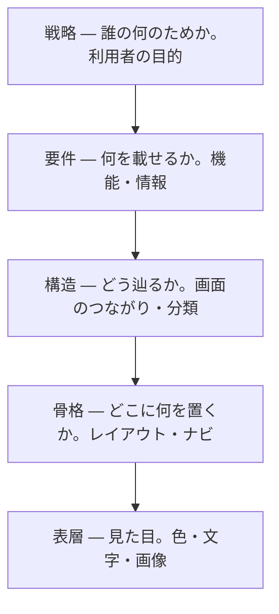

# UX の5層 — 見た目は一番上でしかない

## 今日のゴール

- きれいな画面は、その下にある戦略・要件・構造・骨格の上に乗っていると知る
- 「いい感じに作って」が的外れになるのは、一番上の見た目しか指定していないからだと分かる
- 画面の違和感を「どの層の話か」で切り分け、言葉にして直せる

## AI に頼んだ「いい感じの画面」

AI に「管理画面をいい感じに作って」と頼むと、見た目の整った画面が返ってきます。色は揃い、余白もきれいです。

でも使ってみると、今日やるべきタスクが先週の分に埋もれていたり、1件直すだけで別ページの奥まで潜らされたりします。見た目は良いのに中身が的外れになるのは、なぜでしょうか。

## 画面は一番上の層でしかない

その答えは、画面の「見た目」が一番上の薄い層でしかない、というところにあります。見た目の下には、目に見えない4つの層が積み重なっています。

Jesse James Garrett が『The Elements of User Experience』で示した、UX の5層という捉え方があります。下の抽象的な土台から、上の具体的な見た目へと積み上がります。

大事なのは並び順です。下の層が決まらないと、上の層は決められません。

## 下から積み上がる

タスク管理アプリを例に、下から順に追います。各層の決定が、1つ上の層の選べる範囲をどう縛るかに注目してください。

- **戦略**: 誰が何のために使うのか。ここでは「チームが今日やることを見失わないため」とし、これが上の4層すべての判断基準になります
- **要件**: その目的のために何を載せるか。今日の分を見分けられる一覧と、終わったものを消す完了チェックが要ります
- **構造**: 載せた物をどう辿るか。一覧から1件を開いて直して戻る、この道筋が短いほど目的に近づきます
- **骨格**: 1画面のどこに何を置くか。今日のタスクを上に、といった配置を Figma のワイヤーフレームで描きます
- **表層**: 最後の見た目。色・文字・余白で、骨格に沿って仕上げます

戦略が要件を決め、要件が構造を、構造が骨格を、骨格が表層を決める。こうして下の決定が、上で選べる範囲を1つずつ狭めていきます。

Figma で手を動かすのは、主に上の骨格と表層です。研修で描くのは上2層で、その下に3つの層が隠れている、と考えると位置がつかめます。

## 層を飛ばすと何が起きるか

下の層を決めないまま上を作ると、具体的にどう壊れるのか。同じタスク管理アプリで見てみます。

**戦略を外すと**、全タスクをただ期限順に並べた画面ができます。見た目はきれいでも、「今日やること」が先の予定に埋もれて、目的そのものを果たせません。

**要件が足りないと**、完了チェックのない一覧ができます。終わったタスクを消すには編集して削除するしかなく、毎日使うには重すぎます。

**構造がまずいと**、編集が別ページの奥に置かれます。1件直すたびにページを移動して戻る羽目になり、操作が回りくどくなります。

どれも「見た目が悪い」わけではありません。下の層の判断が抜けているために、上の見た目が整っていても使えない、という壊れ方です。

## なぜ「いい感じに作って」は的外れになるのか

ここで最初の疑問に戻ります。「いい感じに作って」は、一番上の表層だけを指定して、下の4層を相手の推測に任せる頼み方です。

AI は下の層を自分で埋めて画面を作ります。その推測がこちらの意図とずれれば、さっき見たような壊れ方をします。

誰が使い、何を載せ、どう辿るのかを渡していないのだから、無理もありません。

渡し方を変えると結果も変わります。同じ依頼でも、下の層から言葉にして渡してみます。

> チームが「今日やること」を見失わないためのタスク管理画面。今日のタスクを上に、各行に完了チェック、編集はその場でできるようにして、いい感じに整えて。

戦略・要件・構造を先に渡したので、AI が作る表層まで一本の筋が通ります。表層だけを指定していたときとの差が、そのまま5層の差です。

## 違和感をどの層で切り分けるか

この地図は、返ってきた画面を直すときにも効きます。「なんか使いにくい」を、どの層の問題かに翻訳できるからです。

| 気になったこと | たぶんこの層 | 指示の例 |
|---|---|---|
| 色や余白が地味・古い | 表層 | 「配色をもっと落ち着いた印象に」 |
| 押しにくい・目的の物が探しにくい | 骨格 | 「よく使う操作を上に固定して」 |
| 手順が回りくどい | 構造 | 「編集は一覧のその場でできるように」 |
| 欲しい情報が載っていない | 要件 | 「締め切りも各行に表示して」 |
| きれいだが目的に合わない | 戦略 | 「誰が何のために使う画面か」から見直す |

上ほど直すのが軽く、下ほど作り直しが大きくなります。だから違和感を覚えたら、まず「これは表層の話か、それとももっと下か」を見極めるのが早道です。

## 一直線ではない

5層は、下から1つずつ完成させてから次へ進む工程ではありません。実際は行き来しますし、層の境目もくっきり分かれるわけではありません。

それでも、下が上を支える関係は変わりません。表層をいくら磨いても、戦略がぶれていれば的外れは直りません。

5層は順番に作る手順ではなく、どの層に問題があるかを見る地図として使います。

## まとめ

- 見た目は一番上の層で、下に戦略・要件・構造・骨格がある
- 土台の層がぶれると、見た目を磨いても的外れなまま
- 指示は表層だけでなく、下の層（誰が・何を・どう辿る）から渡す
- 違和感を「どの層の問題か」で切り分ける（上ほど直しは軽い）
